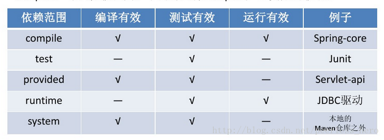

# 第01章 项目介绍、Maven项目管理工具、后台系统搭建、JSON

[toc]

## 一. 项目架构

### 1.1 项目介绍

拉勾教育后台管理系统,是提供给拉勾教育的相关业务人员使用的一个后台管理系统, 业务人员可以在这个后台管理系统中,对课程信息、讲师信息、 学员信息等数据进行维护.

为了巩固同学们对 web阶段的技术的理解,提高同学们综合运用技术的能力, 接下来会带领同学们去完成拉勾教育后台管理系统中的课程管理模块.


### 1.2 模块介绍

- 先给Chrome内核的浏览器安装一个名为`Axure RP`的插件, 这个插件必须进行性如下设置
  - 
- 打开路径`.\第00章 学习资料\09_需求文档\实战项目-V1.0\index.html`所表示的网页, 这个就是产品的需求文档了
- 课程管理模块中包含的内容
  - 课程信息页面展示
  - 课程营销信息配置
  - 配置课时(即课程内容管理)

### 1.3 前后端分离开发

#### 1.3.1 前后端分离架构介绍

前后端分离已成为互联网项目开发的业界标准使用方式, 将前端和后端的开发进行解耦, 并且前后端分离会为以后的大型分布式架构、微服务架构、多端化服务（各种客户端，比如浏览器。车载终端、安卓、IOS等）打下坚实的基础

> 前后端分离的核心思想就是前端HTML页面通过AJAX调用后端的API接口， 并通过JSON数据进行交互


#### 1.3.2 接口文档

##### 1.3.2.1 什么是接口文档

在我们的项目中使用的是前后端分离开发方式，需要前后端工程师共同定义接口、编写接口文档， 之后大家都根据这个接口文档进行开发，到项目结束前都要一直进行接口文档的维护。

##### 1.3.2.2 为什么要写接口文档

- 项目开发过程中前后端工程师有一个统一的文件进行沟通交流，以此进行并行开发
- 项目维护中或者项目人员更迭，方便后期人员查看、维护

##### 1.3.2.3 接口规范是什么

一个接口的描述至少包括下面几项：

- 名称：findCourseList

- 描述：根据条件查询课程信息

- URL：<http://localhot:8080/lagou_edu_home/course/>

- 请求方式：GET

- 请求参数

  - ```txt
    methodName:"findCourseList";
    ```

- 响应结果

  - ```txt
    {
    	"status" : "0",
    	"msg" : "success"
    }
    ```

#### 1.3.3 前后端分离架构的优势

##### 1.3.3.1 前后端耦合的开发方式

这种方式中 Java程序员又当爹又当妈，又搞前端，又搞后端。 正所谓术业有专攻，一个人如果什么都会，那么他肯定也什么都不精. 


##### 1.3.3.2 前后端耦合的缺陷(以JSP为例)

- UI出好设计图之后，前端开发工程师只负责将设计图切成HTML，需要由Java开发工程师来将HTML套成JSP页面，修改问题的时候需要双方协同开发，效率低下。 
- JSP页面必须要在支持Java的WEB服务器上运行（如Tomcat、Jetty等），无法使用Nginx等（官方宣称单实例HTTP并发高达5W），性能提升不上来。 
- 第一次请求JSP，必须要在WEB服务器中编译成Servlet，第一次运行会较慢。 之后的每次请求JSP都是访问Servlet再用输出流输出的HTML页面，效率没有直接使用HTML高 

##### 1.3.3.3 前后端分离的开发方式


##### 1.3.3.4 前后端分离的优势

- 前后端分离的模式下，如果发现Bug，可以快速定位是谁的问题，不会出现互相踢皮球的现象 
- 前后端分离可以减少后端服务器的并发/负载压力。除了接口以外的其他所有HTTP请求全部转移到前端Nginx上，接口的请求则转发调用Tomcat.
- 前后端分离的模式下，即使后端服务器暂时超时或宕机了，前端页面也会正常访问，只不过数据刷不出来而已。 
- 前后端分离会更加合理的分配团队的工作量，减轻后端团队的工作量，提高了性能和可扩展性。 

### 1.4 技术选型

#### 1.4.1 前端技术选型

| 前端技术         | 说明                                                         |
| ---------------- | ------------------------------------------------------------ |
| **Vue.js**       | 是一套用于构建用户界面的渐进式**JavaScript框架**             |
| **Element UI库** | element-ui 是饿了么前端出品的基于 Vue.js的 后台组件库，<br>方便程序员进行页面快速布局和构建 |
| **node.js**      | 简单的说 Node.js 就是运行在服务端的 JavaScript 运行环境 .    |
| **axios**        | 对ajax的封装, 简单来说就是ajax技术实现了局部数据的刷新，axios实现了对ajax的封装， |

#### 1.4.2 后端技术选型

| 后端技术      | 说明                                                         | 作用                                                         |
| ------------- | ------------------------------------------------------------ | ------------------------------------------------------------ |
| **web层**     | a) Servlet：前端控制器<br />b) Filter：过滤器 <br />c) Listener: 监听器 | 1. 接收客户端传送的数据<br />2. 使用Service层对客户传来数据进行相应的业务处理, 生成客户端需要的数据<br />3. 将Service层生成的处理数据传送给客户端 |
| **service层** | a) 业务处理                                                  | 利用dao层来实现各种业务功能, 并生成对应的处理数据            |
| **dao层**     | a) Mysql：数据库<br />b) Druid：数据库连接池<br />c) DBUtils: 操作数据库 | 用来实现服务端与数据库的交互, 一般是服务器上的Service层与数据库的交互 |
| pojo          | plain old java object, 简单的持久化的java对象                | 可以作为传送的数据                                           |

### 1.5 项目开发环境

#### 1.5.1 开发工具

- 后端: IDEA 2019.3.5
- 前端: VS code
- 数据库: SQLYog

#### 1.5.2 开发环境

- JDK 11.0.11
- Maven 3.8.1
- MySQL 80

## 二. Maven项目管理工具

### 2.1 Maven介绍

#### 2.1.1 什么是Maven

Maven是一个跨平台的项目管理工具。作为Apache组织的一个颇为成功的开源项目，其主要服务于**基于Java平台的项目**==的创建==，==依赖管理==和==信息管理==。maven是Apache的顶级项目，解释为“专家，内行”，它是一个**项目管理的**工具，maven自身是纯java开发的，可**以使用maven对java项目进行构建、依赖管理和信息管理**。

#### 2.1.2 Maven的作用

- **依赖管理**
  - 依赖指的就是 我们项目中需要使用的第三方Jar包, 一个大一点的工程往往需要几十上百个Jar包,按照我们之前的方式,每使用一种Jar包,就需要导入到工程中,还要解决各种Jar包冲突的问题.
  - Maven可以对Jar包进行统一的管理,包括快速引入Jar包,以及对使用的 Jar包进行统一的版本控制
- **一键构建项目**
  - 之前我们创建项目,需要确定项目的目录结构,比如`src` (用来存放Java源码), `resources`(用来存放配置文件),还要配置环境比如JDK的版本等等,如果有多个项目 那么就需要每次自己搞一套配置,十分麻烦
  - **Maven为我们提供了一个标准化的Java项目结构,我们可以通过Maven快速地创建一个标准的Java项目.**

### 2.2 Maven的使用

#### 2.2.1 Maven软件的下载

- 下载地址: <https://maven.apache.org/download.cgi>
- 打开这个网址, 找到所需的版本, Windows系统使用的是`.zip`文件, Linux系统使用的是`.tar.gz`文件

#### 2.2.2 Maven软件的安装

Maven下载好后, 将文件解压到一个没有中文没有空格的路径下, 比如:`C:/Apache/`下面. 解压后的目录结构如下:


| 目录   | 功能                                             |
| ------ | ------------------------------------------------ |
| `bin`  | 存放了Maven的命令                                |
| `boot` | 存放了Maven本身的引导程序, 如类加载器等          |
| `conf` | 存放了Maven的一些配置文件, 如: `setting.xml`文件 |
| `lib`  | 存放了Maven本身运行时所需的一些Jar包             |

#### 2.2.3 Maven环境变量配置

- 配置`MAVEN_HOME`, 变量值就是Maven的安装路径(bin目录的上一级目录)
- 将`%MAVEN_HOEM%\bin`添加到`Path`系统变量

#### 2.2.4 测试Maven是否安装成功

打开`CMD`, 运行命令`mvn -v`, 如果显示Maven的版本信息就说明安装成功

### 2.3 Maven仓库

- Maven中的仓库是用来存放Maven构建的项目和各种依赖的(即jar包和Mavaen插件)

#### 2.3.1 Maven的仓库分类

- **本地仓库**    位于自己计算机中的仓库, 用来存储从远程仓库或者中央仓库下载的插件和jar包
- **中央仓库**    在maven然间中内置了一个远程仓库地址 <http://repo1.maven.org/maven2>, 它是中央仓库, 服务与整个互联网, 它是由Maven团队自己维护, 里面存储了非常全的Jar包, 它包含了世界上大部分流行的开源项目构件
- **远程仓库**    由于`GFW`的存在导致国内连接中央仓库下载jar包速度很慢, 甚至可能连接不上, 所以需要设置一个**远程仓库**来代替中央仓库, 远程仓库是**中央仓库的一个在国内的镜像仓库**, 会定时同步中央仓库的资源, 因为是在国内所以下载jar包的速度也很快, 一般使用<http://maven.aliyun.com/nexus/content/groups/public/>作为镜像仓库
- 

#### 2.3.2 自定义Maven本地仓库的存储位置

- Maven本地仓库的默认位置是`C:\.m2`, 最好改成其他的位置

- 打开Maven安装目录下的`conf`文件夹下的的``setting.xml`文件, 搜索`<localRepository>`, 如果没有这个节点,就创建一个, 如果有的话就将该节点的内容改成本地仓库的存储路径, 如下所示

  - ```xml
    <!-- 本地仓库的存储路径 -->
    <localRepository>D:\Repository\MavenRepository</localRepository>
    ```

#### 2.3.3 配置阿里云远程仓库

- Maven默认的中央仓库是在国外, 所以下载jar包时速度会非常慢, 这里推荐使用阿里云仓库

- 打开Maven安装目录下的`conf`文件夹下的的``setting.xml`文件, 找到`<mirrors>`标签, 把下面的内容复制到`<mirrors>`中即可, 可以在<https://developer.aliyun.com/article/78124>中找到这些配置

  - ```xml
    <mirror>
          <id>alimaven</id>
          <name>aliyun maven</name>
          <url>http://maven.aliyun.com/nexus/content/groups/public/</url>
          <mirrorOf>central</mirrorOf>        
        </mirror>
    ```

- Maven从`3.8.1`版本开始`<mirrors`节点下默认有这个一个节点

  - ```xml
    <mirror>
          <id>maven-default-http-blocker</id>
          <mirrorOf>external:http:*</mirrorOf>
          <name>Pseudo repository to mirror external repositories initially using HTTP.</name>
          <url>http://0.0.0.0/</url>
          <blocked>true</blocked>
        </mirror>
    ```

  - **这个节点用来阻止外部HTTP存储库, 也就是说Maven不可以使用http协议的镜像仓库, 但镜像仓库大多是http协议, 所以还是注释掉这个节点好了**

### 2.4 创建Maven项目

#### 2.4.1 配置IDEA的Maven

- 打开IDEA, 点击`Configuration`→`Setting`
  - 
- 点击`Build,Execution,Deployment`→`Build Tools`→`Maven`, 对红框的部分进行设置
  - 
  - `Maven home directory`改成Maven软件的安装目录
  - `User setting file`改成Maven安装目录下的conf文件夹下的`setting.xml`文件的路径
  - `Local repository`改成自定义的LocalRepository的路径
- 点击`Build,Execution,Deployment`→`Build Tools`→`Maven`→`Importing`, 勾选`Import Maven projects automatically`
  - 
  - 这样当本地仓库没有项目依赖的jar包时, 就会自动到远程仓库下载

#### 2.4.2 创建Maven工程

- 创建一个名为web_work的空项目

  - 点击`File`→`Project Structure`→`Project`, 将以下内容设置成跟系统安装的jdk的版本一致
  - 
- 点击`File`→`Project Structure`→`Modules`→`+`→`New Module`→`Maven`→`Next`

  - 
  - 
- 对红框部分进行自定义设置

  - 
  - Name    是模块的名字
  - Location    是模块的保存位置, 设置为**项目路径\\模块名**即可
  - Artifact Coordinates    产品坐标, 需要点击下拉图标才会打开
    - GroupId    公司或组织的名称
    - ArtifactId    工程名, 一般跟模块名相同
    - Version    这个产品是第几个版本
  - 设置完成后点击`Finish`
- 之后让选择这个模块的`pom.xml`文件的保存位置, 选择红框标出来的那一个

  - 
  - 点击`OK`, **等待该模块完全 生成再进行下一步**

##### Maven工程的各个目录及其作用

- 创建好的模块长这个样子

  - 

  - | 目录/文件            | 功能                                             |
    | -------------------- | ------------------------------------------------ |
    | `src/main/java`      | 存放项目的`.java`文件(源代码文件)                |
    | `src/main/resources` | 存放项目资源文件, 如数据库的配置文件             |
    | `src/test/java`      | 存放所有单元测试的`.java`文件, 如`Junit`         |
    | target               | 项目输出的目录, 编译后的`.class`件会输出到此目录 |
    | pom.xml              | Maven项目的核心配置文件                          |

#### 2.4.3 Maven工程改造改造成`Web项目`

当前创建的maven项目是一个普通的Java项目, 我们需要将其改造成Web项目

- 在`main`目录下创建一个`webapp`文件夹
  - 
- 点击`File`→`Project Structure`→`Facets`→`+`→`Web`→选择当前模块
  - 
- 修改路径信息
  - 将`Web Module Deployment Descriptor`的值改成`webapp的路径\WEB-INF\web.xml`
  - 将`Web Resource Directory`的值改成`webapp的路径`
  - 
  - 点击`Create Artifact`, 生成一个`hello_manven:Web exploed`
    - 
- 生成`hello_maven:war exploded`
  - 
  - 
  - 
- 点击`OK`之后, 本模块就成了web模块, 在webapp目录下再创建一个index.jsp文件就齐活了

#### 2.4.4 pom核心配置文件                                                                          

**一个 maven 工程(模块)都有一个 pom.xml 文件，通过 `pom.xml `文件定义本项目的坐标信息、本项目的Maven编译器信息、引入本项目的Maven编译插件、本项目的项目依赖等等。** 

##### 2.4.4.0 完善`pom.xml`文件, 在根节点下加入以下子节点

```xml
<?xml version="1.0" encoding="UTF-8"?>
<project xmlns="http://maven.apache.org/POM/4.0.0"
         xmlns:xsi="http://www.w3.org/2001/XMLSchema-instance"
         xsi:schemaLocation="http://maven.apache.org/POM/4.0.0 http://maven.apache.org/xsd/maven-4.0.0.xsd">
    <modelVersion>4.0.0</modelVersion>
	<!-- 本Maven工程的坐标信息 -->
    <groupId>com.zq</groupId>
    <artifactId>hello_maven</artifactId>
    <version>1.0-SNAPSHOT</version>
	<!-- 本Maven项目是编译成war包还是jar包 -->
    <packaging>war</packaging>

    <!-- properties 是全局设置,可以设置整个maven项目的编译器使用的JDK版本 -->
    <properties>
        <project.build.sourceEncoding>UTF-8</project.build.sourceEncoding>
        <!-- 重点  -->
        <maven.compiler.source>11</maven.compiler.source>
        <maven.compiler.target>11</maven.compiler.target>
    </properties>

    <!-- 在build中 我们需要指定一下项目的JDK编译版本,maven默认使用1.5版本进行编译
    注意 build 与 dependencies是平级关系,标签不要写错位置  -->
    <build>
        <!-- 插件 -->
        <plugins>
            <!-- Maven编译插件, 必须设置 -->
            <plugin>
                <groupId>org.apache.maven.plugins</groupId>
                <artifactId>maven-compiler-plugin</artifactId>
                <version>3.8.1</version>
                <!-- 本项目使用的JDK版本,最好跟Maven编译器使用的JDK版本一致 -->
                <configuration>
                    <release>11</release>
                </configuration>
            </plugin>
        </plugins>
    </build>

    <!-- 项目依赖 -->
    <dependencies>
    
    </dependencies>

</project>
```


##### 2.4.4.1 定义项目信息

**根节点的以下节点定义了项目信息**

```xml
   	<!-- 本Maven工程的坐标信息 -->
    <groupId>com.zq</groupId>
    <artifactId>hello_maven</artifactId>
    <version>1.0-SNAPSHOT</version>
	<!-- 本Maven项目是编译成war包还是jar包 -->
    <packaging>war</packaging>
```

| 标签名     | 含义                                                         |
| ---------- | ------------------------------------------------------------ |
| groupId    | 定义创建当前Maven工程的组织的名称, 通常是公司名              |
| artifactId | 定义当前Maven工程的名字                                      |
| version    | 定义当前Maven工程的版本                                      |
| packaging  | 定义当前Maven工程的打包类型<br />内容为`jar` : 编译后本工程打包成一个jar包<br />内容为`war` : 编译后本工程打包成一个war包 |

###### Maven工程的坐标

一个Maven工程就是由`groupId`，`artifactId `和 `version` 三者组成唯一标识的 我们在引用其他第三方库的时候，也是通过这3个变量确定。通过这三个变量Maven就可以在本地仓库中找到指定的第三方库, 如果本地仓库没有, 就从远程仓库中根据这三个变量下载指定的第三方库到本地仓库中

- 坐标的概念
  - 在maven中坐标就是为了定位一个唯一且确定的jar包。
  - maven世界拥有大量构建，我们需要找一个用来唯一标识一个构建的统一规范，拥有了统一规范，就可以把查找工作交给机器
- Maven坐标主要组成部分: `GAV`, 分别是`groupId`  `artifactId`  `version`
  - `GAV`的作用
    - 确定一个jar包在本地仓库的位置
    - 确定一个jar包在远程仓库中的位置 

##### 2.4.4.2 配置本Maven工程编译器的JDK版本

在`pom.xml`的根节点下加入`<properties>`节点, 配置如下:

```xml
    <!-- properties 是全局设置,可以设置整个maven项目的编译器使用的JDK版本 -->
    <properties>
        <project.build.sourceEncoding>UTF-8</project.build.sourceEncoding>
        <!-- 重点  -->
        <maven.compiler.source>11</maven.compiler.source>
        <maven.compiler.target>11</maven.compiler.target>
    </properties>
```

##### 2.4.4.3 引入插件

###### 2.4.4.3.1 引入Maven编译插件

引入本Maven工程的**Maven编译**插件, 并设置这个**Maven编译**插件所使用的JDK版本(JDK版本默认是1.5), 在`pom.xml`的**根节点下**加入如下配置:

```xml
    <!-- 在build中 我们需要指定一下项目的JDK编译版本,maven默认使用1.5版本进行编译
    注意 build 与 dependencies是平级关系,标签不要写错位置  -->
    <build>
        <!-- 插件 -->
        <plugins>
            <!-- Maven编译插件, 必须设置 -->
            <plugin>
                <groupId>org.apache.maven.plugins</groupId>
                <artifactId>maven-compiler-plugin</artifactId>
                <version>3.8.1</version>
                <!-- 本项目使用的JDK版本,最好跟Maven编译器使用的JDK版本一致 -->
                <configuration>
                    <release>11</release>
                </configuration>
            </plugin>
        </plugins>
    </build>
```

##### 2.4.4.4 项目依赖

往一个Maven项目中引入第三方依赖其实就是在`pom.xml`文件中引入第三方依赖jar包或者Maven插件的**Maven坐标**, 格式如下

```xml
<dependencies>
    <!-- jstl依赖, 依赖范围是默认值, 即compile -->
    <dependency>
        <groupId>javax.servlet</groupId>
        <artifactId>jstl</artifactId>
        <version>1.2</version>
    </dependency>
    <!--EL表达式依赖, 依赖范围是默认值, 即compile -->
    <dependency>
        <groupId>javax.el</groupId>
        <artifactId>javax.el-api</artifactId>
        <version>3.0.0</version>
    </dependency>
    <!-- servlet依赖, 依赖范围是provided -->
    <dependency>
        <groupId>javax.servlet</groupId>
        <artifactId>javax.servlet-api</artifactId>
        <version>4.0.1</version>
        <scope>provided</scope>
    </dependency>
    <!-- juit依赖, 依赖范围是test -->
    <dependency>
        <groupId>junit</groupId>
        <artifactId>junit</artifactId>
        <version>4.12</version>
        <scope>test</scope>
    </dependency>

    <dependency>
        <groupId>com.alibaba</groupId>
        <artifactId>fastjson</artifactId>
        <version>1.2.3</version>
    </dependency>

    <dependency>
        <groupId>com.colobu</groupId>
        <artifactId>fastjson-jaxrs-json-provider</artifactId>
        <version>0.3.1</version>
    </dependency>

</dependencies>
```

| 标签名         | 作用                                                         |
| -------------- | ------------------------------------------------------------ |
| `dependencies` | 用来统一管理项目所有的依赖<br />是所有依赖节点的父节点<br />该节点只有一个, 是根节点的子节点 |
| `dependency`   | 用来声明一个依赖, 如果本地仓库没有这个依赖, Maven就会自动从远程仓库下载这个依赖<br />该节点可以有多个, 一个`<dependency>`节点表示一个依赖<br />父节点是`<dependencies>`<br />该节点有三个子节点, 分别是`<groupId>`  `<artifactId>`  `<version>`,  是这个依赖的Maven坐标 |

###### 2.4.4.4.1 依赖的Maven坐标的来源方式

- 到<https://mvnrepository.com>网站上查找, 这个方法可以找到所有所需的依赖包
- 或者打开`pom.xml`文件, 点击鼠标右键→`Generate`→`Dependency`, 这种方式比较方便, 但有可能找不到所需的包

###### 2.4.4.4.2 依赖范围--依赖的项目会在该范围内进入本Maven工程

> 一个Maven工程有编译、测试、运行三个阶段， 依赖范围决定了当Maven工程处于某个阶段时，这个依赖是否存在于该Maven工程中。

Maven有以下几种依赖范围：**`compile`**、**`test`**、**runtime**、**`provider`**、**system**

- `compile`    **编译**依赖范围，**使用此依赖范围的依赖存在于Maven工程的编译、测试、运行三个阶段中**
- `test`            **测试依**赖范围，只对测试有效，表明只在测试的时候需要**，在Maven工程进行编译和运行时，是没有这个依赖的， 所以在Maven工程进行编译和运行时将无法使用该类依赖**，如 junit；
- `provided`  **已提供**依赖范围。编译和测试有效，运行是无效。**在Maven工程进行编译和测试时，该Maven工程中是有这个依赖的，但该Maven工程运行时，该Maven工程中是不存在这个依赖的， 因为运行这个Maven工程的容器具有这个依赖**， 如servlet-api，在项目运行时，tomcat等容器已经提供，无需Maven重复引入；
- **runtime**     **运行时**依赖范围。测试和运行有效，编译无效。如 jdbc 驱动实现，编译时只需接口，测试或运行时才需要具体的 jdbc 驱动实现；
- **system **      **系统**依赖范围，使用system范围的依赖时必须通过systemPath元素显示地指定依赖文件的路径，不依赖Maven仓库解析，所以可能会造成建构的不可移植，谨慎使用。



#### 2.4.5 运行Maven项目

##### 2.4.5.1 完善项目代码

###### 2.4.5.1.1 初步完善`pom.xml`

**在根节点下添加一下节点**

```xml
	<!-- 本Maven项目是编译成war包还是jar包 -->
    <packaging>war</packaging>

    <!-- properties 是全局设置,可以设置整个maven项目的编译器使用的JDK版本 -->
    <properties>
        <project.build.sourceEncoding>UTF-8</project.build.sourceEncoding>
        <!-- 重点  -->
        <maven.compiler.source>11</maven.compiler.source>
        <maven.compiler.target>11</maven.compiler.target>
    </properties>

    <!-- 在build中 我们需要指定一下项目的JDK编译版本,maven默认使用1.5版本进行编译
    注意 build 与 dependencies是平级关系,标签不要写错位置  -->
    <build>
        <!-- 插件 -->
        <plugins>
            <!-- Maven编译插件, 必须设置 -->
            <plugin>
                <groupId>org.apache.maven.plugins</groupId>
                <artifactId>maven-compiler-plugin</artifactId>
                <version>3.8.1</version>
                <!-- 本项目使用的JDK版本,最好跟Maven编译器使用的JDK版本一致 -->
                <configuration>
                    <release>11</release>
                </configuration>
            </plugin>
        </plugins>
    </build>

    <!-- 项目依赖 -->
    <dependencies>
        <!-- jstl依赖, 依赖范围是默认值, 即compile -->
        <dependency>
            <groupId>javax.servlet</groupId>
            <artifactId>jstl</artifactId>
            <version>1.2</version>
        </dependency>
        <!--EL表达式依赖, 依赖范围是默认值, 即compile -->
        <dependency>
            <groupId>javax.el</groupId>
            <artifactId>javax.el-api</artifactId>
            <version>3.0.0</version>
        </dependency>
        <!-- servlet依赖, 依赖范围是provided -->
        <dependency>
            <groupId>javax.servlet</groupId>
            <artifactId>javax.servlet-api</artifactId>
            <version>4.0.1</version>
            <scope>provided</scope>
        </dependency>
        <!-- juit依赖, 依赖范围是test -->
        <dependency>
            <groupId>junit</groupId>
            <artifactId>junit</artifactId>
            <version>4.12</version>
            <scope>test</scope>
        </dependency>

        <dependency>
            <groupId>com.alibaba</groupId>
            <artifactId>fastjson</artifactId>
            <version>1.2.3</version>
        </dependency>

        <dependency>
            <groupId>com.colobu</groupId>
            <artifactId>fastjson-jaxrs-json-provider</artifactId>
            <version>0.3.1</version>
        </dependency>

	</dependencies>
```

###### 2.4.5.1.2 创建`Demo01Servlet.java`文件

```java
@WebServlet(name = "Demo01Servlet", urlPatterns ="/demo01")
public class Demo01Servlet extends HttpServlet {
    private static final long serialVersionUID = -5121779762388086730L;

    @Override
    protected void doPost(HttpServletRequest request, HttpServletResponse response) throws ServletException, IOException {
        request.setCharacterEncoding("utf-8");
        HttpSession session = request.getSession();
        
        System.out.println("Hello Maven");
    }

    @Override
    protected void doGet(HttpServletRequest request, HttpServletResponse response) throws ServletException, IOException {
        doPost(request, response);
    }
}
```

###### 2.4.5.1.3 在`pom.xml`中添加`servlet`依赖

###### 2.4.5.1.4 在目录webapp下创建`index.jsp`文件

###### 2.4.5.1.5 配置本Maven项目的运行设置

- 
- 
- 选择`;war exploded`结尾的的那个
  - 
- 

###### 2.4.5.1.6 运行项目

#### 2.4.6 Maven的常用命令

##### 2.4.6.1 Maven项目的生命周期

Maven 的内部有三个构建生命周期，分别是 `clean`(项目清理的处理), `default`(项目部署的处理), site(项目站点文档创建的处理)

其中 `default` 生命周期有以下几个核心阶段：

开始→**validate**→**compile**→**test**→**package**→**verify**→**install**→**deploy**

| 阶段          | 处理     | 描述                                                     |
| :------------ | :------- | :------------------------------------------------------- |
| 验证 validate | 验证项目 | 验证项目是否正确且所有必须信息是可用的                   |
| 编译 compile  | 执行编译 | 源代码编译在此阶段完成                                   |
| 测试 Test     | 测试     | 使用适当的单元测试框架（例如JUnit）运行测试。            |
| 包装 package  | 打包     | 创建JAR/WAR包如在 pom.xml 中定义提及的包                 |
| 检查 verify   | 检查     | 对集成测试的结果进行检查，以保证质量达标                 |
| 安装 install  | 安装     | 安装打包的项目到本地仓库，以供其他项目使用               |
| 部署 deploy   | 部署     | 拷贝最终的工程包到远程仓库中，以共享给其他开发人员和工程 |

##### 2.4.6.2 Maven的常用命令

- `mvn clean`    执行此命令后会删除所有上次编译形成的
- `mvn validate`
- `mvn compile`
- `mvn test`
- `mvn package`
- `mvn verify`
- `mvn install`    执行 `mvn install `命令，将完成 validate, compile, test, package, verify, install 阶段，并将 package 生成的包发布到本地仓库中
- `mvn deploy`
- `mvn site`

#### 2.4.7 IDEA的`Maven`侧边栏

IDEA中创建好`Maven`项目后, 在界面左侧有一个maven视图, 里面有对应的命令插件,**双击后**可以对该`Maven`工程执行[2.4.6.2 Maven的常用命令](#2.4.6.2 Maven的常用命令)中的对应命令

- 

#### `Maven`侧边栏的工具栏介绍

- 

| 工具序号 | 作用                                                         |
| -------- | ------------------------------------------------------------ |
| 1        | 根据pom.xml文件重新导入所有Maven项目和依赖,并刷新            |
| 2        | 创建源码（重新编译）并更新目录                               |
| 3        | 下载源码或文档                                               |
| 4        | 添加Maven项目                                                |
| 5        | 执行生命周期中的阶段，选中lifecycle选项中生命周期中的一个阶段（phase），才能点击执行。 |
| 6        | 运行Maven生命周期或插件                                      |
| 7        | 切换离线模式，就是关闭本地跟远程仓库的链接，从本地仓库中获取，也不能将jar包提交到远程仓库 |
| 8        | 是否跳过测试，点击选中就可以跳过测试，再次点击就能取消跳过测试 |
| 9        | 展示当前选中的maven项目jar包的依赖，并且可以直接在图形化依赖图上进行排除依赖操作 |
| 10       | 收起下面展开的视图                                           |
| 11       | 跳转到maven的Setting页面                                     |

#### 2.4.8 依赖的作用范围介绍

**A 依赖 B，需要在 A 的 `pom.xml `文件中添加 B 的坐标，添加B的坐标时需要指定B这个依赖在A上的作用范围**，依赖的作用范围包括

| 依赖范围     | 说明                                                         |
| ------------ | ------------------------------------------------------------ |
| **compile**  | 编译范围，指 A在编译时依赖 B，**此范围为默认的依赖范围**。编译范围的依赖会用在Maven项目的编译、测试、运行阶段，由于运行时需要, 所以编译范围的依赖会在A项目的打包阶段被打包到A项目中 |
| **provided** | `provided`这个依赖范围只有在当该依赖是由 JDK 或者一个容器已提供时才使用， provided范围的依赖在编译和测试时由本地仓库提供，在运行时由运行本项目的容器提供，比如：servlet api 被 tomcat 容器提供, 所以`provided`范围的依赖不会被打包进项目 |
| runtime      | runtime依赖范围的依赖在运行和测试A项目的时候会用到，但在编译的时候不需要。比如：jdbc 的驱动包。由于运行时需要所以 runtime依赖范围的依赖会被打包进项目。 |
| **test**     | test依赖范围的依赖在编译和运行时都不会被用到，它们只有在测试编译和测试运行阶段可用， 比如：junit。由于运行时不需要, 所以test范围的依赖不会被打包进项目。 |
| system       | **system 范围依赖与 provided 类似**，但是你必须显式的提供一个对于本地系统中 JAR 文件的路径，需要指定 systemPath 磁盘路径，**system依赖范围不推荐使用** |

##### 示例代码

```xml
		<!-- jstl依赖, 依赖范围是默认值, 即compile -->
        <dependency>
            <groupId>javax.servlet</groupId>
            <artifactId>jstl</artifactId>
            <version>1.2</version>
        </dependency>
        <!--EL表达式依赖, 依赖范围是默认值, 即compile -->
        <dependency>
            <groupId>javax.el</groupId>
            <artifactId>javax.el-api</artifactId>
            <version>3.0.0</version>
        </dependency>
        <!-- servlet依赖, 依赖范围是provided -->
        <dependency>
            <groupId>javax.servlet</groupId>
            <artifactId>javax.servlet-api</artifactId>
            <version>4.0.1</version>
            <scope>provided</scope>
        </dependency>
        <!-- juit依赖, 以来范围是test -->
        <dependency>
            <groupId>org.junit.jupiter</groupId>
            <artifactId>junit-jupiter-api</artifactId>
            <version>5.8.0-M1</version>
            <scope>test</scope>
        </dependency>
```

## 三. 后台系统搭建

### 3.1 课程管理模块功能分析

- 在本文件的父目录下找到路径**.\第00章 学习资料\09_需求文档\实战项目-V1.0\index.html**所表示的文件,  双击打开该文件(注意: 浏览器一定要安装==Axure rp==插件), 如图所示找到**课程管理模块**
  - 
- 在本次的项目中,主要完成拉勾教育后台管理系统的**课程管理模块**, 课程管理模块包含了**添加课程**,**配置课程相关信息,** 以及**管理课程章节**等功能,我们来一起看一下产品的原型图

#### 3.1.1 课程管理模块

- 

- 需要实现以下功能
  - 展示课程列表
  - 根据课程名和状态进行查询
  - 新建课程
  - 课程上架与下架

#### 3.1.2 营销信息

- 
- 营销信息, 其实就是设置课程的详细信息
  - 回显课程信息
  - 修改课程信息, 包含了图片的上传

#### 3.1.3 配置课时

- 
- 配置课时指的是对课程下所属的章节与课时进行配置(一个课程对应多个章节,一个章节有多个课时)
  - 以树形结构的下拉框形式, 展示课程对应的章节与课时信息
  - 添加章节功能
  - 修改章节功能
  - 修改章节状态功能

### 3.2 课程管理模块表设计

#### 3.2.1 创建数据库及表

在本文件的父目录下找到路径**`.\第00章 学习资料\03_数据库脚本\lagou_edu.sql`**所表示的文件

- 使用SQLYog导入数据库`lagou_edu`: 
  - 先创建一个名为`lagou_edu`的空数据库, 在这个数据库上点击右键→**导入**→**执行SQL脚本...**

#### 3.2.2 表关系介绍


### 3.3 环境搭建

#### 3.3.1 创建项目`lagou_edu_home`

- 创建一个名为`lagou_edu_home_zq`的Maven项目
- 将`lagou_edu_home_zq`改造成一个web项目
- 初步完善java目录下的包结构
  - 

#### 3.3.2 完善`pom.xml`文件

```xml
<?xml version="1.0" encoding="UTF-8"?>
<project xmlns="http://maven.apache.org/POM/4.0.0"
         xmlns:xsi="http://www.w3.org/2001/XMLSchema-instance"
         xsi:schemaLocation="http://maven.apache.org/POM/4.0.0 http://maven.apache.org/xsd/maven-4.0.0.xsd">
    <modelVersion>4.0.0</modelVersion>

    <groupId>com.zq</groupId>
    <artifactId>lagou_edu_home_zq</artifactId>
    <version>1.0-SNAPSHOT</version>
    <packaging>war</packaging>

    <!-- properties 是全局设置,可以设置整个maven项目的编译器 JDK版本 -->
    <properties>
        <project.build.sourceEncoding>UTF-8</project.build.sourceEncoding>
        <maven.compiler.source>11</maven.compiler.source>
        <maven.compiler.target>11</maven.compiler.target>
    </properties>

    <dependencies>
        <!-- Servlet -->
        <!-- https://mvnrepository.com/artifact/javax.servlet/javax.servlet-api -->
        <dependency>
            <groupId>javax.servlet</groupId>
            <artifactId>javax.servlet-api</artifactId>
            <version>4.0.1</version>
            <scope>provided</scope>
        </dependency>

        <!-- https://mvnrepository.com/artifact/javax.servlet.jsp/javax.servlet.jsp-api -->
        <dependency>
            <groupId>javax.servlet.jsp</groupId>
            <artifactId>javax.servlet.jsp-api</artifactId>
            <version>2.3.3</version>
            <scope>provided</scope>
        </dependency>


        <!-- https://mvnrepository.com/artifact/org.junit.jupiter/junit-jupiter-api -->
        <dependency>
            <groupId>org.junit.jupiter</groupId>
            <artifactId>junit-jupiter-api</artifactId>
            <version>5.8.2</version>
            <scope>test</scope>
        </dependency>


        <!--    Beanutils    -->
        <!-- https://mvnrepository.com/artifact/commons-beanutils/commons-beanutils -->
        <dependency>
            <groupId>commons-beanutils</groupId>
            <artifactId>commons-beanutils</artifactId>
            <version>1.9.4</version>
        </dependency>


        <!--   DBUtils    -->
        <!-- https://mvnrepository.com/artifact/commons-dbutils/commons-dbutils -->
        <dependency>
            <groupId>commons-dbutils</groupId>
            <artifactId>commons-dbutils</artifactId>
            <version>1.7</version>
        </dependency>


        <dependency>
            <groupId>commons-logging</groupId>
            <artifactId>commons-logging</artifactId>
            <version>1.1.1</version>
        </dependency>


        <!-- 数据库相关 -->
        <!-- https://mvnrepository.com/artifact/mysql/mysql-connector-java -->
        <dependency>
            <groupId>mysql</groupId>
            <artifactId>mysql-connector-java</artifactId>
            <version>8.0.28</version>
        </dependency>


        <!-- https://mvnrepository.com/artifact/com.alibaba/druid -->
        <dependency>
            <groupId>com.alibaba</groupId>
            <artifactId>druid</artifactId>
            <version>1.2.8</version>
        </dependency>


        <!--fastjson工具包 -->
        <!-- https://mvnrepository.com/artifact/com.alibaba/fastjson -->
        <dependency>
            <groupId>com.alibaba</groupId>
            <artifactId>fastjson</artifactId>
            <version>1.2.79</version>
        </dependency>


        <dependency>
            <groupId>com.colobu</groupId>
            <artifactId>fastjson-jaxrs-json-provider</artifactId>
            <version>0.3.2</version>
        </dependency>

        <!--  文件上传 -->
        <!-- https://mvnrepository.com/artifact/commons-io/commons-io -->
        <dependency>
            <groupId>commons-io</groupId>
            <artifactId>commons-io</artifactId>
            <version>2.11.0</version>
        </dependency>


        <!-- https://mvnrepository.com/artifact/commons-fileupload/commons-fileupload -->
        <dependency>
            <groupId>commons-fileupload</groupId>
            <artifactId>commons-fileupload</artifactId>
            <version>1.4</version>
        </dependency>


        <!--   Lombok  -->
        <!-- https://mvnrepository.com/artifact/org.projectlombok/lombok -->
        <dependency>
            <groupId>org.projectlombok</groupId>
            <artifactId>lombok</artifactId>
            <version>1.18.22</version>
            <scope>provided</scope>
        </dependency>


    </dependencies>

    <build>
        <plugins>

            <!--  maven编译插件 -->
            <plugin>
                <groupId>org.apache.maven.plugins</groupId>
                <artifactId>maven-compiler-plugin</artifactId>
                <version>3.8.1</version>
                <configuration>
                    <release>11</release>
                </configuration>
            </plugin>

        </plugins>
    </build>

</project>
```

#### 3.3.3 导入工具类及配套的配置文件


#### 3.3.4 导入实体类

##### 3.3.4.1 IDEA的插件--`Lombok`

###### 3.3.4.1.1 Lombok介绍

在项目中使用Lombok可以减少很多重复代码的书写。比如说getter/setter/toString等方法的编写。使用注解的反射机制实现

###### 3.3.4.1.2 IDEA中安装Lombok插件

- `File`→`Setting`→`Plugins`→搜索`Lombok`→点击`Install`→点击``Restart`

###### 3.3.4.1.3 项目中引入Lombok依赖

往项目中引入`Lombok`依赖, 就可以使用Lombok了

```xml
<!-- Lombok依赖 -->
<dependency>
    <groupId>org.projectlombok</groupId>
    <artifactId>lombok</artifactId>
    <version>1.18.0</version>
    <scope>provided</scope>
</dependency>
```

###### 3.3.4.1.4 Lombok常用注解

最常用的是`@NoArgsContructor`和`@Data`两个注解同时使用

| 注解                | 功能                                                         |
| ------------------- | ------------------------------------------------------------ |
| @Getter             | 作用在类上或者成员变量上<br />生成所有成员变量的getter方法或者为指定的成员变量生成setter方法 |
| @Setter             | 作用在类上或者成员变量上<br />生成所有成员变量的setter方法或者为指定的成员变量生成setter方法 |
| @ToString           | 作用在类上<br />覆盖默认的toString()方法 ,可以通过of属性限定显示某些字段，通过exclude属性排除某些字段 |
| @AllArgsConstructor | 作用在类上<br />生成一个包含全部成员变量的构造器             |
| @NoArgsConstructor  | 作用在类上<br />生成一个不包含任何成员变量的构造器           |
| @Data               | 作用在类上<br />该注解会为所有成员变量提供getter和setter方法, 会为类提供`equals`  `hashCode`和`toString`方法 |

##### 3.3.4.2 配置`Database`侧边栏, 导入实体类

###### 3.3.4.2.1 配置`Database`侧边栏

- 
- 
- 

###### 3.3.4.2.2 导入表对应的实体类

在本文件的父目录下找到路径**.\第01章 学习资料\09_需求文档\实\04_实体类**所表示的目录, 把该目录下的文件导入到`pojo`包中


#### 3.3.5 将Maven工程改造为web项目

根据[2.4.3 Maven工程改造改造成`Web项目`](#2.4.3 Maven工程改造改造成`Web项目`)的步骤将本Maven工程改造成Web项目

### 3.4 通用Servlet

#### 3.4.1 需求分析

- 课程模块下有两个子模块:
  - 课程模块
    - 营销信息
    - 配置课时(课程内容管理)
- **每个模块下都有很多的功能, 比如课程模块 的 新建课程, 上架课程,下架课程,根据课程名查询等等功能 , 每一个功能都是一个Servlet.**
-  一个功能就是一个Servlet, 那么一个项目下有海量的Servlet. Servlet太多了,不好管理, 光是为Servlet起名字就是个大问题, 而且Servlet越多 服务器运行就越慢,资源消耗就越多.
- ==解决办法就是将一个模块定义为一个Servlet, 将每一个功能定义为Servlet的对应方法, 通过某个的请求参数(比如`methodName`)的值来判断在访问哪一个功能, 从而调用对应的方法==

#### 3.4.2 Servlet对应模块

##### 3.4.2.1 index.jsp

```jsp
<%@ page contentType="text/html;charset=UTF-8" language="java" %>
<html>
  <head>
    <title>$Title$</title>
  </head>
  <body>
    <%--  一个模块对应一个Servlet  --%>
    <a href="test?methodName=addCourse">新建课程</a>
    <a href="test?methodName=findByName">根据课程名查询</a>
    <a href="test?methodName=findByStatus">根据状态查询</a>
  </body>
</html>
```

##### 3.4.2.2 TestServlet.java

```java
/**
 *  模拟课程模块 ,模块中有很多功能
 * */
@WebServlet("/test")
public class TestServlet extends HttpServlet {

    /**
     *  doGet()方法作为调度器 控制器,根据请求的功能不同,调用对应的方法
     *
     * */
    @Override
    protected void doGet(HttpServletRequest req, HttpServletResponse resp) throws ServletException, IOException {

        //1.获取参数
        //获取要调用的方法名
        String methodName = req.getParameter("methodName");

        //2.业务处理, 通过请求参数的值来判断在访问哪个功能
        //判断 执行对应的方法
        if("addCourse".equals(methodName)){
            addCourse(req,resp);

        }else if("findByStatus".equals(methodName)){
            findByName(req,resp);

        }else if("findByStatus".equals(methodName)){
            findByStatus(req,resp);

        }else{
            System.out.println("访问的功能不存在!");
        }

    }

    @Override
    protected void doPost(HttpServletRequest req, HttpServletResponse resp) throws ServletException, IOException {
        doGet(req,resp);
    }


    /**
     *  2.模块对应的功能部分
     * */
    public void addCourse(HttpServletRequest req, HttpServletResponse resp){
        System.out.println("新建课程");
    }

    public void findByStatus(HttpServletRequest req, HttpServletResponse resp){
        System.out.println("根据状态查询");
    }

    public void findByName(HttpServletRequest req, HttpServletResponse resp){
        System.out.println("根据课程名称查询");
    }

}
```

#### 3.4.3 提高代码的可维护行

我们可以使用反射去对代码进行优化, 提升代码的可维护性/可扩展性.

 

- ==可以利用Java的反射机制, 通过`methodName`的值来调用`Servlet`中对应的方法==

  - ```java
    Class<? extends BaseServlet> clazz = this.getClass();
    Method method = clazz.getMethod(methodName, HttpServletRequest.class, HttpServletResponse.class);
    method.invoke(this, request , response)
    ```

##### 优化后的TestServlet.java

```java
/**
 *  模拟课程模块 ,模块中有很多功能
 * */
@WebServlet("/test")
public class TestServlet extends HttpServlet {

    /**
     *  doGet()方法作为调度器 控制器,根据请求的功能不同,调用对应的方法
     *
     * */
    @Override
    protected void doGet(HttpServletRequest req, HttpServletResponse resp) throws ServletException, IOException {
		request.setCharacterEncoding("utf-8");
        response.setCharacterEncoding("utf-8");

        String methodName = request.getParameter("methodName");
        if (EmptyUtils.isEmpty(methodName)) {
            Class<? extends BaseServlet> clazz = this.getClass();
            try {
                Method method = clazz.getMethod(methodName,
                        HttpServletRequest.class,
                        HttpServletResponse.class);
                method.invoke(this,request,response);
            } catch (NoSuchMethodException e) {
                System.out.println("不存在'" + methodName + "'这个功能");
                e.printStackTrace();
            } catch (IllegalAccessException | InvocationTargetException e) {
                e.printStackTrace();
            }
        } else {
            System.out.println("request请求没有携带methodName参数");
        }

    }

    @Override
    protected void doPost(HttpServletRequest req, HttpServletResponse resp) throws ServletException, IOException {
        doGet(req,resp);
    }


    /**
     *  2.模块对应的功能部分
     * */
    public void addCourse(HttpServletRequest req, HttpServletResponse resp){
        System.out.println("新建课程");
    }

    public void findByStatus(HttpServletRequest req, HttpServletResponse resp){
        System.out.println("根据状态查询");
    }

    public void findByName(HttpServletRequest req, HttpServletResponse resp){
        System.out.println("根据课程名称查询");
    }
}
```

#### 3.4.4 抽取通用的BaseServlet

- 当前代码依然存在问题: 
  - 每个Servlet模块都需要写一份相同的反射代码
- 解决方案: 
  - 将反射相关的代码抽取到一个类中 **BaseServlet**, 让BaseServlet去继承HTTPServlet

##### 3.4.4.1 BaseServlet.java

```java
public class BaseServlet extends HttpServlet {

    @Override
    protected void doGet(HttpServletRequest req, HttpServletResponse resp) throws ServletException, IOException {

        request.setCharacterEncoding("utf-8");
        response.setCharacterEncoding("utf-8");

        String methodName = request.getParameter("methodName");
        if (!EmptyUtils.isEmpty(methodName)) {
            Class<? extends BaseServlet> clazz = this.getClass();
            try {
                Method method = clazz.getMethod(methodName,
                        HttpServletRequest.class,
                        HttpServletResponse.class);
                method.invoke(this,request,response);
            } catch (NoSuchMethodException e) {
                System.out.println("不存在'" + methodName + "'这个功能");
                e.printStackTrace();
            } catch (IllegalAccessException | InvocationTargetException e) {
                e.printStackTrace();
            }
        } else {
            System.out.println("request请求没有携带methodName参数");
        }
    }

    @Override
    protected void doPost(HttpServletRequest req, HttpServletResponse resp) throws ServletException, IOException {
        doGet(req,resp);
    }
}
```

##### 3.4.4.2 修改 TestServlet,继承 BaseServlet


```java
@WebServlet("/test")
public class TestServlet extends BaseServlet {

    /**
     *  在模块对应的Servlet中只保留 业务相关代码
     *  当有请求访问到 TestServlet时, 发现没有doGet和doPost方法,就回去父类中找,从而执行BaseServlet中的
     *  doGet方法
     * */
    public void addCourse(HttpServletRequest req, HttpServletResponse resp){
        System.out.println("新建课程");
    }

    public void findByStatus(HttpServletRequest req, HttpServletResponse resp){
        System.out.println("根据状态查询");
    }

    public void findByName(HttpServletRequest req, HttpServletResponse resp){
        System.out.println("根据课程名称查询");
    }
}
```

## 四. JSON

### 4.1 JSON简述

JSON(javaScript Object Notation)---JavaScript对象表示法. 在`stage03-前端技术\第03章 JavaScript.md`的**七. JSON**中对JSON有简单的描述

> JSON(javaScript Object Notation, JS对象简谱)是一种轻量级的数据交换格式, 它基于ECMAScript(欧洲计算机协会指定的js规范)的一个子集, 采用完全独立于编程语言的文本格式来存储和表示数据, 简洁和清晰的层次结构使得JSON成为理想的数据交换语言, 易与人阅读和编写, 同时也易于机器解析和生成, 并有效地提升网络传输效率.

#### JSON的特点

- JSON是一种轻量级的数据交换格式
- JSON采用完全独立于语言的文本格式，就是说不同的编程语言JSON数据是一致的。
- JSON易于人阅读和编写，同时也易于机器解析和生成(一般用于提升网络传输速率)。

### 4.2 XML与JSON的区别

- XML : 可扩展标记语言，是一种用于标记电子文件使其内容具有结构性的标记语言。 
- JSON:  (JavaScript Object Notation, JS 对象简谱) 是一种轻量级的数据交换格式。

- 相同点:  

  - 它们都可以作为一种数据交换格式。

- 区别:
  - XML是重量级的，JSON是轻量级的,XML在传输过程中比较占带宽，JSON占带宽少，易于压缩。
  - XML和json都用在项目交互下，**XML多用于做配置文件**，**JSON用于数据交互**
  - JSON独立于编程语言存在,任何编程语言都可以去解析json

### 4.3 JSON语法格式

#### 4.3.1 JSON对象

- JSON对象的外面是用花括号`{ }`括起来

  -  成员变量间用分号`;`隔开
  - 成员变量由成员变量名和成员变量值组成
    - 成员变量名只能是个字符串
    - 成员变量值可以是**数字**、**布尔值**、**null**、**字符串**、**JSON对象**、**JSON数组**

- ```html
  <script>
  	ver person1={"name": "黑百合"; "gender": "女"; "age": 30};
      ver person2={"name": "穗乃果"; "gender": "女"; "age": 18}
  </script>
  ```


#### 4.3.2 JSON数组

- JSON数组外面是用中括号`[ ]`括起来，
  - 元素之间用`,`隔开
  - 元素的类型是**数字**、**布尔值**、**null**、**字符串**、**JSON对象**、**JSON数组**
  - 一个JSON数组里可以有不同类型的元素
- JSON数组的长度是可变的
- JSON数组中的元素可以是一个JSON对象

```html
<script>
	ver numArr=[21, 31, 22, 33, 55];
    ver strArr=["蒂法", "艾丽丝", "杰西", "斯嘉莱特"];
    ver booleanArr=[false, true, true, false];
    ver mixedArr=["蒂法", 22, false, "斯嘉莱特", 30, true]
    ver personArr=[{"name":"tom","sex":"女", "age":12},{"name":"jack","sex":"男", "age":22}]
</script>
```

### 4.4 JSON数据与JavaBean对象间的转换

目前, 前后端的ajax通讯几乎用的都是json格式的了,所以在开发的过程中,我们经常会涉及到JSON数据的转换


#### 4.4.1 `FastJson`介绍

- Fastjson 是一个由**阿里巴巴(Alibaba)**提供的Java 库，可以将 Java 对象转换为 JSON 格式的字符串，当然它也可以将 JSON格式的字符串转换为Java对象。
- FastJson特点如下：
  -  能够支持将JavaBean对象序列化成JSON字符串，也能够将JSON字符串反序列化成JavaBean对象
  -  顾名思义，FastJson操作JSON的速度是非常快的。
  -  无其他包的依赖, 使用比较方便。

#### 4.4.2 `FastJson`的使用

##### 4.4.2.1 往项目引入`FastJson`的依赖

在项目的`pom.xml`文件中添加以下依赖

```xml
		<!--fastjson工具包 -->
        <!-- https://mvnrepository.com/artifact/com.alibaba/fastjson -->
        <dependency>
            <groupId>com.alibaba</groupId>
            <artifactId>fastjson</artifactId>
            <version>1.2.79</version>
        </dependency>


        <dependency>
            <groupId>com.colobu</groupId>
            <artifactId>fastjson-jaxrs-json-provider</artifactId>
            <version>0.3.2</version>
        </dependency>
```

##### 4.4.2.2 JSON格式的字符串与Java对象间的互转

###### 4.4.2.2.1 Java对象转换为Json格式的字符串的方法

- 工具类JSON的静态方法`static String toJSONString(Object obj)`
- JavaBean对象、数组、集合转换为Json格式的字符串都是用这个方法

######  4.4.2.2.2 只转换Java对象的部分属性到JSON格式的字符串中

- 工具类JSON的静态方法`static String toJSONString(Object object, SerializeFilter filter)`

  - `SimplePropertyPreFilter`类是`SerializeFilter`类的子类, 常用的构造器是`SimplePropertyPreFileter(Class<?> clazz, String... properties)`
    - clazz是要转成JSON的对象的**类的对象**
    - properties用来指定需要转换到Json格式的字符串中的clazz的字段(属性)

- 示例代码

  - ```java
        Person person = new Person();
    	person.setName("蒂法");
    	person.setGender("女");
    	person.setAge(30);
    
    	SimplePropertyPreFilter sppFilter = new SimplePropertyPreFilter(Person.class, "name",
                    "gender",
                    "price");
         String json = JSON.toJSONString(person, sppFilter);
    	 System.out.println(json);
    ```

  - 打印结果是: {"name" : "蒂法" ; "gender" : "女"} , 没有`age`这个属性

###### 4.4.2.2.2 JSON格式的字符串转换为Java对象

- JSON数组格式的字符串转为List集合
  - 工具类JSON的静态方法`static List<T> parseArray(String jsonStr, Class<T> clazz)`
- JSON对象格式的字符串转为JavaBean对象
  - 工具类JSON的静态方法`static T parseObject(String jsonStr, Class<T> clazz)`

##### 4.4.2.3 FastJson中的`@JSONField`注解

- 作用在JavaBean类的**字段(成员变量)**上
- 通过注解`@JSONField`, 我们可以自定义字段的名称进行输出，并控制字段的排序，还可以进行序列化标记。 
  - 使用name属性, 值是String类型, 指定该字段的**名称**(**该JavaBean对象转换为JSON字符串后, 该字段在Json字符串中的名称**)
  - 使用 ordinal属性,值是int类型, 指定该字段的**顺序**(**该JavaBean对象转换为JSON字符串后, 该字段在Json字符串中的顺序**)
  - 使用 serialize属性, 值是boolean类型, 指定该字段是否**序列化**, 默认值是**true**. (作用是决定**该JavaBean对象转换为JSON字符串时, ==该字段是否出现==在转换后Json字符串中**), 可以简化[4.4.2.2.2 只转换Java对象的部分属性到JSON格式的字符串中](#4.4.2.2.2 只转换Java对象的部分属性到JSON格式的字符串中)的过程, 从而直接使用[4.4.2.2.1 Java对象转换为Json格式的字符串的方法](#4.4.2.2.1 Java对象转换为Json格式的字符串的方法)

