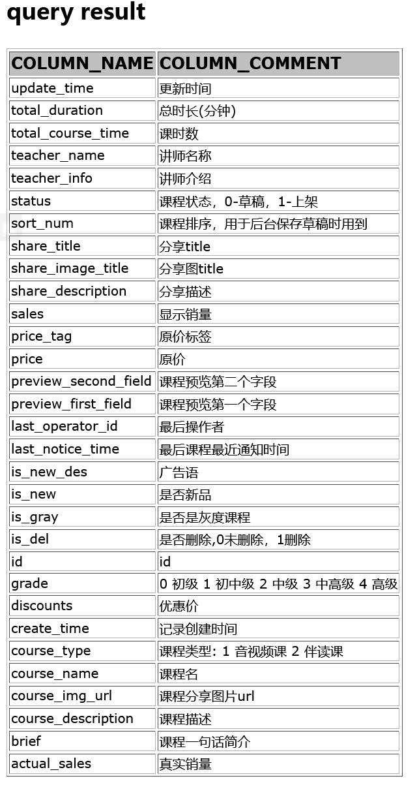
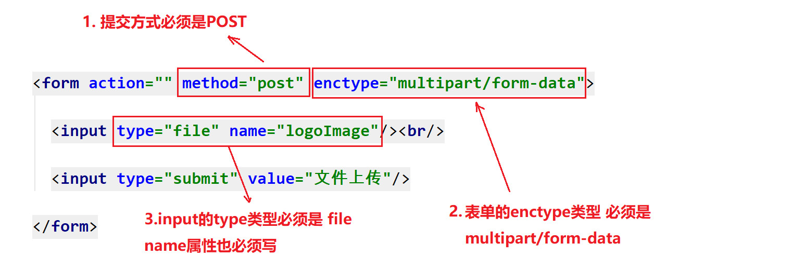
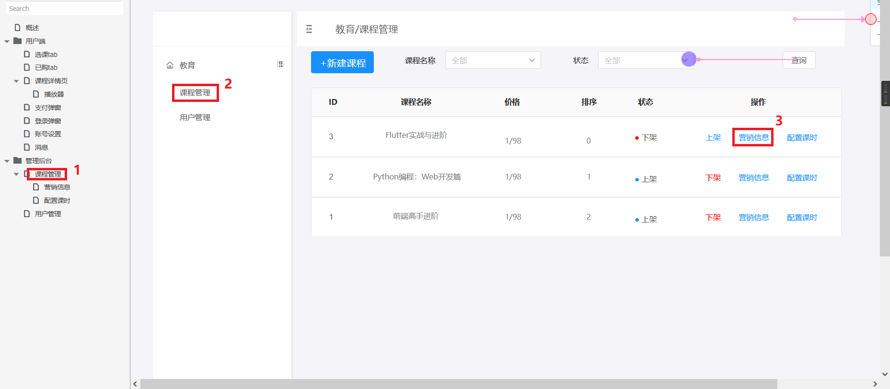

# 第02章 课程管理模块开发01

[toc]

## 一. 开发流程

### 1.1 需求分析

 

### 1.2 数据库表分析

这里展示的是我们需要使用的部分表字段

 

### 1.3 实体类设计

根据数据库中的Course表,对应创建 Course.java

 

#### 1.3.1 FastJson的注解在实体类中的应用

==使用 @JSONField(ordinal = int类型的值) ,  指定排序的值,生成JSON时会按照指定顺序进行排序==

==使用 @JSONField(serialize = false) ,排除不需要转换的字段==

==fastjson还会自动排除值为空的字段==

```java
/**
 * 课程类
 * */
@Data
public class Course implements Serializable {

  //使用 JSONField 设置ordinal的值,来对转换成的JSON数据进行排序
  //课程ID
  @JSONField(ordinal = 1)
  private int id;

  //课程名称
  @JSONField(ordinal = 2)
  private String course_name;

  //课程介绍
  @JSONField(ordinal = 3)
  private String brief;

  //讲师名称
  @JSONField(ordinal = 4)
  private String teacher_name;

  //讲师介绍
  @JSONField(ordinal = 5)
  private String teacher_info;

  //课程原价
  @JSONField(ordinal = 6)
  private double price;

  //原价标签
  @JSONField(ordinal = 7)
  private String price_tag;

  //课程优惠价
  @JSONField(ordinal = 8)
  private double discounts;

  //课程概述
  @JSONField(ordinal = 9)
  private String preview_first_field;

  //课程概述第二个字段
  @JSONField(ordinal = 10)
  private String preview_second_field;

  //分享图片url
  @JSONField(ordinal = 11)
  private String course_img_url;

  //分享标题
  @JSONField(ordinal = 12)
  private String share_title;

  //分享描述
  @JSONField(ordinal = 13)
  private String share_description;

  //课程描述
  @JSONField(ordinal = 14)
  private String course_description;

  //排序
  @JSONField(ordinal = 15)
  private int sort_num;

  //课程状态,0-草稿,1-上架
  @JSONField(ordinal = 16)
  private int status;

  //创建时间
  @JSONField(ordinal = 17)
  private String create_time;

  //修改时间
  @JSONField(ordinal = 18)
  private String update_time;

  //是否删除
  @JSONField(ordinal = 19)
  private int isDel;

  @JSONField(ordinal = 20)
  private String share_image_title; //分享图title


  //使用JSONField(serialize = false)排除不需要转换的字段

  @JSONField(serialize = false)
  private int total_course_time; //课时数

  @JSONField(serialize = false)
  private int sales; //显示销量

  @JSONField(serialize = false)
  private int actual_sales; //真实销量

  @JSONField(serialize = false)
  private int is_new; //是否新品

  @JSONField(serialize = false)
  private String is_new_des; //广告语

  @JSONField(serialize = false)
  private int last_operator_id; //最后操作者

  @JSONField(serialize = false)
  private int total_duration; //总时长

  @JSONField(serialize = false)
  private long course_type; //课程类型

  @JSONField(serialize = false)
  private String last_notice_time;  //最后课程最近通知时间

  @JSONField(serialize = false)
  private long is_gray; //是否是灰度课程

  @JSONField(serialize = false)
  private long grade; //级别


}
```


### 1.4 Dao接口及实现类编写

 

```java
/**
 * 课程模块 DAO层接口
 * */
public interface CourseDao {

}
```

```java
/**
 * 课程模块 DAO层实现类
 * */
public class CourseDaoImpl implements CourseDao {

}
```

### 1.5 Service接口及实现类编写

 


```java
/**
 *  课程模块 Service层 接口
 * */
public interface CourseService {
    
}
```

```java
/**
 * 课程管理模块的service层的实现类
 *
 * @author zq007
 * @version V1.0
 * @date 2022/2/3 19:34
 */
@NoArgsConstructor
public class CourseServiceImpl implements CourseService {
    @Getter
    @Setter
    private CourseDao courseDao;

    public CourseServiceImpl(CourseDao courseDao){
        this.courseDao = courseDao;
    }

}
```

### 1.6 CourseServlet编写

CourseServlet 要继承通用的BaseServlet.

```java
@WebServlet(name = "CourseServlet", urlPatterns ={"/course"})
public class CourseServlet extends BaseServlet{

}
```


## 二. 功能1: 查询课程列表信息

### 2.1 需求分析

#### 2.1.1 页面分析: 需要展示哪些数据

 

##### 2.1.1.1 查询`course`表中所有字段的名字以及对应的注释

```mysql
SELECT column_name, column_comment FROM information_schema.`COLUMNS` WHERE table_schema='lagou_edu' AND table_name='course';
```



##### 2.1.1.2 找出要展示的数据

```mysql
select 
    id,/*ID*/
    course_name,/*课程名称*/
    price,/*价格*/
    sort_num,/*排序*/
    status/*状态*/
from course
where is_del = 0;/*逻辑删除状态为未删除*/
```


### 2.2 编写代码

#### 2.2.1 Dao层编写

##### 2.2.1.1 编写BaseDao

```java
/**
 * DAO基类, 有一个数据库连接池成员变量和QueryRunner对象成员变量
 *
 * @author zq007
 * @version V1.0
 * @date 2022/2/3 19:59
 */
@NoArgsConstructor
public abstract class BaseDao {
    /**
     * 数据库连接池
     */
    @Getter
    @Setter
    private DataSource dataSource;

    /**
     * DButils的QueryRunner对象
     */
    @Getter
    @Setter
    private QueryRunner queryRunner;


    public BaseDao(DataSource dataSource) {
        this.dataSource = dataSource;
        queryRunner = new QueryRunner(dataSource);
    }

}
```

##### 2.2.1.2  修改CourseDao,添加 **findCourseList** 方法

```java
public interface CourseDao {
    /**
     * 获取所有课程的信息
     * @return
     */
    List<Course> findCourseList();
}
```

##### 2.2.1.3 在CourseDaoImpl中实现 **findCourseList** 方法

```java
public class CourseDaoImpl extends BaseDao implements CourseDao{
	public CourseDaoImpl() {
    }

    public CourseDaoImpl(DataSource dataSource) {
        super(dataSource);
    }
    /**
     * 获取所有课程的信息
     *
     * @return 获取所有课程的信息
     */
    @Override
    public List<Course> findCourseList() {
        // 1. 编写SQL语句
        // language=MySQL
        String sql = "select \n" +
                "    id,/*ID*/\n" +
                "    course_name,/*课程名称*/\n" +
                "    price,/*价格*/\n" +
                "    sort_num,/*排序*/\n" +
                "    status/*状态*/\n" +
                "from course\n" +
                "where is_del = 0/*逻辑删除状态为未删除*/";
        // 2. 创建QueryRunner对象
        QueryRunner queryRunner = getQueryRunner();
        // 3. 创建一个可以下划线与驼峰命名转换的BeanHandler对象
        GenerousBeanProcessor gbp = new GenerousBeanProcessor();
        BasicRowProcessor brp = new BasicRowProcessor(gbp);
        BeanListHandler<Course> beanListHandler = new BeanListHandler<>(Course.class, brp);
        //4. 执行查找并以JavaBean集合的形式获得结果
        List<Course> query = null;
        try {
            query = queryRunner.query(sql, beanListHandler);
        } catch (SQLException e) {
            e.printStackTrace();
        }
        return query;
    }
}

```

###### 数据库表中的逻辑删除与物理删除

**逻辑删除**

- 逻辑删除的本质是**修改操作**，所谓的逻辑删除其实并不是真正的删除，而是在表中将对应的是否删除标识,做修改操作。比如: 0是未删除，1是删除。在逻辑上数据是被删除的，但数据本身依然存在库中。 

**物理删除** 

- 物理删除就是真正的从数据库中做删除操作了。 

  

#### 2.2.2 Service层编写

##### 2.2.2.1 修改CourseService 添加 **findCourseList** 方法

```java
public interface CourseService {
    /**
     * 获取所有课程的信息
     * @return
     */
    List<Course> findCourseList();
}
```

##### 2.2.2.2 在CourseServiceImpl中实现findCourseList方法

```java
/**
 * 课程管理模块的service层的实现类
 *
 * @author zq007
 * @version V1.0
 * @date 2022/2/3 19:34
 */
@NoArgsConstructor
public class CourseServiceImpl implements CourseService {
    @Getter
    @Setter
    private CourseDao courseDao;

    public CourseServiceImpl(CourseDao courseDao){
        this.courseDao = courseDao;
    }

    /**
     * 获取所有课程的信息
     *
     * @return
     */
    @Override
    public List<Course> findCourseList() {
        return courseDao.findCourseList();
    }
}
```


#### 2.2.3  Servlet编写

##### 2.2.3.1 接口开发规范

​	我们在做的是一个前后端分离项目、需要通过接口文档对接的项目. 所以开发过程中要仔细查看前端所需的api接口和参数字段 

为了严格按照接口进行开发，提高效率，对请求及响应格式进行规范化。 

###### 2.2.3.1.1 开发规范

1. get 请求时，采用`key=value`格式请求，Servlet中可以使用 getParameter() 获取。
2. post请求时有三种数据格式
   1. 第一种:  Json数据 ,jsonl类型的数据, Servlet中使用 fastjson进行解析
   2. 第二种:  提交form表单数据
   3. 第三种:  文件等多部件类型（multipart/form-data）
3. 响应结果统一格式为json

###### 2.2.3.1.2 为什么使用JSON?

> ​	数据格式比较简单, 易于读写, JSON格式能够直接为服务器端代码使用, 大大简化了服务器端和客户端的代码开发量, 但是完成的任务不变, 且易于维护

本项目使用的是 JSON解析工具为阿里巴巴的fastjson, maven工程导入下面的依赖即可.

```xml
		<!--fastjson工具包 -->
        <!-- https://mvnrepository.com/artifact/com.alibaba/fastjson -->
        <dependency>
            <groupId>com.alibaba</groupId>
            <artifactId>fastjson</artifactId>
            <version>1.2.79</version>
        </dependency>


        <dependency>
            <groupId>com.colobu</groupId>
            <artifactId>fastjson-jaxrs-json-provider</artifactId>
            <version>0.3.2</version>
        </dependency>
```


##### 2.2.3.2 接口文档

​	前端的开发基于服务端编写的接口，如果前端人员等待服务端人员将接口开发完毕再去开发前端内容这样做效率是 非常低下的，所以当接口定义完成，可以使用工具生成接口文档，前端人员查看接口文档即可进行前端开发，这样 前端和服务人员并行开发，大大提高了生产效率.

本次开发的接口文档是: `.\第00章 学习资料\10_接口文档\项目接口文档.pdf` 

##### 2.2.3.3 编写CourseServlet

在CourseServlet中添加 **findCourseList**方法

```java
    /**
     * 课程管理模块中的获取所有课程信息的功能
     * @param req
     * @param resp
     */
    public void findCourseList(HttpServletRequest req, HttpServletResponse resp){
        // 1. 接收参数
        // 没有"methodName"之外的参数
        // 2. 业务处理
        CourseDao coureseDao = new CourseDaoImpl(dataSource);
        CourseService courseService = new CourseServiceImpl(coureseDao);
        List<Course> courseList = courseService.findCourseList();
        /*jsonFilter -- 实体类对象转换成json对象时, 可以指定实体类中的哪些字段能够转换成json字符串*/
        SimplePropertyPreFilter jsonFilter = new SimplePropertyPreFilter(Course.class,
                "id","course_name","price","sort_num","status");
        String courseListJson = JSON.toJSONString(courseList, jsonFilter);

        // 3. 响应结果
        try {
            resp.getWriter().println(courseListJson);
        } catch (IOException e) {
            e.printStackTrace();
        }
    }
```


### 2.3 Postman

#### 2.3.1 postMan介绍

Postman是一款功能强大的http接口测试工具，使用postman可以完成http各种请求的功能测试。

官方地址：<https://www.postman.com/downloads/>

安装Postman

#### 2.3.2 Postman使用

1.      打开PostMan后申请一个账号, 使用账号登录
2.      登录后点击`WorkSpace`
        1.      
3.      点击`+`创建一个`Collection`, 重命名为`lagou_edu_home_zq`, 
        1.       右键点击这个`Collection`,  点击`Add Folder`,  生成一个`Folder`, 重命名这个`Folder`为`Course`
                1.      
        2.      右键点击这个`Folder`,  点击`Add Request`, 生成一个`Request`, 重命名这个`Request`为`findCourseList`
                1.      
4.      窗口介绍
        1.      
        2.      


#### 2.3.3 使用postman测试接口 


## 三. 功能2: 多条件查询课程信息

### 3.1 需求分析

1. 根据课程名称和课程状态进行查询

   1. 

2. 要查询的字段

   1. ```mysql
      id,	course_name,price, sort_num, STATUS
      ```

3. 查询条件

   1. ```mysql
      is_del/*0是未删除, 1是删除*/
      course_name/*可以进行模糊查询*/
      statuts/*0是下架, 1是上架*/
      ```


### 3.2 根据条件查询课程信息

#### 3.2.2 Dao层编写

##### 3.2.2.1 CourseDao

```java
    /**
     * 根据课程名称和课程状态查询课程信息, 课程名称可以模糊查询
     * @param courseName
     * @param status 课程状态, 0是上架, 1是下架
     * @return 所有满足条件的课程信息
     */
    List<Course> findCourseListByCourseNameAndStatus(String courseName, String status);
```

##### 3.2.2.2 CourseDaoImpl

```java
    /**
     * 根据课程名称和课程状态查询课程信息, 课程名称可以模糊查询
     *
     * @param courseName
     * @param status     课程状态, 0是上架, 1是下架
     * @return 所有满足条件的课程信息
     */
    @Override
    public List<Course> findCourseListByCourseNameAndStatus(String courseName, String status) {
        // 0. 拼接SQL语句, 填充占位符对应的参数
        StringBuilder sqlSb = new StringBuilder(
                "SELECT id, course_name, price, sort_num, STATUS FROM course WHERE 1 = ? && is_del = 0");
        // 用来存放占位符的参数
        List<Object> paramList = new ArrayList<>();
        // 条件"1 = 1"是为了方便后面直接拼接"&&"语句, 将第二个"1"换成"?"是可以保证当方法的两个
        // 参数的值都为空, 在queryRunner运行query方法时, paramList.toArray()这个参数不会多余
        paramList.add(1);

        if (!EmptyUtils.isEmpty(courseName)) {
            sqlSb.append(" && course_name like concat('%', ?, '%')");
            paramList.add(courseName);
        }

        if (!EmptyUtils.isEmpty(status)) {
            sqlSb.append(" && status = ?");
            paramList.add(Integer.parseInt(status));
        }

        // 1. 编写SQL语句
        // language=MySQL
        String sql = sqlSb.toString();
        // 2. 创建QueryRunner对象
        QueryRunner queryRunner = getQueryRunner();
        // 3. 创建一个可以下划线与驼峰命名转换的BeanHandler对象
        GenerousBeanProcessor gbp = new GenerousBeanProcessor();
        BasicRowProcessor brp = new BasicRowProcessor(gbp);
        BeanListHandler<Course> beanListHandler = new BeanListHandler<>(Course.class, brp);
        //4. 执行查找并以JavaBean集合的形式获得结果
        List<Course> query = null;
        try {
            query = queryRunner.query(sql, beanListHandler, paramList.toArray()
            );
        } catch (SQLException e) {
            e.printStackTrace();
        }
        return query;
    }
```


#### 3.2.3 Service层编写

##### 3.2.3.1 CourseService

```java
/**
     * 根据课程名称和课程状态查询课程信息, 课程名称可以进行模糊查询
     * @param courseName
     * @param status
     * @return
     */
    List<Course> findCourseListByCourseNameAndStatus(String courseName, String status);
```

##### 3.2.3.2 CourseServiceImpl

```java
    /**
     * 根据课程名称和课程状态查询课程信息, 课程名称可以进行模糊查询
     *
     * @param courseName
     * @param status
     * @return
     */
    @Override
    public List<Course> findCourseListByCourseNameAndStatus(String courseName, String status) {
        return courseDao.findCourseListByCourseNameAndStatus(courseName, status);
    }
```


#### 3.2.4 Servlet编写

根据`.\第00章 学习资料\10_接口文档\项目接口文档.pdf`中的`2. 接口2 条件查询课程信息 `中的要求, 在CourseServlet中添加 **findByCourseNameOrStatus**方法

```java
    public void findByCourseNameAndStatus(HttpServletRequest req, HttpServletResponse resp){
        // 1. 接收参数
        String courseName = req.getParameter("course_name");
        String status = req.getParameter("status");
        // 2. 处理业务
        CourseDao courseDao = new CourseDaoImpl(dataSource);
        CourseService courseService = new CourseServiceImpl(courseDao);
        List<Course> courseList = courseService.findCourseListByCourseNameAndStatus(
                courseName, status);
        /*jsonFilter -- 实体类对象转换成json对象时, 可以指定实体类中的哪些字段能够转换成json字符串*/
        SimplePropertyPreFilter filter = new SimplePropertyPreFilter(Course.class,
                "id","course_name","price","sort_num","status");
        String respString = JSON.toJSONString(courseList, filter);
        // 3. 响应结果
        try {
            resp.getWriter().println(respString);
        } catch (IOException e) {
            e.printStackTrace();
        }

    }
```

#### 3.2.5 接口测试

- 查阅`.\第00章 学习资料\10_接口文档\项目接口文档.pdf`中的`2. 接口2 条件查询课程信息 `中的信息, 使用postman进行接口测试.
- 

## 四. 功能3: 新建课程营销信息

### 4.1 需求分析

选择新建课程,对课程营销信息进行录入

 

#### 4.1.1 基本信息

 

#### 4.1.2 销售信息

 

#### 4.1.3 分享信息

  

#### 4.1.4 课程详情

 


### 4.2 Dao层编写

#### 4.2.1 CourseDao

```java
    /**
     * 保存课程营销信息
     * @param course
     * @return
     */
    int saveCourseSaleInfo(Course course);
```

#### 4.2.2 CourseDaoImpl

```java
    /**
     * 保存课程营销信息
     *
     * @param course
     * @return
     */
    @Override
    public int saveCourseSaleInfo(Course course) {
        //1. 编写SQL语句
        // language=MySQL
        String sql = "INSERT INTO course(\n" +
                "course_name,/*名称*/\n" +
                "brief,/*简介*/\n" +
                "teacher_name,/*讲师名称*/\n" +
                "teacher_info,/*讲师介绍*/\n" +
                "preview_first_field,/*课程概述第一个预览字段*/\n" +
                "preview_second_field,/*课程概述第二个预览字段*/\n" +
                "discounts,/*售卖价格*/\n" +
                "price,/*商品原价*/\n" +
                "price_tag,/*活动文案*/\n" +
                "share_image_title,/*分享小图的标题*/\n" +
                "share_title,/*分享标题*/\n" +
                "share_description,/*分享简介*/\n" +
                "course_description,/*课程概述*/\n" +
                "course_img_url,/*课程分享小图的url*/\n" +
                "STATUS,/*课程状态*/\n" +
                "create_time,/*课程创建时间*/\n" +
                "update_time/*课程更新时间*/\n" +
                ")VALUES(?,?,?,?,?,?,?,?,?,?,?,?,?,?,?,?,?);";
        ;
        // 2. 创建QueryRunner
        QueryRunner queryRunner = getQueryRunner();
        // 3. 执行增删改操作
        int result = 0;
        try {
            result = queryRunner.update(sql,
                    course.getCourse_name(), course.getBrief(), course.getTeacher_name(),
                    course.getTeacher_info(), course.getPreview_first_field(),
                    course.getPreview_second_field(), course.getDiscounts(),
                    course.getPrice(), course.getPrice_tag(), course.getShare_image_title(),
                    course.getShare_title(), course.getShare_description(),
                    course.getCourse_description(), course.getCourse_img_url(),
                    course.getStatus(), course.getCreate_time(), course.getUpdate_time());
        } catch (SQLException e) {
            e.printStackTrace();
        }
        return result;

    }
```

### 4.3 Dao层方法测试

```java
    /**
     * 测试{@link CourseDaoImpl#saveCourseSaleInfo(Course)}方法的功能
     */
    @Test
    public void testSaveCourseSaleInfo() {
        Course course = new Course();
        course.setCourse_name("微服务架构demo01");
        course.setBrief("大厂架构师带你一起学demo01");
        course.setTeacher_name("PDD_demo01");
        course.setTeacher_info("技术精湛安全驾驶30年demo01");
        course.setPrice(800.0);
        course.setPrice_tag("先到先得demo01");
        course.setDiscounts(88.8);
        course.setPreview_first_field("共5讲demo01");
        course.setPreview_second_field("每周二更新demo01");
        course.setCourse_img_url("htttps://www.xxx.com/xx.png");
        course.setShare_title("IT修炼之路永无止境demo01");
        course.setShare_description("金牌讲师带你了解最新最牛的技术让你的实力再次进阶!demo01");
        course.setCourse_description("十年编程两茫茫，工期短，需求长。千行代码，Bug何处藏。纵使上线又如何，新 版本，继续忙。黑白颠倒没商量，睡地铺，吃食堂。夜半梦醒，无人在身旁。最怕灯火阑珊时，手机响，心里 慌.demo01");
        course.setStatus(1);
        course.setShare_image_title("hello word_demo01");

        String dateTime = DateTimeUtils.getDateTime();
        course.setCreate_time(dateTime);
        course.setUpdate_time(dateTime);

        int result = courseDao.saveCourseSaleInfo(course);
        System.out.println(result);


    }
```


### 4.4 Service层编写

### 4.4.1 编写枚举类`StatusCode`,设置响应状态码

```java
/**
 * 用来表示不同状态码的枚举类
 *
 * @author zq007
 * @version V1.0
 * @date 2022/2/4 18:06
 */
public enum StatusCode {
    /**
     * 表示消息发送成功的枚举对象
     */
    SUCCESS("success", 0),
    /**
     * 表示消息发送失败的枚举对象
     */
    FAIL("fail",1);

    @Getter
    private final String msg;

    @Getter
    private final int status;

    private StatusCode(String msg, int status){
        this.msg = msg;
        this.status = status;
    }

    /**
     * 将枚举对象转化成Json字符串,格式为: {"msg":"success","status":0}
     * @return
     */
    @Override
    public String toString() {
        JSONObject jsonObject = new JSONObject();
        jsonObject.put("msg",this.getMsg());
        jsonObject.put("status",this.getStatus());
        return jsonObject.toString();
    }

}
```

### 4.4.2 编写ServiceDao

```java
    /**
     * 保存课程营销信息
     * @param course
     * @return  以{"msg":"success","status":0}的格式返回保存结果
     */
    String saveCourseSaleInfo(Course course);
```

#### 4.4.3 编写ServiceDaoImpl

```java
    @Override
    public String saveCourseSaleInfo(Course course) {
        int result = courseDao.saveCourseSaleInfo(course);
        return result > 0 ? StatusCode.SUCCESS.toString() :
                StatusCode.FAIL.toString();
    }
```


### 4.5 文件上传

#### 4.5.1 图片上传分析

在添加课程营销信息的表单中,有一个图片上传项


#### 4.5.2 文件上传介绍

文件上传的实质：文件的拷贝

- 文件上传：从本地将文件拷贝到服务器磁盘上 
  - 客户端:  需要编写文件上传表单
  - 服务端:  需要编写代码用来接收客户端上传的文件


#### 4.5.3 客户端编码

##### 4.5.3.1 文件上传三要素:

- 1.表单提交方式: **post** (get方式提交有大小限制,post没有) 
- 2.表单的`enctype`属性的值必须设置为` multipart/form-data`[^注释1]
  - enctype就是encodetype就是编码类型的意思.
  - multipart/form-data是多部件文件上传 , 指表单数据有多部分构成，既有文本数据，又有文件这种二进制数据的意思。
- 3.表单必须有文件上传项:`<input type="file" name="upload"`, 该项必须要有name属性和值 



[^注释1]: 默认情况下，表单的enctype的值是`application/x-www-form-urlencoded`，不能用于文件上传，只有值是`multipart/form-data`，才能完整的传递文件数据

##### 4.5.3.2 示例

```HTML
<!DOCTYPE html>
<html lang="en" xmlns="http://www.w3.org/1999/html">
<head>
    <meta charset="UTF-8">
    <title>上传文件</title>
</head>
<body>
    <form method="post" enctype="multipart/form-data" action="upload">
        <input type="text" placeholder="名称" name="name"/><br/>
        <input type="text" placeholder="密码" name="password"/><br/>
        <input type="file" name="logo"/><br/>
        <input type="submit" value="上传文件"/>
    </form>
</body>
</html>
```


#### 4.5.4 服务端编码

服务端要接收文件上传的表单数据

##### 4.5.4.1 上传文件, 抓包分析

使用360浏览器进行抓包,谷歌浏览器不方便查看

 

##### 4.5.4.2 服务端获取上传的文件的过程

1. 通过request获取请求体的内容

2. 解析请求体: 多部件上传的特点是,每个input都是一个表单项.

   根据分隔符将请求中所有的内容,切割成数组,数组中的每一个元素 都是一个表单项

3. 遍历数组,分清楚那个是**普通的表单项**, 哪个是**文件上传项**

   如何区分?  ---  判断是否有 filename

4. 获取到普通表单项中的内容,通过属性name获取

5. 获取文件上传项内容

   文件名: filname = aaa.txt

   文件内容: 

6. 使用IO将文件内容,保存到服务器中

#### 4.5.5 FileUpload工具类

##### 4.5.5.1 导入依赖

FileUpload包可以很容易地将文件接收到你的Web应用程序.

IOUtils封装了Java中io的常见操作，比如文件的复制, 使用十分方便 ,需要下载 `commons-io `包 

###### 4.5.5.1.1 IOUtils中常用功能

| 方法                                                         | 说明     |
| ------------------------------------------------------------ | -------- |
| static void copy(InputStream inputStream, OutputStream outputStream) | 复制文件 |


```xml
<!-- https://mvnrepository.com/artifact/commons-fileupload/commons-fileupload -->
<dependency>
    <groupId>commons-fileupload</groupId>
    <artifactId>commons-fileupload</artifactId>
    <version>1.4</version>
</dependency>


<!-- https://mvnrepository.com/artifact/commons-io/commons-io -->
<dependency>
    <groupId>commons-io</groupId>
    <artifactId>commons-io</artifactId>
    <version>2.11.0</version>
</dependency>

```

##### 4.5.5.2 FileUpload 核心类介绍

| 类名                | 介绍                                                         |
| ------------------- | ------------------------------------------------------------ |
| DiskFileItemFactory | 磁盘文件项工厂, 读取文件相关的配置,比如:  缓存的大小 , 临时目录的位置 |
| ServletFileUpload   | 文件上传的一个核心类                                         |
| FileItem            | 代表每一个表单项                                             |

##### 4.5.5.3 文件上传相关API的详解

###### 4.5.5.3.1 ServletFileUpload

| 方法                                                         | 说明                                                         |
| ------------------------------------------------------------ | ------------------------------------------------------------ |
| `static boolean isMultipartContent(HttpServletRequest request)` | 判断该request是否是一个上传了文件的表单                      |
| `List<FileItem> parseRequest(HttpServletRequuest request)`   | 解析request获得该请求里的表单项的集合                        |
| `void setHeaderEncoding(String charset)`                     | 设置表单中上传的 文件的 文件名 的编码方式,(一般设置成"utf-8", 可以避免乱码) |

###### 4.5.5.3.2 FileItem

| 方法                             | 说明                                                      |
| -------------------------------- | --------------------------------------------------------- |
| boolean isFormField()            | 判断是否是普通表单项                                      |
| String getFieldName()            | 获得表单的name属性值                                      |
| String getString(String charset) | 获得表单的value值(charset一般设置成"utf-8", 可以避免乱码) |
| String getName()                 | 获得上传文件的名称                                        |
| InputStream getInputStream()     | 获得上传文件                                              |
| void delete()                    | 删除临时文件                                              |

##### 4. 文件上传后台代码编写

FileUpload使用步骤:

​	1、创建磁盘文件项工厂

​	2、创建文件上传的核心类`ServletFileUpload`的对象

​	3、使用`ServletFileUpload`对象解析request---获得文件项集合

​	4、遍历文件项集合

​	5、判断普通表单项和文件上传项

```java
@WebServlet(name = "FileUploadServlet", urlPatterns = {"/upload"})
public class FileUploadServlet extends HttpServlet {

    private static final long serialVersionUID = 1496612196186899432L;

    @Override
    protected void doGet(HttpServletRequest req, HttpServletResponse resp) throws ServletException, IOException {

        // 1. 创建磁盘文件项工厂
        DiskFileItemFactory diskFileItemFactory = new DiskFileItemFactory();
        // 2. 创建文件上传核心类
        ServletFileUpload servletFileUpload = new ServletFileUpload(diskFileItemFactory);
        // 设置上传文件的文件名的编码, 避免读取文件名时出现乱码
        servletFileUpload.setHeaderEncoding("utf-8");
        // 判断请求是否是一个上传了文件的表单
        if(ServletFileUpload.isMultipartContent(req)){
            try {
                // 3. 解析request, 获取表单项集合
                List<FileItem> fileItemList = servletFileUpload.parseRequest(req);
                // 4. 遍历表单项集合, 获取每一个表单项
                for (FileItem fileItem :
                        fileItemList) {
                    // 5. 判断普通表单项和文件上传项, 进行对应操作
                    if (fileItem.isFormField()) {
                        String name = fileItem.getFieldName();
                        //以指定的编码获取表单项的值, 可以避免乱码
                        String value = fileItem.getString("utf-8");
                        System.out.println(name + " : " + value);
                    } else { // 对包含文件的表单项进行处理
                        //  获取上传文件的输入流
                        InputStream inputStream = fileItem.getInputStream();

                        // 获取项目的部署环境在服务器上硬盘上的路径
                        String realContextPath = this.getServletContext().getRealPath("/");
                        // C:\Apache\tomcat-8.5.68\webapps\lagou_edu_home_zq\
                        String rootPath = realContextPath.substring(0,
                                realContextPath.lastIndexOf("\\", realContextPath.length() - 2));
                        File uploadDir = new File(rootPath + "\\upload");
                        uploadDir.mkdirs();

                        File file = new File(uploadDir,
                                UUIDUtils.generateUUID() + "_" + fileItem.getName());
                        System.out.println(file.getAbsolutePath());
                        // 创建输出流, 用来把上传文件的数据从输出流中拷贝到服务器的硬盘上
                        FileOutputStream fos = new FileOutputStream(file);
                        // 把上传文件的数据从输出流中拷贝到服务器的硬盘上
                        IOUtils.copy(inputStream, fos);
                        // 关闭流
                        CloseUtils.closeResources(fos,inputStream);
                    }
                }

            } catch (Exception e) {
                e.printStackTrace();
            }
        }

    }

    @Override
    protected void doPost(HttpServletRequest req, HttpServletResponse resp) throws ServletException, IOException {
        doGet(req, resp);
    }
}
```


#### 4.5.6 将图片上传到tomcat服务器的`webapps`目录下

##### 4.5.6.1 将项目部署到`webapps`

**将项目部署方式改变为 war模式,就可以把项目部署在tomcat的webapps下**

`Deployment`→`+`→`Artifact..`→`lagou_edu_home_zq`


- IDEA中部署项目的两种方式
  - war模式：将项目以war包的形式上传到tomcat服务器的webapps目录中；
  - war exploded模式：编译后的项目本身是在target目录下, 同时这个项目会被映射到了Tomcat的webaspps目录下

 


##### 4.5.6.2 在webapps中创建upload目录

upload目录专门用来保存上传过来的图片

 

##### 4.5.6.3 修改代码,将图片上传到服务器

- 修改图片的输出路径
  1. 获取到项目的运行目录信息
  2. 截取到webapps的 目录路径
  3. 拼接输出路径,将图片保存到upload

```java
        // 1. 创建磁盘文件项工厂
        DiskFileItemFactory diskFileItemFactory = new DiskFileItemFactory();
        // 2. 创建文件上传核心类
        ServletFileUpload servletFileUpload = new ServletFileUpload(diskFileItemFactory);
		// 设置上传文件的文件名的编码, 避免读取文件名时出现乱码
        servletFileUpload.setHeaderEncoding("utf-8");
        // 判断请求是否是一个上传了文件的表单
        if(ServletFileUpload.isMultipartContent(req)){
            try {
                // 3. 解析request, 获取表单项集合
                List<FileItem> fileItemList = servletFileUpload.parseRequest(req);
                // 4. 遍历表单项集合, 获取每一个表单项
                for (FileItem fileItem :
                        fileItemList) {
                    // 5. 判断普通表单项和文件上传项, 进行对应操作
                    if (fileItem.isFormField()) {
                        String name = fileItem.getFieldName();
                        //以指定的编码获取表单项的值, 可以避免乱码
                        String value = fileItem.getString("utf-8");
                        System.out.println(name + " : " + value);
                    } else { // 对包含文件的表单项进行处理
                        //  获取上传文件的输入流
                        InputStream inputStream = fileItem.getInputStream();

                        // 一.获取项目的部署环境在服务器上硬盘上的路径
                        String realContextPath = this.getServletContext().getRealPath("/");
                        // C:\Apache\tomcat-8.5.68\webapps\lagou_edu_home_zq\
                        // 二.截取到webapps的 目录路径
                        String rootPath = realContextPath.substring(0,
                                realContextPath.lastIndexOf("\\", realContextPath.length() - 2));
                        File uploadDir = new File(rootPath + "\\upload");
                        uploadDir.mkdirs();
						// 三.拼接输出路径,将图片保存到upload
                        File file = new File(uploadDir,
                                UUIDUtils.generateUUID() + "_" + fileItem.getName());
                        System.out.println(file.getAbsolutePath());
                        // 创建输出流, 用来把上传文件的数据从输出流中拷贝到服务器的硬盘上
                        FileOutputStream fos = new FileOutputStream(file);
                        // 把上传文件的数据从输出流中拷贝到服务器的硬盘上
                        IOUtils.copy(inputStream, fos);
                        // 关闭流
                        CloseUtils.closeResources(fos,inputStream);
                    }
                }

            } catch (Exception e) {
                e.printStackTrace();
            }
        }
```


##### 4.5.6.4 页面加载图片

将tomcat作为图片服务器使用时，存储上传的图片后,如果想要图片可以访问,需要在idea中进行配置:

- `Deployment`→`+`→`External Source..`→找到upload文件夹

  - 
  -  

- 上传一张图片到服务器

-  在项目内部页面加载图片

  - ```html
    
    
    ```

- 也可以通过HTTP方式访问

  - <http://localhost:8080/upload/demo01.jpg>
  - <http://localhost:8080/upload//demo01.webp>


### 4.6 BeanUtils工具类

#### 4.6.1 介绍

BeanUtils 是 Apache commons组件的成员之一，主要用于简化JavaBean封装数据的操作。**可以将一个表单提交的所有数据封装到JavaBean中**。

#### 4.6.2 导入依赖

```xml
<!-- https://mvnrepository.com/artifact/commons-beanutils/commons-beanutils -->
<dependency>
    <groupId>commons-beanutils</groupId>
    <artifactId>commons-beanutils</artifactId>
    <version>1.9.4</version>
</dependency>

```

#### 4.6.3 BeanUtils 对象常用静态方法

| 方法                                                         | 描述                                                         |
| ------------------------------------------------------------ | ------------------------------------------------------------ |
| static void populate(Object bean, Map properties)            | 将Map数据封装到指定Javabean中，<br />一般用于将表单的所有数据封装到javabean |
| static void setProperty(Object obj,String name,Object value) | 设置属性值                                                   |
| static String getProperty(Object obj,String name)            | 获得属性值                                                   |

#### 4.6.4 BeanUtils 使用测试

```java
public class TestBeanUtils {

    @Test
    public void test01() throws InvocationTargetException, IllegalAccessException, NoSuchMethodException {

        //1.创建course对象
        Course course = new Course();

        //2.创建Map
        Map<String,Object> map = new HashMap<>();

        //3.向map集合中添加数据, key要与course的属性名保持一致,value的数据类型与course的属性的类型保持一致
        map.put("id",1);
        map.put("course_name","大数据");
        map.put("brief","课程包含所有大数据流行的技术");
        map.put("teacher_name","周星星");
        map.put("teacher_info","非著名演员");

        //将map中的数据封装到 course中
        BeanUtils.populate(course,map);

        System.out.println(course.getId()+" " + course.getCourse_name() +" " +course.getBrief()
        +"   "+course.getTeacher_name()+" " +course.getTeacher_info());

        //设置属性 获取属性
        BeanUtils.setProperty(course,"price",100.0);

        String price = BeanUtils.getProperty(course, "price");

        System.out.println(price);
    }
}
```


### 4.7 Servlet编写

#### 4.7.1 CourseSalesInfoServlet

创建CourseSalesInfoServlet类,继承HttpServlet , 完成保存课程营销信息操作.

**因为上传的表单信息包含二进制文件数据,无法直接通过request直接获取参数,所以不能继承BaseServlet**

```java
@WebServlet(name = "CourseSaleInfoServlet", urlPatterns ={"/courseSaleInfo"})
public class CourseSaleInfoServlet extends HttpServlet{

    private static final long serialVersionUID = 545203547345018070L;

    @Override
    protected void doGet(HttpServletRequest req, HttpServletResponse resp) throws ServletException, IOException {
        // 一. 解析请求数据
        // 请求发送到了这里, 就说明这个请求是一个上传文件的表单
        // 1. 创建磁盘表单项工厂
        DiskFileItemFactory factory = new DiskFileItemFactory();
        // 2. 创建文件上传核心类
        ServletFileUpload servletFileUpload = new ServletFileUpload(factory);
        // 设置上传文件的文件名的编码, 避免读取文件名时出现乱码
        servletFileUpload.setHeaderEncoding("utf-8");
        try {
            // 3. 解析请求, 获取表单项集合
            List<FileItem> fileItems = servletFileUpload.parseRequest(req);
            // 4. 遍历表单项集合
            Map<String,String> map = new HashMap<>();
            for (FileItem fileItem :
                    fileItems) {
                // 5. 判断是普通表单项, 还是含有文件的表单项
                if(fileItem.isFormField()){
                    map.put(fileItem.getFieldName(),
                            fileItem.getString("utf-8"));
                }else{
                    InputStream inputStream = fileItem.getInputStream();

                    String realPath = this.getServletContext().getRealPath("/");
                    String rootPath = realPath.substring(0,
                            realPath.lastIndexOf(req.getContextPath().substring(1)));
                    // req.getContextPath() : "/lagou_edu_home_zq"
                    File uploadDir = new File(rootPath + "upload");
                    if (!uploadDir.exists()){
                        uploadDir.mkdirs();
                    }

                    File file = new File(uploadDir,
                            UUIDUtils.generateUUID() + "_" + fileItem.getName());

                    FileOutputStream fos = new FileOutputStream(file);

                    IOUtils.copy(inputStream,fos);

                    CloseUtils.closeResources(fos, inputStream);

                    map.put("course_img_url",
                            WebConstant.UPLOAD_URL + "/" + file.getName());
                }
            }

            // 二. 业务处理
            Course course = new Course();
            BeanUtils.populate(course,map);
            // 完善course的数据
            course.setStatus(1);
            String nowDateTime = DateTimeUtils.getDateTime();
            course.setCreate_time(nowDateTime);
            course.setUpdate_time(nowDateTime);
            CourseDao courseDao = new CourseDaoImpl(DruidPool.getInstance().getDataSource());
            CourseService courseService = new CourseServiceImpl(courseDao);
            String result = courseService.saveCourseSaleInfo(course);

            // 三. 响应结果
            resp.getWriter().println(result);

        } catch (FileUploadException e) {
            e.printStackTrace();
        } catch (Exception e) {
            e.printStackTrace();
        }
    }

    @Override
    protected void doPost(HttpServletRequest req, HttpServletResponse resp) throws ServletException, IOException {
        doGet(req, resp);
    }
}

```


#### 4.7.2 接口测试

**postman测试上传文件**

- 接口地址填写正确
- 将请求方式设置为POST
- 需要上传文件, 必须设置Headers:  **"key":"Content-Type", "value":"multipart/form-data"** 
  - 
- 点击`Body`, 选择`form-data`, 文件的key可以是任意值, 但必须有, 否则该文件不会被上传
  - 
- 按照`.\第00章 学习资料\10_接口文档项目接口文档.pdf`文件中的`3. 接口3 保存&修改 课程营销信息 `中的要求补全数据


#### 4.7.3 保存图片URL优化

1.在`base`包中创建常量类

```java
public class Constant {
    public static final String ROOT_URL = "http://localhost:8080";
    public static final String UPLOAD_URL = "http://localhost:8080/upload";
}
```

2.拼接图片URL

```java
 //将图片路径进行保存
 map.put("course_img_url",
                            WebConstant.UPLOAD_URL + "/" + file.getName())
```


## 五. 功能4: 修改课程营销信息

### 5.1 需求分析

​	营销信息其实就是课程相关的信息, 操作的依然是 **course** 表. 我们通过点击营销信息按钮,进入到对应的课程营销信息页面,对原有信息进行修改.

 


### 5.2 Dao层编写

1) 通过上面的分析,首先要编写 根据课程ID查询课程信息,进行回显

```java
接口
    //根据课程ID 查询课程信息
    public Course findCourseById(int id);	

实现类
	//根据课程ID 查询课程营销信息
    @Override
    public Course findCourseById(int id) {
        try {
            QueryRunner qr = new QueryRunner(DruidUtils.getDataSource());

            String sql = "SELECT \n" +
                    "id,\n" +
                    "course_name,\n" +
                    "brief,\n" +
                    "teacher_name,\n" +
                    "teacher_info,\n" +
                    "preview_first_field,\n" +
                    "preview_second_field,\n" +
                    "discounts,\n" +
                    "price,\n" +
                    "price_tag,\n" +
                    "course_img_url,\n" +
                    "share_image_title,\n" +
                    "share_title,\n" +
                    "share_description,\n" +
                    "course_description,\n" +
                    "STATUS\n" +
                    "FROM course WHERE id = ?;";

            Course course = qr.query(sql, new BeanHandler<Course>(Course.class), id);
            return course;

        } catch (SQLException e) {
            e.printStackTrace();
            return null;
        }
        
    }
```

```sql
-- 根据ID查询课程信息SQL
SELECT 
id,
course_name,
brief,
teacher_name,
teacher_info,
preview_first_field,
preview_second_field,
discounts,
price,
price_tag,
course_img_url,
share_image_title,
share_title,
share_description,
course_description,
STATUS
FROM course WHERE id = ?;
```

2) 编写修改课程营销信息的方法,将修改写入数据库

```java
接口
    //修改课程营销信息
    public int updateCourseSalesInfo(Course course);

实现类
    //修改课程营销信息
    @Override
    public int updateCourseSalesInfo(Course course) {

        try {
            QueryRunner qr = new QueryRunner(DruidUtils.getDataSource());

            String sql = "UPDATE course SET \n" +
                    "course_name = ?,\n" +
                    "brief = ?,\n" +
                    "teacher_name = ?,\n" +
                    "teacher_info = ?,\n" +
                    "preview_first_field = ?,\n" +
                    "preview_second_field = ?,\n" +
                    "discounts = ?,\n" +
                    "price = ?,\n" +
                    "price_tag = ?,\n" +
                    "share_image_title = ?,\n" +
                    "share_title = ?,\n" +
                    "share_description = ?,\n" +
                    "course_description = ?,\n" +
                    "course_img_url = ?,\n" +
                    "update_time = ?\n" +
                    "WHERE id = ?";

            Object[] param = {course.getCourse_name(),course.getBrief(),course.getTeacher_name(),course.getTeacher_info(),
            course.getPreview_first_field(),course.getPreview_second_field(),course.getDiscounts(),course.getPrice(),course.getPrice_tag(),
            course.getShare_image_title(),course.getShare_title(),course.getShare_description(),course.getCourse_description(),
            course.getCourse_img_url(),course.getUpdate_time(),course.getId()};

            int row  = qr.update(sql, param);
            return row;

        } catch (SQLException e) {
            e.printStackTrace();
            return 0;
        }
        
    }
```

```sql
修改课程
UPDATE course SET 
course_name = ?,
brief = ?,
teacher_name = ?,
teacher_info = ?,
preview_first_field = ?,
preview_second_field = ?,
discounts = ?,
price = ?,
price_tag = ?,
share_image_title = ?,
share_title = ?,
share_description = ?,
course_description = ?,
course_img_url = ?,
update_time = ? 
WHERE id = ?
```

3) 测试


### 5.3 Service层编写

```java
接口
	public Course findCourseById(int id);
	
实现类
 	@Override
    public Course findCourseById(int id) {
        return courseDao.findCourseById(id);
    }
```

```java
接口
	public String updateCourseSalesInfo(Course course);

实现类
	 @Override
    public String updateCourseSalesInfo(Course course)  {

        //调用dao
        int i = courseDao.updateCourseSalesInfo(course);

        //根据插入是否成功,封装对应信息

        if(i > 0){
            //保存成功
            String result = StatusCode.SUCCESS.toString();
            return result;
        }else{
            //保存失败
            String result = StatusCode.FAIL.toString();
            return result;
        }

    }
```

### 5.4 Servlet编写

#### 5.4.1 根据ID查询课程信息

##### 5.4.1.1 CourseServlet

在CourseServlet中, 添加根据ID查询课程信息的功能

```java
	/**
     * 根据课程ID查询课程营销信息
     * */
    public void findCourseById(HttpServletRequest request , HttpServletResponse response){

        try {
            //1.接收参数
            String id = request.getParameter("id");

            //2.业务处理
            CourseService cs = new CourseServiceImpl();
            Course course = cs.findCourseById(Integer.parseInt(id));

            //3.返回结果 响应JSON格式数据
            //使用 SimplePropertyPreFilter,指定要转换为JSON的字段
            SimplePropertyPreFilter filter = new SimplePropertyPreFilter(Course.class,"id","course_name","brief","teacher_name",
                    "teacher_info","preview_first_field","preview_second_field","discounts","price","price_tag","share_image_title","share_title","share_description","course_description");

            String result  = JSON.toJSONString(course, filter);
            response.getWriter().println(result);

        } catch (IOException e) {
            e.printStackTrace();
        }
    }
```

##### 5.4.1.2 接口测试

详见接口文档


#### 5.4.2 修改CourseSalesInfoServlet

##### 5.4.2.1 需求分析

保存营销信息和修改营销信息,访问的是同一个接口,所以在**CourseSalesInfoServlet**中,我们需要进行一下判断

- 携带id 就是修改操作
- 未携带id就是新增操作

##### 5.4.2.2 代码修改

```java 
@WebServlet("/courseSalesInfo")
public class CourseSalesInfoServlet extends HttpServlet {


    /**
     *  保存营销信息
     *      收集表单的数据 封装一个Course实体 将上传图片存到服务器磁盘上
     * */
    @Override
    protected void doGet(HttpServletRequest req, HttpServletResponse resp) throws ServletException, IOException {

        try {
            //1.获取参数,调用FIleUploadUtils,进行文件上传和参数的封装
            Map<String, Object> map = FileUploadUtil.upload(req);

            //2.使用BeanUtils 将map中的数据封装到 Course对象中
            Course course = new Course();
            BeanUtils.populate(course,map);

            //3.业务处理
            if(map.get("id") != null){

                //补全信息 修改时间
                course.setUpdate_time(DateUtils.getDateFormart());

                CourseService cs = new CourseServiceImpl();
                Map<String, String> message = cs.updateSalesInfo(course);

                //4.响应JSON数据
                String result = JSON.toJSONString(message);
                resp.getWriter().println(result);

            }else{

                //补全信息
                course.setCreate_time(DateUtils.getDateFormart());//创建时间
                course.setUpdate_time(DateUtils.getDateFormart());//修改时间
                course.setStatus(0);//状态

                //8.业务处理
                CourseService cs = new CourseServiceImpl();
                Map<String, String> message = cs.saveSalesInfo(course);

                //9.响应JSON数据
                String result = JSON.toJSONString(message);
                resp.getWriter().println(result);
            }

        } catch (Exception e) {
            e.printStackTrace();
        }

    }

    @Override
    protected void doPost(HttpServletRequest req, HttpServletResponse resp) throws ServletException, IOException {
        doGet(req, resp);
    }

}
```

##### 5.4.2.3 接口测试

根据接口文档,进行测试


## 6. 功能五: 修改课程状态

### 6.1 需求分析

1) 数据库中课程状态码为0或者1 ,课程状态，0-草稿(下架)，1-上架 

 


2) 页面分析

 


### 6.2 DAO层编写

```java
接口
	//修改课程状态
    int updateCourseStatus(Course course);

实现类
	//修改课程状态
    @Override
    public int updateCourseStatus(Course course) {

        try {
            QueryRunner qr = new QueryRunner(DruidUtils.getDataSource());

            String sql = "UPDATE course SET STATUS = ? ,update_time = ? WHERE id = ?";

            Object[] param = {course.getStatus(),course.getUpdate_time(),course.getId()};

            int row = qr.update(sql, param);

            return row;
        } catch (SQLException e) {
            e.printStackTrace();
            return 0;
        }
    }
```

### 6.3 Service层编写

```java
接口
	public Map<String,Integer> updateCourseStatus(Course course);

实现类
 	@Override
    public Map<String, Integer> updateCourseStatus(Course course) {

        //调用dao
        int row = courseDao.updateCourseStatus(course);

        Map<String ,Integer> map = new HashMap<>();

        if(row > 0){

            if(course.getStatus() == 0){
                map.put("status",0);
            }else{
                map.put("status",1);
            }
        }

        return map;
    }
```


### 6.4 Servlet编写

在CourseServlet中, 添加**updateCourseStatus**方法

```java
	//修改课程状态
    public void updateCourseStatus(HttpServletRequest request,HttpServletResponse response){

        try {
            //1.获取参数
            String id = request.getParameter("id");

            //2.业务处理
            CourseService cs = new CourseServiceImpl();

            //3.根据课程id 查询课程信息
            Course course = cs.findCourseById(Integer.parseInt(id));

            //4.判断课程信息状态,进行取反设置
            int status = course.getStatus();
            if(status == 0){
                //如果是0 设置为1
                course.setStatus(1);
            }else{
                course.setStatus(0);
            }

            //5.设置更新时间
            course.setUpdate_time(DateUtils.getDateFormart());

            //6.修改状态
            Map<String, Integer> map = cs.updateCourseStatus(course);

            //7.响应结果
            String result = JSON.toJSONString(map);

            response.getWriter().print(result);

        } catch (IOException e) {
            e.printStackTrace();
        }
    }
```

### 6.5 接口测试

查看接口文档,进行测试


### 


