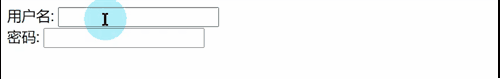

# 第04章 Ajax

[toc]

## 一. Ajax 概述

传统的网页如果需要更新内容，就必须重载整个网页页面。每当用户向服务器发送请求，哪怕只是需要更新一点点的局部内容，服务器都会将整个页面进行刷新。这种方式的缺点是:

- 性能会有所降低 (一点内容，刷新整个页面！)

- 用户的对页面的操作会被中断(整个页面被刷新了)

  

### 1.1 什么是Ajax

Ajax 即"Asynchronous Javascript And XML"，是指一种创建交互式网页应用的网页开发技术。异步的javscript和XML. **Ajax的作用是客户端与服务器进行交互时，可以在【不刷新整个浏览器页面】的情况下，与服务器进行异步通讯的技术**. 

- ==同步通讯:==: 客户端向服务端发送了请求, 客户端就得**停止当前页面的所有操作并放弃当前页面**, 等待服务端接收请求后响应,, 客户端接收到响应后就会跳转到响应的页面
- ==异步通讯==:  客户端向服务端发送了请求, 客户端可以继续当前页面的操作, 同一时间待服务端在接收请求处理业务然后进行响应,, 客户端接收到响应后可以在当前页面继续操作


### 1.2 Ajax 的作用

Ajax  可以使网页实现**异步更新**。这意味着可以在不重新加载整个网页的情况下，对网页的**某部分进行更新（局部更新）**


### 1.3 Ajax的好处

- 减轻服务器负担，按需要获得数据。
- 无刷新更新页面，减少用户的实际和心理的等待时间。
- 只更新部分页面，有效利用带宽
- 主流浏览器都支持Ajax


### 1.4 异步与同步

- 浏览器访问服务器的方式
  - 同步访问: 客户端必须等待服务器端的响应,在等待过程中不能进行其他操作
  - 异步访问: 客户端不需要等待服务的响应,在等待期间,浏览器可以进行其他操作


## 二. JS方式ajax的实现(了解)

JS的ajax：出现最早。使用一个对象XmlHttpRequest对象。专门用于进行ajax请求发送，和响应的接收 .

使用ajax发请求，使用ajax接收响应，使用`js`进行页面局部刷新。

- 缺点:

  - 若使用`js`的AJAX技术，为了实现简单功能，就需要书写大量复杂代码。
  - `js`的AJAX代码，浏览器兼容性比较差。

### 2.1 后端`LoginServlet`

这个`servlet`会从请求中获取参数`username`的值, 然后将这个值响应给浏览器

```java
@WebServlet(name = "LoginServlet", urlPatterns ={"/login"})
public class LoginServlet extends HttpServlet {

    private static final long serialVersionUID = -6149840476654716708L;

    @Override
    protected void doGet(HttpServletRequest req, HttpServletResponse resp) throws ServletException, IOException {

        //1.获取请求数据
        String username = req.getParameter("username");

        //打印 username
        System.out.println(username);
        resp.setContentType("text/text;charset=utf-8");
        resp.setCharacterEncoding("utf-8");
        resp.getWriter().write(username);
    }

    @Override
    protected void doPost(HttpServletRequest req, HttpServletResponse resp) throws ServletException, IOException {
        doGet(req, resp);
    }
}
```


### 2.2 前端示例代码

前端`js`代码,复制即可

**demo.jsp**

```html
<%@ page language="java" contentType="text/html; charset=UTF-8"
         pageEncoding="UTF-8" isELIgnored="false" %>
<!DOCTYPE html>
<html>
<head>
    <meta http-equiv="Content-Type" content="text/html; charset=UTF-8">
    <title>js方式的Ajax的demo</title>

    <script>
        function run() {
            console.log("开始运行")
            //1.创建 核心对象
            var xmlHttp;

            //2.判断浏览器类型
            if (window.XMLHttpRequest) {
                xmlHttp = new XMLHttpRequest();
            } else {
                xmlHttp = new ActiveXObject("MicroSoft.XMLHTTP");
            }


            //3.建立连接
            /*
             * 三个参数:
             *      1.请求方式 get post
             *      2.请求资源的路径
             *      3.是否为异步 是 or 否
             */
            xmlHttp.open("GET", "/hello_maven/login?username=bayonetta", true)
            //4.发送请求
            xmlHttp.send();

            //5.获取响应结果
            /*
             * 什么时候获取响应数据?
             *     在服务器响应成功后获取
             */
            //监听readyState状态改变
            xmlHttp.onreadystatechange=function () {
                //readyState==4 响应已经就绪, status==200 访问成功
                if (xmlHttp.readyState == 4 && xmlHttp.status == 200) {
                    // 获取到响应了
                    var text = xmlHttp.responseText;
                    console.log(text);
                    alert(text);
                }
            }
        }
    </script>
</head>
<body>
<input type="button" value="发送异步请求" onclick="run()"><br>
局部刷新 <input type="text">
</body>
</html>
```


## 三. jQuery框架的ajax

### 3.1 JQuery框架的ajax简介

- jquery是一个优秀的js框架，自然对js原生的ajax进行了封装，封装后的ajax的操 作方法更简洁，功能更强大.

- 与ajax操作相关的JQuery对象的方法在开发中经常使用的有三个: `get`  `post`  `ajax`

- | 方法                                                    | 说明                                                         |
  | ------------------------------------------------------- | ------------------------------------------------------------ |
  | jQuery.get( url [, data ] [, success ] [, dataType ] )  | url<br />data: 请求时携带的数据, **通常为json对象**, 也可以是`key=value`  或者`  {username=’baby’,pwd:666}`<br />success: 成功获取响应后的回调函数, 一般是`function(param){//操作}`, param是响应的数据<br />dataType: 响应的数据类型, 有四种`json` `html` `xml` `text` |
  | jQuery.post( url [, data ] [, success ] [, dataType ] ) | url<br />data: 请求时携带的数据, 请求时携带的数据, **通常为json对象**, 也可以是`key=value`  或者`  {username=’baby’,pwd:666}`<br />success: 成功获取响应后的回调函数, 一般是`function(params){//操作},`param是响应的数据<br />dataType: 响应数据的类型, 有四种`json` `html` `xml` `text` |
  | jQuery.ajax( url [, settings ] )                        |                                                              |
  | jQuery.ajax( settings )                                 |                                                              |


### 3.2 GET请求方式

通过远程 HTTP GET 请求载入信息。这是一个简单的 GET 请求功能，如需复杂的ajax参数设置请使用`$.ajax`

**Get请求方式语法**

`$.get( url [, data ] [, success ] [, dataType ] )`

- 参数1:  `url` 	请求路径
- 参数2:  `data` 	请求时携带的数据, **通常为json对象**, 也可以是`key=value`  或者`  {username=’baby’,pwd:666}`
- 参数3: `success`    成功获取响应后的回调函数, 一般是`function(params){//操作},`param是响应的数据
- 参数4:  `type` 	响应数据的类型, 有四种`json` `html` `xml` `text`

**代码示例**

```js
//JQuery get方式发送异步请求
function run2() {
    //1.参数1 url
    var url = "/login";

    //2.参数2 数据
    var data = {username:"jack"};

    //3.发送get请求
    $.get(url,data,function (param) {
        //data响应回来的内容体
        alert("响应成功! 响应数据: " + param);
    },"text");
}
```


### 3.3 POST请求方式

通过远程 HTTP POST 请求载入信息。这是一个简单的 POST 请求功能，如需复杂的ajax参数设置请使用`$.ajax`

`$.post( url [, data ] [, success ] [, dataType ] )`

- 参数1:  `url` 	请求路径
- 参数2:  `data` 	请求时携带的数据, **通常为json对象**, 也可以是`key=value`  或者`  {username=’baby’,pwd:666}`
- 参数3: `success`  成功获取响应后的回调函数, 一般是`function(params){//操作},`param是响应的数据
- 参数4:  `type` 	响应数据的类型, 有四种`json` `html` `xml` `tex

**代码示例**

```js
//JQuery post方式发送异步请求
function run3() {
    //1.参数1 url
    var url = "/login";

    //2.参数2 数据
    var data = {username:"lucy"};

    //3.发送get请求
    $.post(url,data,function (param) {
    	//data响应回来的内容体
    	alert("响应成功! 响应数据: " + param);
    },"text");
}
```


### 3.4 Ajax请求方式

`$.ajax()`方法可以更加详细的设置底层的参数。该方法通常用于其他方法不能完成的请求。

### 3.4.1 ajax请求方式语法:

- **方式1:  $.ajax({[settings]})**
- **方式2: $.ajax({})**
- **方式3: $.ajax( url [ , settings] )**

settings是一个js字面量形式的对象，格式是键值对`{name1:value1,name2:value2}`，常用的name属性名如下：

| name属性名   | value值                                                      |
| ------------ | ------------------------------------------------------------ |
| url          | 请求路径                                                     |
| async        | true --- 异步通讯<br />false --- 同步通讯                    |
| type         | 请求方式, `"post"`或者`"get"`                                |
| `data`       | 请求中携带的数据, 一般是个json对象<br />例如: {username : "honoka" , password : "123456"} |
| Content-Type | `post`请求时, 必须有着这个键值对, 可取值`"application/x-www-form-urlencoded"`  `"application/json;charset=utf-8"`  `"multipart/form-data"`<br />当取值`""application/json;charset=utf-8""`, 请求携带的数据是json格式的字符串, 所以`data`的值必须是json格式的字符串, 可以使用`JSON.stringify(json对象)`方法将json对象转换成json格式的字符串 |
| dataType     | 响应数据的类型, `"text"`  `"html"`  `"json"  `  `"xml"`      |
| success      | 获取响应成功时的回调函数, 一般是`function(param){...}`, `param`是相应的数据 |
| error        | 获取响应失败时的回调函数, 一般是`function(){}`               |


**代码示例**

```js
//Ajax方式 发送请求
function run4() {
 	$.ajax({
	 	url:"/login",
 		async:true, //是否异步
 		data:{username:"tom"},
 		type:"POST", //请求方式
 		dataType:"text", //返回数据的数据类型
 		success:function (param) {
 			alert("响应成功!! " + param)
 		},
 		error:function () {
 			alert("响应失败!!")
 		}
 	});
}
```

### 3.5 案例: 检测用户名是否已经被注册

#### 3.5.1 需求分析



- 用户输入用户名,鼠标移除后, 对用户名进行判断,提示用户名是否可用

#### 3.5.2 代码编写

##### 3.5.2.1 步骤

1. 准备Servlet ,对用户名进行校验,并返回结果(是否可用)
2. 为用户名输入框, 绑定失去焦点事件
3. 进行异步请求,获取响应结果
4. 根据结果,动态添加 HTML代码

##### 3.5.2.2 后台Servlet

```java
@WebServlet(name = "CheckNameServlet", urlPatterns ={"/checkName"})
public class CheckNameServlet extends HttpServlet{
    private static final long serialVersionUID = 7125575485985364716L;

    @Override
    protected void doGet(HttpServletRequest req, HttpServletResponse resp) throws ServletException, IOException {
        try {
            // 1. 解析请求
            req.setCharacterEncoding("utf-8");
            String username = req.getParameter("username").trim();
            // 2. 业务处理
            String resqData = null;
            HashMap<String, Object> map = new HashMap<String, Object>();
            if ("nami".equalsIgnoreCase(username)){
                map.put("flag",false);
                map.put("msg","用户名已存在, 不可使用!");
            }else{
                map.put("flag",true);
                map.put("msg","用户名可以使用");
            }

            String respData = JSON.toJSONString(map);

            //3. 进行响应
            resp.getWriter().write(respData);
        } catch (UnsupportedEncodingException e) {
            e.printStackTrace();
        }
    }

    @Override
    protected void doPost(HttpServletRequest req, HttpServletResponse resp) throws ServletException, IOException {
        doGet(req, resp);
    }
}
```

##### 2.5.2.3 前台JSP

```html
<%@ page language="java" contentType="text/html; charset=UTF-8" pageEncoding="UTF-8" %>
<!DOCTYPE html>
<html>
<head>
    <meta http-equiv="Content-Type" content="text/html; charset=UTF-8">
    <title>注册页面</title>
    <script src="https://code.jquery.com/jquery-3.6.0.min.js" integrity="sha256-/xUj+3OJU5yExlq6GSYGSHk7tPXikynS7ogEvDej/m4=" crossorigin="anonymous"></script>
    <script>
        $(function () {
            $("#msg").hide();
            $("#username").blur(function () {
                var name = $(this).val().trim();
                console.log("${pageContext.request.contextPath}/checkName");
                if (name == null || name.length === 0){
                    $("#msg").hide();
                }else{
                    $.ajax({
                        url : "${pageContext.request.contextPath}/checkName",
                        method : "GET",
                        data : { username : name },
                        dataType : "json",
                        success : function (data) {
                            console.log(data);
                            console.log(data.msg);
                            $("#msg").text(data.msg).show();
                        },
                        error : function () {
                            $("#msg").text("").hide();
                            alert("请求处理失败");
                        }

                    });
                }
            })
        });
    </script>
</head>
<body>
    <form method="POST" action="#">
        用户名: <input type="text" id="username" name="username"/><span id="msg" style="color:red ; font-size: 1em">吃了吗</span><br/>
        密码: <input type="text">
    </form>
</body>
</html>
```