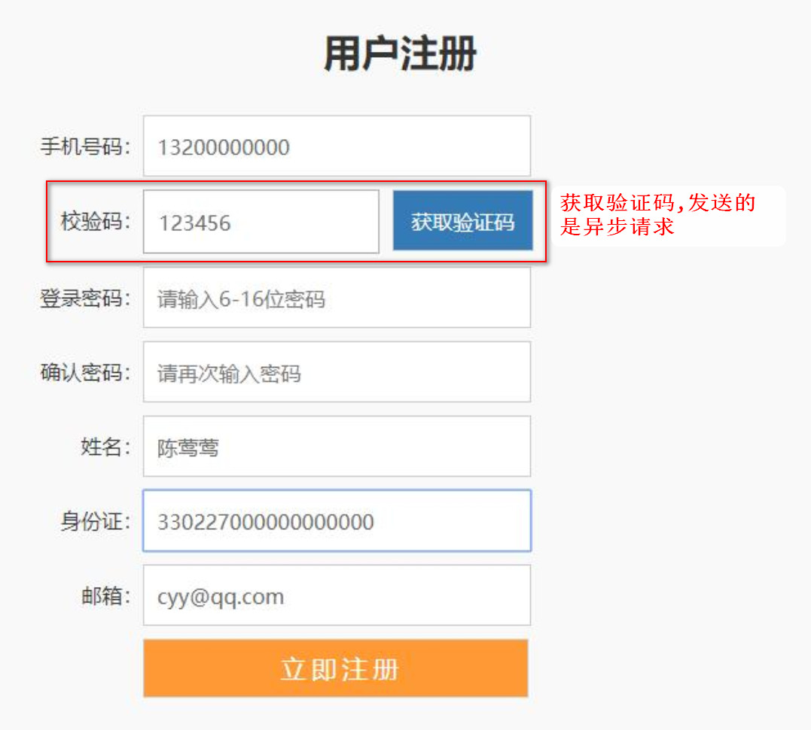
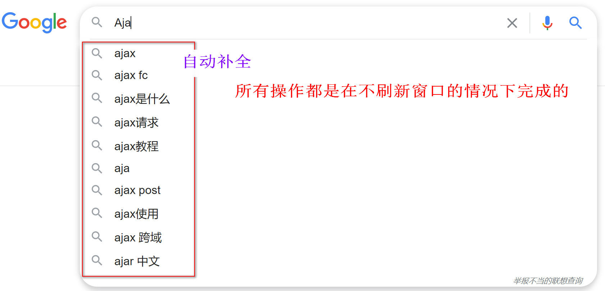

# 第04章 Ajax

[toc]

## 一. Ajax 概述

传统的网页如果需要更新内容，就必须重载整个网页页面。每当用户向服务器发送请求，哪怕只是需要更新一点点的局部内容，服务器都会将整个页面进行刷新。这种方式的缺点是:

- 性能会有所降低 (一点内容，刷新整个页面！)

- 用户的对页面的操作会被中断(整个页面被刷新了)

  

### 1.1 什么是Ajax

Ajax 即"Asynchronous Javascript And XML"，是指一种创建交互式网页应用的网页开发技术。异步的javscript和XML. **Ajax的作用是客户端与服务器进行交互时，可以在【不刷新整个浏览器页面】的情况下，与服务器进行异步通讯的技术**. 

- ==同步通讯:==: 客户端向服务端发送了请求, 客户端就得**停止当前页面的所有操作并放弃当前页面**, 等待服务端接收请求后响应,, 客户端接收到响应后就会跳转到响应的页面
- ==异步通讯==:  客户端向服务端发送了请求, 客户端可以继续当前页面的操作, 同一时间待服务端在接收请求处理业务然后进行响应,, 客户端接收到响应后可以在当前页面继续操作




### 1.2 Ajax 的作用

Ajax  可以使网页实现**异步更新**。这意味着可以在不重新加载整个网页的情况下，对网页的**某部分进行更新（局部更新）**



### 1.3 Ajax的好处

- 减轻服务器负担，按需要获得数据。
- 无刷新更新页面，减少用户的实际和心理的等待时间。
- 只更新部分页面，有效利用带宽
- 主流浏览器都支持Ajax


### 1.4 异步与同步

- 浏览器访问服务器的方式
  - 同步访问: 客户端必须等待服务器端的响应,在等待过程中不能进行其他操作
  - 异步访问: 客户端不需要等待服务的响应,在等待期间,浏览器可以进行其他操作


## 二. JS方式ajax的实现(了解)

JS的ajax：出现最早。使用一个对象XmlHttpRequest对象。专门用于进行ajax请求发送，和响应的接收 .

使用ajax发请求，使用ajax接收响应，使用`js`进行页面局部刷新。

- 缺点:

  - 若使用`js`的AJAX技术，为了实现简单功能，就需要书写大量复杂代码。
  - `js`的AJAX代码，浏览器兼容性比较差。


### 2.1 前端示例代码

前端`js`代码,复制即可

**login.jsp**

```html
<%@ page language="java" contentType="text/html; charset=UTF-8" pageEncoding="UTF-8" isELIgnored="false" %>
<!DOCTYPE html>
<html>
<head>
    <meta http-equiv="Content-Type" content="text/html; charset=UTF-8">
    <title>new jsp</title>

    <script>
        function run() {
            //1.创建 核心对象
            var xmlhttp;

            //2.判断浏览器类型
            if (window.XMLHttpRequest) {
                xmlhttp=new XMLHttpRequest();
            } else {
                xmlhttp=new ActiveXObject("Microsoft.XMLHTTP");
            }


            //3.建立连接
            /**
             * 三个参数:
             *      1.请求方式 get post
             *      2.请求资源的路径
             *      3.是否为异步 是 or 否
             */
            xmlhttp.open("GET","/login?username=tom",true);

            //4.发送请求
            xmlhttp.send();

            //5.获取响应结果
            /**
             * 什么时候获取响应数据?
             *      在服务器响应成功后获取
             */
            //监听readyState状态改变
            xmlhttp.onreadystatechange=function() {
                //readyState==4 响应已经就绪, 200 访问成功
                if (xmlhttp.readyState==4 && xmlhttp.status==200) {
                    //获取响应数据
                    var text = xmlhttp.responseText;
                    alert(text);
                }
            }
        }
    </script>
</head>
<body>
    <input type="button" value="发送异步请求" onclick="run()"><br>
    局部刷新 <input type="text">
</body>
</html>
```


### 2.3 后端servlet代码

```java
@WebServlet("/login")
public class LoginServlet extends HttpServlet {

    @Override
    protected void doGet(HttpServletRequest req, HttpServletResponse resp) throws ServletException, IOException {

        //1.获取请求数据
        String username = req.getParameter("username");

        //打印 username
        System.out.println(username);
        resp.getWriter().write(username);
    }

    @Override
    protected void doPost(HttpServletRequest req, HttpServletResponse resp) throws ServletException, IOException {
        doGet(req, resp);
    }
}
```

## 三. jQuery框架的ajax

### 3.1 JQuery框架的ajax简介

- jquery是一个优秀的js框架，自然对js原生的ajax进行了封装，封装后的ajax的操 作方法更简洁，功能更强大.

- 与ajax操作相关的jquery方法在开发中经常使用的有三: `get`  `post`  `ajax`

### 3.2 GET请求方式

通过远程 HTTP GET 请求载入信息。这是一个简单的 GET 请求功能，如需复杂的ajax参数设置请使用$.ajax

**Get请求方式语法**

**$.get(url,data,callback,type)**

- 参数1:  `url` 	请求路径
- 参数2:  `data` 	请求时携带的数据
  格式:   `key=value`  或者  {username=’baby’,pwd:666}
- 参数3: `callback`  响应成功后的回调函数
- 参数4:  `type` 	响应的数据类型 text html xml json

**代码示例**

```js
//JQuery get方式发送异步请求
function run2() {
    //1.参数1 url
    var url = "/login";

    //2.参数2 数据
    var data = {username:"jack"};

    //3.发送get请求
    $.get(url,data,function (param) {
        //data响应回来的内容体
        alert("响应成功! 响应数据: " + param);
    },"text");
}
```


### 3.3 POST请求方式

通过远程 HTTP POST 请求载入信息。这是一个简单的 POST 请求功能，如需复杂的ajax参数设置请使用$.ajax

Post请求方式语法

	**$.post(url,data,callback,type)** 
	里面的四个参数和get方式是一样, 不一样的是请求方式的不同


**代码示例**

```js
//JQuery post方式发送异步请求
function run3() {
    //1.参数1 url
    var url = "/login";

    //2.参数2 数据
    var data = {username:"lucy"};

    //3.发送get请求
    $.post(url,data,function (param) {
    	//data响应回来的内容体
    	alert("响应成功! 响应数据: " + param);
    },"text");
}
```


### 3.4 Ajax请求方式

$.ajax()方法可以更加详细的设置底层的参数。该方法通常用于其他方法不能完成的请求。

ajax请求方式语法:

- **方式1:  jQuery.ajax({[settings]})**
- **方式2: $.ajax({})**

settings是一个js字面量形式的对象，格式是键值对{name:value,name:value	}，常用的name属性名如下：


**代码示例**

```js
//Ajax方式 发送请求
function run4() {
 	$.ajax({
	 	url:"/login",
 		async:true, //是否异步
 		data:{username:"tom"},
 		type:"POST", //请求方式
 		dataType:"text", //返回数据的数据类型
 		success:function (param) {
 			alert("响应成功!! " + param)
 		},
 		error:function () {
 			alert("响应失败!!")
 		}
 	});
}
```

### 3.5 案例: 检测用户名是否已经被注册

#### 3.5.1 需求分析


- 用户输入用户名,鼠标移除后, 对用户名进行判断,提示用户名是否可用

#### 3.5.2 代码编写

##### 3.5.2.1 步骤

1. 准备Servlet ,对用户名进行校验,并返回结果(是否可用)
2. 为页面输入框,绑定鼠标移除事件
3. 进行异步请求,获取响应结果
4. 根据结果,动态添加 HTML代码

##### 3.5.2.2 后台Servlet

```java
@WebServlet("/checkName")
public class CheckNameServelt extends HttpServlet {

    @Override
    protected void doGet(HttpServletRequest req, HttpServletResponse resp) throws ServletException, IOException {

        req.setCharacterEncoding("utf-8");
        resp.setContentType("text/html;charset=utf-8");

        //获取姓名
        String username = req.getParameter("username");

        //封装数据
        HashMap<String,Object> map = new HashMap<>();

        //判断用户是否存在
        if("tom".equals(username)){
            map.put("flag",true);
            map.put("msg","用户名已经被占用!");
            String data = JSON.toJSONString(map);
            resp.getWriter().print(data);
        }else{
            //用户名未被使用
            map.put("flag",false);
            map.put("msg","用户名可以使用!");
            String data = JSON.toJSONString(map);
            resp.getWriter().print(data);
        }
    }

    @Override
    protected void doPost(HttpServletRequest req, HttpServletResponse resp) throws ServletException, IOException {
        doGet(req, resp);
    }
}
```

##### 2.5.2.3 前台JSP

```html
<%@ page language="java" contentType="text/html; charset=UTF-8" pageEncoding="UTF-8" isELIgnored="false" %>
<!DOCTYPE html>
<html>
<head>
    <meta http-equiv="Content-Type" content="text/html; charset=UTF-8">
    <title>new jsp</title>
    <script typet="text/javascript" src="http://code.jquery.com/jquery-latest.js"></script>

    <script>
        $(function() {
            $("#username").blur(function () {

                //获取用户名
                var name = $(this).val();

                //判断用户名不为空
                if(name != null && name != ""){
                    $.ajax({
                        url:"/checkName",
                        type:"GET",
                        data:{username:name},
                        dataType:"json",
                        success:function (data) {
                            if(data.flag){
                                //设置span内容体
                                $("#spanMsg").html("<font color='red'>" + data.msg+ "</font>");

                            }else if(!data.flag){
                                $("#spanMsg").html("<font color='green'>"+ data.msg + "</font>");
                            }
                        },
                        error:function () {
                            alert("请求处理失败!")
                        }
                    });

                }
            })
        });

    </script>
</head>
<body>
<form action="#" method="post">

    用户名: <input type="text" id="username" name="username" placeholder="请输入用户名">
    <span id="spanMsg" style="color:red"></span><br>

    密码: <input type="text" name="password" placeholder="请输入密码"><br>
</form>

</body>
</html>
```