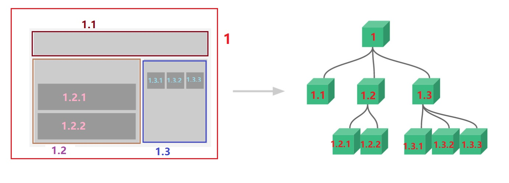

#  第05章 Vue.js

[toc]

## 一. Vue.js介绍

### 1.1 Vue.js是什么?

Vue(读音/vju/, 类似于view)是一套用于构建用户姐买你的渐进式框架, 与其他大型框架不同的是, Vue被设计为可以自底向上逐层应用

Vue的核心库只关注视图层, 不仅易于上手, 还便于与第三方库或既有项目整合, 另一方面, 当与现代化的工具链以及各种支持类库结合使用时, Vue也完全能够为复杂的单页应用提供驱动.

自底向上逐层应用: 作为渐进式框架要实现的目标就是方便项目增量开发(即插即用).

官方网站: <https://v3.cn.vuejs.org/>, 作者: 尤雨溪

### 1.2 为什么使用Vue

1. 声明时渲染: 前后端分离是未来趋势
2. 渐进式框架: 适用于各种业务需求
3. 简单易学: 国人开发,中文文档, 不存在语言障碍, 易于理解和学习

## 二. Vue.js基础

### 2.1 Vue.js的使用

- 暂时先学习`vue2`版本, 等有了基础再学习`vue3`版本

- 在html页面使用script引入vue.js的库即可使用

  - 引入远程`vue.js`
  
    - ```html
      
      ```
  <script src="https://cdn.jsdelivr.net/npm/vue@2.6.14/dist/vue.min.js"></script>
      ```
  
    - 注意: **不要用**`https://unpkg.com/browse/vue@2.6.14/dist/vue.min.js`, 这个js文件大概率会出问题, 有可能无法正常使用
    
  - 引入本地`vue.js`,(需要先下载到本地)
  
    - ```html
      <script src="../lib/js/vue.min.js"
      ```
  
- **Vue-CLI脚手架** : 使用vue.js提供的CLI脚手架可以很方便地创建vue.js工程雏形

### 2.2 入门提示

创建一个vue基础目录, 并在目录下创建`01-vue入门程序.html`文件

代码编写步骤:

1. 创建html文件, 引入vue.js
2. 定义 `app div`, 此区域作为vue的接管区域
3. 定义`Vue`实例, (注意Vue实例是Vue类型的一种对象, **不是**json类型的对象)
4. 接管app区域
5. 定义`model`(数据对性)
6. 在app中显示数据

```html
<!DOCTYPE html>
<html lang="en">
  <head>
    <meta charset="UTF-8" />
    <meta http-equiv="X-UA-Compatible" content="IE=edge" />
    <meta name="viewport" content="width=device-width, initial-scale=1.0" />
    <title>01-vue入门程序</title>
  </head>
  <!-- 1.创建html文件, 引入vue.js-->
  <script src="../lib/js/vue.min.js"></script>
  <body>
    <!-- 2. 定义app div区域, 此区域作为vue的接管区域-->
    <div id="app">
      <!--6.在app中展示数据-->
      {{name}}
    </div>
  </body>
  <script>
    // 3. 定义vue实例
    var vm = new Vue({
      // 4. 接管app区域
      el: "#app",
      // 5. 定义model(数据对象)
      data: { name: "蒂法" },
    });
  </script>
</html>

```

#### 2.2.1 `{{}}` : 插值表达式

##### 2.2.1.1 作用

- 插值表达式是一个表达式, 这个表达式可以调用**vue实例中**定义的数据`data对象中的属性`
- 这个**表达式里**可以调用`data对象`里的多个属性进行运算, ==最终的运算结果会显示在页面上==

##### 2.2.1.2 使用方法

- 只能作为**节点的文本内容**来使用
- **不能作为节点属性的值**, 因为此时它只是一个普通的字符串, 而非插值表达式
- 插值表达式实际是对`Model`中的对应属性进行调用, 这些属性是可以进行数学运算或者字符串拼接
- 插值表达式内可以调用`Model`中的多个属性进行数学运算或者字符串拼接, 只要最终的结果是个可输出文本就行了

#### 2.2.2 `el` : 挂载点

##### 2.2.2.1 el的值

el的值等同于Jquery中的选择器, 可通过各种选择器指向对应的节点, **这里建议只是用id选择器**, el的值可以跟`<body>`元素下的所有元素关联, 但时建议选用`<div>`

##### 2.2.2.2 作用

定义Vue实例挂载的元素节点, 表示该Vue实例接管对应的区域

##### 2.2.2.3 作用范围

Vue实例会管理el所表示的元素, 包括其内部元素

#### 2.2.3 `data`: 数据对象

1. vue实例中用到的数据定义在data对象中
2. data的值是一个json对象

### 2.3 MVVM模式

#### 2.3.1 MVVM模式介绍

- MVVM是Model-View-ViewModel的缩写, 它是一种基于前端开发的架构模式
- MUUM模式将页面, 分层了`M`、`v`、`VM`三中结构, 解释为:
  - `Model` : 负责数据存储
  - `View` : 负责页面展示, 展示相关数据
  - `ViewModel` : 将`Model`和`View`关联起来, 并负责业务逻辑处理(比如Ajax请求等), 对`Model`中的数据进行加工后交给`View`来展示

```html
<!DOCTYPE html>
<html lang="en">
  <head>
    <meta charset="UTF-8" />
    <meta http-equiv="X-UA-Compatible" content="IE=edge" />
    <meta name="viewport" content="width=device-width, initial-scale=1.0" />
    <title>01-vue入门程序</title>
  </head>
  <script src="../lib/js/vue.min.js"></script>
  <body>
    <!--这是View-->
    <div id="app">
      {{num}}<br />
      <input type="button" @click="run" value="点一下" />
    </div>
  </body>
  <script>
    // 这是ViewModel
    var vm = new Vue({
      // 将View和Model关联起来
      el: "#app",
      // 这是Model
      data: { num: 1 },
      methods: {
        // 对Model中的数据进行加工后交给View来展示
        run: function () {
          this.num += 1;
        },
      },
    });
  </script>
</html>

```

#### 2.3.2 MVVM模式图示


- 首先, 我们将上图中的`Dom Listener`和`Data Bindings`看作两个工具, 它们是实现双向绑定的关键
  - 从View侧看, ViewModel中的`Dom Listener`工具会帮我们检测页面上DOM元素中的值的变化, 如果有变化, 则更新`Model`中的数据
  - 从`Model`侧看, 当我们更新`Model`中的数据时, `Data Bindings`工具会帮我们更新页面中的DOM元素
- MVVM的思想, 主要是为了让我们的开发更加的方便, 因为MVVM提供了数据的双向绑定

### 2.4 渲染

#### 2.4.1 什么是渲染

渲染其实就是将指定的数据显示在网页对应的位置之上

#### 2.4.2 渲染的两种方式

- 声明式渲染：只告诉程序想要什么结果，如何达成由程序保证，开发者不用关心。不用操作DOM，直接更新数据. ==就像**量子纠缠**, 网页上对应的数据与开发者手里的数据产生了量子纠缠, 开发者手里的数据变了, 网页上对应的数据就会发生改变, 网页上的数据变了, 开发者手里的数据也会发生改变, 而且就算网页上对应的数据的位置改变了, 也影响不了两个数据间的互相影响==

- 命令式渲染：一步一步告诉程序怎么做，能否达成结果取决于开发者的设计。==就像**打座机电话**, 只能由开发者向网页上的指定元素节点打电话, 电话打通了才能向该元素节点安排数据, 或者获取该元素节点里的数据, 开发者不主动打电话询问, 就无法知道元素节点里面数据的变化, 如果元素节点被删除或者位置发生了改变,就会导致销号或者电话号码改变, 那么原来的号码就打不通了, 开发者就得通过新的号码来联系==

##### 1.2 4.3 声明式渲染的好处

比如在vue中，只需定义好展示数据，并把它放在`<div>`中合适的位置。而命令式渲染，如果 DOM 发生变化，js 代码也需要做相应的改变，耦合度很强。且重绘非常耗费性能。JS操作Dom，常常频繁地触发重绘。但是如果把更新 DOM 的操作交给 Vue、React 去做，让 Virtual DOM 发挥作用，可有效提高页面性能。

### 2.5 Vue常用指令

- 根据官网的介绍, 指令是**元素标签**的带有`v-`前缀的特殊属性. 开发者可以通过指令来操作DOM元素. 
- Vue指令的值**实际是个表达式**, 可以调用`ViewModel`里面定义的`data对象`的属性和`methods对象`的属性, 还可以调用这些属性进行运算

#### 2.5.1 `v-text`指令

- 该指令的值是对`Model`中的属性进行调用, 可以只调用1个也可以调用多个, 而且调用的属性可以进行数学运算或者字符串拼接只要最终的结果是个可输出文本就行了

- 这个可输出文本会作为**该标签的文本内容**替换掉该标签下的**所有内容(包括文本内容与子元素)**

```html
<!DOCTYPE html>
<html lang="en">
  <head>
    <meta charset="UTF-8" />
    <meta http-equiv="X-UA-Compatible" content="IE=edge" />
    <meta name="viewport" content="width=device-width, initial-scale=1.0" />
    <title>v-text指令</title>
  </head>
  <script src="../lib/js/vue.min.js"></script>
  <body>
    <div id="app">
      <p>{{message}}娜美</p>
      <p v-text="message">娜美 <a href="https://www.google.com">谷歌搜索</a></p>
      <p v-text="message+1">娜美</p>
      <p v-text="message+url">娜美</p>
      <p v-text="num+1">娜美</p>
    </div>
  </body>
  <script>
    var vm = new Vue({
      el: "#app",
      data: {
        message: "最终幻想7",
        url: "<a href='https://www.google.com'>谷歌搜索</a>",
        num: 8,
      },
    });
  </script>
</html>

```

#### 2.5.2 `v-html`指令

- 该指令的值是对`Model`中的属性进行调用, 可以只调用1个也可以调用多个, 而且调用的属性可以进行数学运算或者字符串拼接只要最终的结果是个可输出文本就行了

- 这个可输出文本会作为**该标签的内容(文本内容和子标签)**替换掉该标签下的**所有内容(包括文本内容与子元素)**

```html
<!DOCTYPE html>
<html lang="en">
  <head>
    <meta charset="UTF-8" />
    <meta http-equiv="X-UA-Compatible" content="IE=edge" />
    <meta name="viewport" content="width=device-width, initial-scale=1.0" />
    <title>v-html指令</title>
  </head>
  <script src="../lib/js/vue.min.js"></script>
  <body>
    <div id="app">
      <p>{{message}}娜美</p>
      <p v-html="message">娜美 <a href="https://www.google.com">谷歌搜索</a></p>
      <p v-html="message+url">
        娜美 <a href="https://www.baidu.com">百度搜索</a>
      </p>
      <p v-html="message+1">娜美</p>
      <p v-html="message+url">娜美</p>
      <p v-html="num+1">娜美</p>
    </div>
  </body>
  <script>
    var vm = new Vue({
      el: "#app",
      data: {
        message: "最终幻想7",
        url: "<a href='https://www.google.com'>谷歌搜索</a>",
        num: 8,
      },
    });
  </script>
</html>

```

#### 2.5.3 `v-on`指令

##### 2.5.3 1 说明

- 监听元素节点的事件, 比如: `v-on:click`, `v-on:`可以简写为`@`, 例如: `@click='方法名'`(监听左键单击事件)
- 事件绑定的处理函数定义在Vue实例的`methods`属性中
- 事件绑定的处理函数也可以定义写在`v-on`指令的值中, 此时这个函数可以直接调用`Model`中的数据

##### 2.5.3.2 Vue实例中的`methods`属性

###### 2.5.3.2.1 作用

是专门用来定义与`v-on`指令监听事件进行绑定的处理函数

###### 2.5.3.2.2 定义规范

- `methods`属性的值是json对象, 该对象中的 各个属性的 函数体中的`this`表示的是作为`Model`的`data对象`, **并且只有通过`this`才能调用到`data对象`中的元素**

  - ```html
    <script>
    	var vm = new Vue({
            el: "#app",
            data: {
                name: "蒂法"
            },
            methods:{
                run: function(){
                    console.log(this.name);
                }
            }
        });
    </script>
    ```

- 处理函数可以没有参数, 也可以有多个参数, 当传入的参数为`$event`时, `$event`就表示当前事件的对象

  - ```html
    <button @click="run()">
        点一下
    </button>
    ```

  - ```html
    <button @click="run("hello","world")">
        点一下
    </button>
    ```

  - ```html
    <button @click="run($event)">
        点一下
    </button>
    ```


###### 2.5.3.2.3 调用规范

- 处理函数没有参数时, 调用时可以不写`()`

  - ```html
    <button @click="run">
        点一下
    </button>
    ```

- 一个事件可以绑定多个处理函数, 调用的函数间用`,`隔开, 每个被调用的函数都必须写`()`,  或者写多个同一事件的指令, 每个指令绑定不同的处理函数

  - ```html
    <button @click="run1(),run2">
              点一下
    </button>
    ```

  - ```html
    <button @click="run1" @click="run2">
              点一下
    </button>
    ```


###### 2.5.3.2.4 示例代码

```html
<!DOCTYPE html>
<html lang="en">
  <head>
    <meta charset="UTF-8" />
    <meta http-equiv="X-UA-Compatible" content="IE=edge" />
    <meta name="viewport" content="width=device-width, initial-scale=1.0" />
    <title>v-on</title>
  </head>
  <script src="../lib/js/vue.min.js"></script>

  <body>
    <div id="app">
      <p>{{desc1}}</p>
      <p>{{desc2}}</p>
      <p>{{desc3}}</p>
      <p>{{desc4}}</p>
      <button @click="run1">run1</button>
      <button @click="run2()">run2</button>
      <button @click="run2(),run3()">run2和run3</button>
      <button @click="run4($event)">run4</button>
    </div>
  </body>
  <script>
    var vm = new Vue({
      el: "#app",
      data: {
        desc1: "desc1",
        count1: 0,
        desc2: "desc2",
        count2: 0,
        desc3: "desc3",
        count3: 0,
        desc4: "desc4",
      },
      methods: {
        run1: function () {
          this.count1++;
          this.desc1 = "第" + this.count1 + "次运行了run1";
        },
        run2: function () {
          this.count2++;
          this.desc2 = "第" + this.count2 + "次运行了run2";
        },
        run3: function () {
          this.count3++;
          this.desc3 = "第" + this.count3 + "次运行了run3";
        },
        run4: function ($event) {
          this.desc4 = $event.type;
        },
      },
    });
  </script>
</html>

```

##### 2.5.3.2 `v-on`指令可以绑定的事件

- v-on这种写法只是提供了便捷的绑定事件方式，并没有改变原生的JS事件，所以所有的原生JS事件都是支持的
- [MDN事件类型一览表](https://developer.mozilla.org/zh-CN/docs/Web/Events)里面展示的事件都是支持的

##### 2.5.3.3 `v-on`指令的事件修饰符

- `.stop`    **阻止**被修饰的事件继续冒泡,  然后执行绑定的处理函数[^注释1]
- `.prevent`    **阻止**被修饰的 事件的 默认处理方式的执行,  比如表单的提交、事件的冒泡传递, 然后执行绑定的处理函数[^注释1]
- `.capture`    **阻止**被修饰的事件继续捕获, 然后执行绑定的处理函数[^注释1]
- `.self`    只有当被修饰的事件是由本元素第一个捕获时, 才执行绑定的处理函数
- `.once`    与被该修饰符修饰的事件 绑定的处理函数只会被执行一次
- `.passive`    会先执行事件的默认处理方式, 比如表单的提交, 事件的冒泡, 当默认处理方式执行完毕后, 再执行绑定的处理函数. 这样处理函数就无法阻止事件的默认处理方式的执行了

```html
<!-- 阻止单击事件继续冒泡 -->
<a @click.stop="doThis"></a>

<!-- 提交事件不再重载页面 -->
<form @submit.prevent="onSubmit"></form>

<!-- 修饰符可以串联 -->
<a @click.stop.prevent="doThat"></a>

<!-- 只有修饰符 -->
<form @submit.prevent></form>

<!-- 添加事件监听器时使用事件捕获模式 -->
<!-- 即内部元素触发的事件先在此处理，然后才交由内部元素进行处理 -->
<div @click.capture="doThis">...</div>

<!-- 只当在 event.target 是当前元素自身时触发处理函数 -->
<!-- 即事件不是从内部元素触发的 -->
<div @click.self="doThat">...</div>

<!-- 滚动事件的默认行为 (即滚动行为) 将会立即触发，   -->
<!-- 而不会等待 `onScroll` 完成，                    -->
<!-- 以防止其中包含 `event.preventDefault()` 的情况  -->
<div @scroll.passive="onScroll">...</div>
```

[^注释1]: 此时处理函数里是无法执行被阻止的默认处理方式的

##### 2.5.3.4 键盘事件及其修饰符

###### 2.5.3.4.1 键盘事件

- keydown    按下任意键的事件
- keypress    按住任意键不动的 事件
- keyup   松开按键的事件

###### 2.5.3.4.2 键盘事件的修饰符

- `.enter`
- `.tab`
- `.delete` (捕获“删除”和“退格”键)
- `.esc`
- `.space`
- `.up`
- `.down`
- `.left`
- `.right`

##### 2.5.3.5 鼠标点击事件及其修饰符

###### 2.5.3.5.1 鼠标点击事件

- click

###### 2.5.3.5.2 鼠标点击事件的修饰符

- `.right`
- `.left`
- `.middle`

#### 2.5.4 计数器案例

##### 2.5.4.1 需求


##### 2.5.4.2 页面准备

- 引入`inputnum.css`样式表

- 页面准备

  - ```html
    <!DOCTYPE html>
    <html lang="en">
      <head>
        <meta charset="UTF-8" />
        <meta http-equiv="X-UA-Compatible" content="IE=edge" />
        <meta name="viewport" content="width=device-width, initial-scale=1.0" />
        <title>计数器</title>
        <!--引入inputNum.css-->
        <link href="../lib/css/inputNum.css" rel="stylesheet" />
      </head>
      <!--引入vue.min.js-->
      <script src="../lib/js/vue.min.js"></script>
      <body>
        <div id="app">
          <button class="btn btn_plus">+</button>
          <span>&nbsp;{{num}}&nbsp;</span>
          <button class="btn btn_minus">-</button>
        </div>
      </body>
      <script>
        var vm = new Vue({
          el: "#app",
          data: {
            num: 0,
          },
          methods: {},
        });
      </script>
    </html>
    
    ```

- 完善代码

  - ```html
    <!DOCTYPE html>
    <html lang="en">
      <head>
        <meta charset="UTF-8" />
        <meta http-equiv="X-UA-Compatible" content="IE=edge" />
        <meta name="viewport" content="width=device-width, initial-scale=1.0" />
        <title>计数器</title>
        <!--引入inputNum.css-->
        <link href="../lib/css/inputNum.css" rel="stylesheet" />
      </head>
      <!--引入vue.min.js-->
      <script src="../lib/js/vue.min.js"></script>
      <body>
        <div id="app">
          <button @click="plus" class="btn btn_plus">+</button>
          <span @click="zero">&nbsp;{{num}}&nbsp;</span>
          <button @click="minus" class="btn btn_minus">-</button>
        </div>
      </body>
      <script>
        var vm = new Vue({
          el: "#app",
          data: {
            num: 0,
          },
          methods: {
            plus: function () {
              this.num++;
            },
            minus: function () {
              this.num--;
            },
            zero: function () {
              this.num = 0;
            },
          },
        });
      </script>
    </html>
    
    ```

#### 2.5.5 `v-show`指令

##### 2.5.5.1 作用

值是布尔类型, 值为true时会隐藏元素, 值为false时会显示元素

- 原理是修改元素css中的display属性, 实现元素的显示或隐藏, 只是元素缩小成一个看不见且不占地方的点了, 该元素节点还是在`dom`中的

##### 2.5.5.2 示例代码

```html
<!DOCTYPE html>
<html lang="en">
  <head>
    <meta charset="UTF-8" />
    <meta http-equiv="X-UA-Compatible" content="IE=edge" />
    <meta name="viewport" content="width=device-width, initial-scale=1.0" />
    <title>v-show指令</title>
  </head>
  <script src="../lib/js/vue.min.js"></script>
  <body>
    <div id="app">
      <br />
       1"
        style="height: 200px"
        src="../lib/img/11_Bowsette HD.jpg"
      /><br />
      <button @click="change1">切换图1的显示状态</button>
      <button @click="change2">切换图2的显示状态</button>
    </div>
  </body>
  <script>
    var vm = new Vue({
      el: "#app",
      data: {
        show: true,
        num: 2,
      },
      methods: {
        change1: function () {
          this.show = !this.show;
        },
        change2: function () {
          this.num = this.num > 1 ? 1 : 2;
        },
      },
    });
  </script>
</html>

```

#### 2.5.6 `v-if`指令

##### 2.5.5.1 作用

值是布尔类型, 值为true时会将元素节点从`dom`中删除, 值为false时会将元素节点创建到`dom`中原来的位置, 以此实现元素的显示与隐藏

- ==频繁切换元素节点的显示与隐藏, 就是用`v-show`指令, 当元素节点只显示一会儿, 然后大部分的时间都隐藏时,  就使用`v-if`指令==

##### 2.5.5.2 示例代码

```html
<!DOCTYPE html>
<html lang="en">
  <head>
    <meta charset="UTF-8" />
    <meta http-equiv="X-UA-Compatible" content="IE=edge" />
    <meta name="viewport" content="width=device-width, initial-scale=1.0" />
    <title>Document</title>
  </head>
  <script src="../lib/js/vue.min.js"></script>
  <body>
    <div id="app">
      <br />
      <button @click="deleteImg">去掉图片</button>
    </div>
  </body>
  <script>
    var vm = new Vue({
      el: "#app",
      data: {
        exist: true,
      },
      methods: {
        deleteImg: function () {
          this.exist = !this.exist;
        },
      },
    });
  </script>
</html>

```


#### 2.5.7 `v-bind`指令

##### 2.5.7.1 说明

作用: 将vue指令与元素节点的属性进行绑定, 使元素节点的属性的值可以作为表达式直接调用`Model`中的属性

##### 2.5.7.2 语法格式

- v-bind: 元素节点的属性名 =  调用`Model`的属性的表达式
- `v-bind`可以去掉, 简写为`:元素节点的属性名 = 调用Model的属性的表达式 `

##### 2.5.7.3 示例代码

```html
<!DOCTYPE html>
<html lang="en">
  <head>
    <meta charset="UTF-8" />
    <meta http-equiv="X-UA-Compatible" content="IE=edge" />
    <meta name="viewport" content="width=device-width, initial-scale=1.0" />
    <title>v-if指令</title>
  </head>
  <script src="../lib/js/vue.min.js"></script>
  <body>
    <div id="app">
      
      
    </div>
  </body>
  <script>
    var vm = new Vue({
      el: "#app",
      data: {
        img1: "../lib/img/19_Chun-Li HD.jpg",
        title1: "春丽",
        img2: "../lib/img/68_Swimsuit Tifa HD2.jpg",
        title2: "蒂法",
        css: "height: 500px",
      },
    });
  </script>
</html>

```

##### 1,2.4.8 `v-for`指令

##### 2.5.8.1 说明

- `v-for`指令的值是`(item, index) in arr`格式的表达式
  - `v-for`指令的值也可以是`item in arr`格式
  - `arr`调用的是作为`Model`的`data对象`中的对应数组
  - `item`是指当前元素节点从`arr`数组中分配到的元素, `item`可以换成其它的单词
  - `index` 是指`item`在`arr`中的索引, `index`是固定写法, 不能换成其他单词
  - 当前元素节点的其他vue指令或者插值表达式都可以调用`item`和`index`
- 作用: 克隆`arr.length-1`份`v-for`指令所在的元素节点**(包括该节点下的子节点)**, 将所有克隆体元素节点依次排列放在母体元素节点的后面, 将数组中的元素依此分配给这些元素节点
- arr中的元素发生变化, 会同步更新`v-for`中调用了`arr`的元素节点上, 因为是响应式的

##### 2.5.8.2 示例代码1

```html
<!DOCTYPE html>
<html lang="en">
  <head>
    <meta charset="UTF-8" />
    <meta http-equiv="X-UA-Compatible" content="IE=edge" />
    <meta name="viewport" content="width=device-width, initial-scale=1.0" />
    <title>v-for指令</title>
  </head>
  <script src="../lib/js/vue.min.js"></script>
  <body>
    <div id="app">
      <ul type="disc">
        <li v-for="(game,index) in games">
          {{index + ". " + game.gameName}}<br />
          <ul type="circle">
            <li v-for="(gameRole, index) in game.gameRoles ">{{gameRole}}</li>
          </ul>
        </li>
      </ul>
    </div>
  </body>
  <script>
    var vm = new Vue({
      el: "#app",
      data: {
        games: [
          {
            gameName: "死或生",
            gameRoles: ["红叶", "穗乃果", "米拉", "不知火舞", "海莲娜"],
          },
          {
            gameName: "最终幻想7",
            gameRoles: ["蒂法", "艾瑞丝", "杰西", "斯嘉莱特"],
          },
          {
            gameName: "守望先锋",
            gameRoles: ["小美", "Mercy", "法老之鹰", "猎空", "黑百合", "黑影"],
          },
        ],
      },
    });
  </script>
</html>
```

##### 2.5.8.3 示例代码2

```html
<!DOCTYPE html>
<html lang="en">
  <head>
    <meta charset="UTF-8" />
    <meta http-equiv="X-UA-Compatible" content="IE=edge" />
    <meta name="viewport" content="width=device-width, initial-scale=1.0" />
    <title>10-v-for指令2</title>
  </head>
  <script src="../lib/js/vue.min.js"></script>
  <body>
    <div id="app">
      
    </div>
  </body>
  <script>
    var vm = new Vue({
      el: "#app",
      data: {
        imgUrls: [
          "../lib/img/360se_picture.gif",
          "../lib/img/75_Vampire widoemaker HD.jpg",
          "../lib/img/71_Thanos HD.jpg",
          "../lib/img/68_Swimsuit Tifa HD2.jpg",
          "../lib/img/xn1guu.webp",
          "../lib/img/62_Supergirl_HD 02.jpg",
          "../lib/img/41_Midnight HD.jpg",
          "../lib/img/Burin (4).gif",
          "../lib/img/24_Elsa_Frozen HD.jpg",
          "../lib/img/27_JIill_valentine HD.jpg",
        ],
      },
    });
  </script>
</html>

```

#### 2.5.9 `v-model`指令

##### 2.5.9.1 说明

- `v-model`指令用来获取和设置表单元素的值
- `v-model`指令取代了表单元素的`value`属性, 并且能够**双向数据绑定**

##### 2.5.9.2 双向数据绑定

- 单向数据绑定: 就是把`Model`绑定到`View`, 当更新`Model`中的数据时,  [1.2.3.2 MVVM模式图示](#1.2.3.2 MVVM模式图示)中所说的`ViewModel`中的`Data Bindings`工具会帮我们更新页面中的DOM元素. 比如`v-text`、`v-html`、`v-bind`、`v-show`、`v-if`、`v-show`指令都是单向数据绑定
- 双向数据绑定: 就是除了具有单向数据绑定的功能外, [1.2.3.2 MVVM模式图示](#1.2.3.2 MVVM模式图示)中所说的`ViewModel`中的`Dom Listener`工具还会帮我们检测页面上DOM元素中的值的变化, 如果有变化, 则更新`Model`中的数据. 比如`v-model`指令就是双向数据绑定
  - 填写表单就是一个最直接的例子。当用户填写表单时，View的状态就被更新了，如果此时MVVM框架可以自动更新Model的状态，那就相当于我们把Model和View做了双向绑定.

##### 2.5.9.3 示例代码

```html
<!DOCTYPE html>
<html lang="en">
  <head>
    <meta charset="UTF-8" />
    <meta http-equiv="X-UA-Compatible" content="IE=edge" />
    <meta name="viewport" content="width=device-width, initial-scale=1.0" />
    <title>v-mode指令</title>
  </head>
  <script src="../lib/js/vue.min.js"></script>
  <body>
    <div id="app">
      <input type="text" v-model="name" placeholder="请输入姓名" />
      <h1>{{name}}</h1>
    </div>
  </body>
  <script>
    var vm = new Vue({
      el: "#app",
      data: {
        name: "",
      },
    });
  </script>
</html>

```

#### 2.5.10 `v-cloak`指令

##### 2.5.10.1 说明

- 作用: 解决插值表达式闪烁问题(即先渲染了插值表达式的源代码, 之后才渲染插值表达式的值)
- 这是因为网络较慢时, 王爷还在加载`Vue.js`, 导致`ViewModel`还未绑定``Model`和`View`建立时, 页面已经开始渲染数据了, 这时就会显示出vue源代码

##### 2.5.10.2 使用方法

- 在`<body>`标签之前添加`<style>`标签J(**注意: 是`style`标签**)

  - ```html
    <style>[v-cloak]{display:none}</style>
    ```

- 在作为`View`的标签上添加属性`v-cloak`

  - ```html
    <div id="app" v-cloak>
        ...
    </div>
    ```


### 2.6 实现简单记事本

#### 2.6.1 功能介绍


#### 2.6.2 开发准备

- 将`index.css`文件复制到`../lib/css`文件夹下
- 复制黏贴`12-记事本案例模板.html`文件中的代码, 在此基础上进行开发

#### 2.6.3 新增内容的功能

-  生成列表结构(`v-for`指令)

- 获取用户输入(`v-model`指令)

- 输入内容,  点击回车后新增数据(`v-on`指令, `@keyup.enter`), 然后将输入框中的内容清空

  ==页面布局不熟悉, 可以打开浏览器, 按`F12`按键打开浏览器的`开发人员工具`, 选择`元素`, 在这里可以审查元素, 从而快速找到与页面中的组件相对应的元素节点==

  

  

#### 2.6.4 删除内容

- 点击`❌`后, 会删除`❌`所在条目的内容(根据索引删除元素)
- 在`methods`中添加一个删除的方法, 使用splice(start, 1)函数进行删除

#### 2.6.5 统计操作

- 统计页面信息的个数, 就是notes数组中元素的个数

#### 2.6.6 清空数据

- 点击`clear`清除所有笔记
- 本质就是清空数组

#### 2.6.7 最终的代码

```html
<!DOCTYPE html>
<html>
  <head>
    <meta http-equiv="content-type" content="text/html; charset=UTF-8" />
    <title>小黑记事本</title>
    <meta http-equiv="content-type" content="text/html; charset=UTF-8" />
    <meta name="robots" content="noindex, nofollow" />
    <meta name="googlebot" content="noindex, nofollow" />
    <meta name="viewport" content="width=device-width, initial-scale=1" />
    <link rel="stylesheet" type="text/css" href="../lib/css/index.css" />
  </head>
  <body>
    <!-- VUE示例接管区域 -->
    <section id="app">
      <!-- 输入框 -->
      <header class="header">
        <h1>VUE记事本</h1>
        <input
          @keyup.enter="addNote"
          v-model="message"
          autofocus="autofocus"
          autocomplete="off"
          placeholder="输入日程"
          class="new-todo"
        />
      </header>

      <!-- 列表区域 -->
      <section class="main">
        <ul class="listview">
          <li v-for="(note, index) in notes" class="todo">
            <div class="view">
              <span class="index">{{index + 1}}.</span> <label>{{note}}</label>
              <button @click="remove(index)" class="destroy"></button>
            </div>
          </li>
        </ul>
      </section>
      <!-- 统计和清空 -->
      <footer class="footer">
        <span class="todo-count">
          <strong>{{notes.length}}</strong> items left
        </span>
        <button @click="clear()" class="clear-completed">Clear</button>
      </footer>
    </section>

    <!-- 开发环境版本，包含了有帮助的命令行警告 -->
    <script src="../lib/js/vue.min.js"></script>
    <script>
      var vm = new Vue({
        el: "#app",
        data: {
          message: "",
          notes: ["王者荣耀", "绝地求生"],
        },
        methods: {
          addNote: function () {
            this.notes.push(this.message);
            this.message = "";
          },

          remove: function (index) {
            this.notes.splice(index, 1);
          },

          clear: function () {
            this.notes = [];
          },
        },
      });
    </script>
  </body>
</html>

```

## 三. `axios`

### 3.1 Ajax回顾

查看同文件夹下的`第04章 Ajax.md`

### 3.2 axios介绍

**Vue**中结合网络数据进行应用的开发

- 目前十分流行的网络请求库, 专门用来进行异步通讯, 其内部封装了ajax, 使用起来比js的ajax和jquery的ajax都要方便, 而且功能更加全面
- axios的作用: 在浏览器中可以帮助我们完成ajax异步请求的发送和响应的接收

==Vue2.0之后, 其作者尤雨溪推荐大家用axios替换JQuery的ajax==

### 3.3 axios入门

#### 3.3.1 导包

- 可以在<https://cdn.jsdelivr.net/npm/axios/dist/>中选择自己需要的版本, 然后把`axios.min.js`下载到本地来使用

- 或者直接使用axios的最新版本的在线地址

  - ```html
    <script src="https://cdn.jsdelivr.net/npm/axios/dist/axios.min.js"></script>
    ```

#### 3.3.2 发送请求和接收响应

##### 3.3.2.1 GET请求方式

`axios.get(url[, config])`

###### 3.3.2.1.1 url介绍

- 可以是绝对路径,
- 也可以是相对路径, 相对路径必须由`/`开头, 会拼接到`baseURL`后面

###### 3.3.2.1.2 config介绍

config是个json对象，可以设置属性`baseURL`、`headers`、`params`、`timeout`、`responseType`等等

- `baseURL:"https://www.zq.com"`    可选，将自动加在 `url` 前面，除非 `url` 是一个绝对 URL  
- `headers:{/*自定义请求头中的键值对*/}`    可选, 自定义请求头中的键值对
- `params:{/*请求参数*/}` 可选, `get`请求的参数
- `timeout: 2000`    可选, 指定请求超时的毫秒数, 
  - 如果请求时间超过 `timeout` 的值，则请求会被中断,
  -  默认值是 `0` (永不超时)
- `responseType:"json"`    可选, 表示浏览器将要响应的数据类型, 
  - 可选的值有` 'arraybuffer'`, `'document'`, `'json'`, `'text'`, `'stream'`, 
  - 默认值是`'json'`

###### 3.3.2.1.3 处理响应与处理错误的方法

- axios进行请求和处理响应以及处理错误时一般使用链式编程

- ```js
  axios.get(url[, config])
  	.then((response) => {
      	//response是请求获取到的响应
      	//response.data是响应中的数据
  	}).catch((error) => {
      	//error是请求错误时抓取到的错误对象
      	//error.message是错误信息
  	});
  ```

- 还可以在then方法与catch方法之间添加一个`then(() => {})`方法, 

  - 这个then方法里的空参回调函数只有在第一个then方法获取到响应并执行完其回调函数里的内容后才会被执行
  - 如果请求出现错误, 那么这个then方法里的空参回调函数就不会被执行

##### 3.3.2.2 POST请求方式

`axios.post(url[, data[, config]])`

###### 3.3.2.2.1 url介绍

- 可以是绝对路径,
- 也可以是相对路径, 相对路径必须由`/`开头, 会拼接到`baseURL`后面

###### 3.3.2.2.2 data介绍

- data是post请求的参数, 可以是`json`对象, 也可以是`FormData`对象, `FormData`对象可以上传文件
- data是FormData对象时, 必须在config的headers中设置`Content-Type`的值为`multipart/form-data;charset=utf-8`

###### 3.3.2.1.3 config介绍

config是个json对象，可以设置属性`baseURL`、`headers`、`timeout`、`responseType`等等

- `baseURL:"https://www.zq.com/"`    可选，将自动加在 `url` 前面，除非 `url` 是一个绝对 URL  

- `headers:{/*自定义请求头中的键值对*/}`    可选, 自定义请求头中的键值对

  - post请求时, headers里面的`Content-Type`的默认值是`application/json`,

  - 如果post请求还上传了文件, 那么`Content-Type`的值就需要改为`Content-Type:"multipart/form-data`

    - ```js
      headers: {
          Content-Type: "multipart/form-data;charset=utf-8"
      }
      ```

- `timeout: 2000`    可选, 指定请求超时的毫秒数, 
  - 如果请求时间超过 `timeout` 的值，则请求会被中断,
  -  默认值是 `0` (永不超时)
  
- `responseType:"json"`    可选, 表示浏览器将要响应的数据类型, 
  - 可选的值有` 'arraybuffer'`, `'document'`, `'json'`, `'text'`, `'stream'`, 
  - 默认值是`'json'`

###### 3.3.2.1.4 处理响应与处理错误的方法

- axios进行请求和处理响应以及处理错误时一般使用链式编程

- ```js
  axios.post(url[data[, config]])
  	.then((response) => {
      	//response是请求获取到的响应
      	//response.data是响应中的数据
  	}).catch((error) => {
      	//error是请求错误时抓取到的错误对象
      	//error.message是错误信息
  	});
  ```

- 还可以在then方法与catch方法之间添加一个`then(() => {})`方法, 

  - 这个then方法里的空参回调函数只有在第一个then方法获取到响应并执行完其回调函数里的内容后才会被执行
  - 如果请求出现错误则这个then方法里的空参回调函数就不会被执行

#### 3.3.3 使用axios测试以下两个接口

##### 3.3.3.1  接口文档

###### 3.3.3.1.1 随机笑话

```text
请求地址: https://autumnfish.cn/api/joke/list
请求方式: get
请求参数: num(整数数字, 用来表示要获取多少条笑话)
响应内容: 随机笑话
```

###### 3.3.3.1.2 用户注册

```text
请求地址: https://autumnfish.cn/api/user/reg
请求方式: post
请求参数: username(字符串,表示用户名)
响应内容: 随机笑话
```

##### 3.3.3.2 示例代码

```html
<!DOCTYPE html>
<html lang="en">
  <head>
    <meta charset="UTF-8" />
    <meta http-equiv="X-UA-Compatible" content="IE=edge" />
    <meta name="viewport" content="width=device-width, initial-scale=1.0" />
    <title>axios接口测试</title>
  </head>
  <!--引入axios库-->
  <script src="../lib/js/axios.min.js"></script>
  <body></body>
  <script>
    axios.get("https://autumnfish.cn/api/joke/list?num=5").then(
      function (response) {
        console.log(response);
        console.log(this);
      },
      function (error) {
        console.log(error);
        console.log(this);
      }
    );

    axios.post("https://autumnfish.cn/api/user/reg", { username: "蒂法" }).then(
      function (response) {
        console.log(response);
        console.log(this);
      },
      function (error) {
        console.log(error);
        console.log(this);
      }
    );
  </script>
</html>

```

#### 3.3.4 获取笑话案例

通过vue+axios完成一个获取笑话的案例

##### 3.3.4.1 需求分析

- 点击按钮, 就会出现一条随机的笑话

##### 3.3.4.2 接口文档

```text
请求地址: https://autumnfish.cn/api/joke
请求方式: get
请求参数: 无
响应内容: 随机
```

##### 3.3.4.3 编写代码

```html
<!DOCTYPE html>
<html lang="en">
  <head>
    <meta charset="UTF-8" />
    <meta http-equiv="X-UA-Compatible" content="IE=edge" />
    <meta name="viewport" content="width=device-width, initial-scale=1.0" />
    <title>获取笑话</title>
  </head>
  <script src="../lib/js/vue.min.js"></script>
  <script src="../lib/js/axios.min.js"></script>
  <body>
    <div id="app">
      <button @click="getJoke">点击获取一个笑话</button><br />
      <h1>{{joke}}</h1>
    </div>
  </body>
  <script>
    var vm = new Vue({
      el: "#app",
      data: {
        joke: "笑口常开",
      },
      methods: {
        getJoke: function () {
          let model = this;
          axios.get("https://autumnfish.cn/api/joke").then(
            function (response) {
              model.joke = response.data;
            },
            function (error) {
              model.joke = "获取笑话失败";
            }
          );
        },
      },
    });
    //console.log(model);
  </script>
</html>

```

#### 3.3.5 天气查询案例

##### 3.3.5.1 需求分析

- 输入框中输入城市, 点击回车(@keyup.enter)
- 获取输入框中的城市(v-model)
- 访问该城市的接口, 获取天气数据(axios)
- 渲染这些数据(v-text)

##### 3.3.5.2 接口文档

```text
请求地址: http://wthrcdn.etouch.cn/weather_mini
请求方式: get
请求参数: city(值是中国城市的汉字)
响应内容: 天气信息
```

##### 3.3.5.3 编写文档

- 将`weather_index.css`文件和`weather_reset.css`文件放到`../lib/css`文件夹下, 将`line.png`和`loading.gif`复制到`../lib/img`文件夹下
- 赋值`天气查询模板`中的代码, 在此基础上进行开发
- 作为一个标准的应用程序, 我们将创建Vue实例的代码抽取到`../lib/js/main.js`文件中

###### 3.3.5.3.1 html文件的代码

```html
<!DOCTYPE html>
<html lang="en">
  <head>
    <meta charset="UTF-8" />
    <meta name="viewport" content="width=device-width, initial-scale=1.0" />
    <meta http-equiv="X-UA-Compatible" content="ie=edge" />
    <title>天气查询</title>
    <link rel="stylesheet" href="../lib/css/weather_index.css" />
    <link rel="stylesheet" href="../lib/css/weather_reset.css" />
  </head>

  <body>
    <div class="wrap" id="app">
      <div class="search_form">
        <div class="logo">天气查询</div>
        <div class="form_group">
          <input
            @keyup.enter="search"
            v-model="city"
            type="text"
            class="input_txt"
            placeholder="请输入要查询的城市"
          />
          <button @click="search" class="input_sub">回车查询</button>
        </div>
      </div>
      <ul class="weather_list">
        <li v-for="weather in weathers">
          <div class="info_type">
            <span class="iconfont">{{weather.type}}</span>
          </div>
          <div class="info_temp">
            <b>{{weather.low}}</b>
            ~
            <b>{{weather.high}}</b>
          </div>
          <div class="info_date"><span>{{weather.date}}</span></div>
        </li>
      </ul>
    </div>
    <!-- 开发环境版本，包含了有帮助的命令行警告 -->
    <script src="../lib/js/vue.min.js"></script>
    <!-- 官网提供的 axios 在线地址 -->
    <script src="../lib/js/axios.min.js"></script>
    <!-- 自己的js -->
    <script src="../lib/js/main.js"></script>
  </body>
</html>

```

###### 3.3.5.3.2 js文件的代码

```js
var vm = new Vue({
  el: "#app",
  data: {
    city: "",
    weathers: [],
  },
  methods: {
    search: function () {
      var model = this;
      axios.get("http://wthrcdn.etouch.cn/weather_mini?city=" + this.city).then(
        function (response) {
          //判断返回数据的状态码, 已确认是否存在这个城市
          if (response.data.status === 1000) {
            model.weathers = response.data.data.forecast;
          } else {
            model.weathers = [];
          }
        },
        function (error) {
          model.weathers = [];
          console.log(error);
        }
      );
    },
  },
});
```

## 四. Vue实例的`computed`计算属性

### 4.1 说明

- 在Vue应用中, `View`中会通过表达式调用`Model`中的数据进行运算, 但是表达式如果过长或者逻辑更为复杂时, `View`就会显得臃肿甚至难以维护和阅读, 比如下面的代码

  - ```html
    <div id="app">
        <!--写在双大括号里的表达式太长了, 不利于阅读-->
        {{text.split(',').reverse().join(',')}}
    </div>
    <!--将这段操作text.split(',').reverse().join(',')放到computed计算属性中的函数中, 这个函数会返回该运算的结果, 表达式只需要调用这个函数就行了-->
    ```

- `computed`中的函数会缓存上次返回值, 当这次调用时, 函数体内调用的`model`中的元素都没有改变时, 函数体就不会被执行, 而是直接返回上次运行的结果

- `computed`中的函数中调用的`model`中的元素发生改变时, 会自动运行函数, 并将结果渲染在对应的`view`上. (**计算属性中的函数是基于它们的响应式依赖[^注1]进行缓存的. 只有在相关响应式依赖[^注1]发生该表示他们才会重新求值**)

[^注1]: 响应式依赖就是该函数从`model`中调用的属性

### 4.2 定义规范

- `computed`属性的值是json对象, 该对象中的 各个属性的 函数体中的`this`表示的是作为`Model`的`data对象`, **并且只有通过`this`才能调用到`data对象`中的元素**
- `computed`中的函数**不能有参数**
- `computed`中的函数**必须有返回值**

### 4.3 调用规范

- 在`View`中被调用时不能写小括号`()`

### 4.4 示例代码

```html
<!DOCTYPE html>
<html lang="en">
  <head>
    <meta charset="UTF-8" />
    <meta http-equiv="X-UA-Compatible" content="IE=edge" />
    <meta name="viewport" content="width=device-width, initial-scale=1.0" />
    <title>01-computed属性</title>
  </head>
  <script src="../lib/js/vue.min.js"></script>
  <!-- <style>
    [v-cloak] {
      display: none;
    }
  </style> -->
  <body>
    <div id="app">
      <h2>a: <input v-model="a" type="text" /></h2>
      <h2>b: <input v-model="b" type="text" /></h2>
      <h2>c: <input v-model="c" type="text" /></h2>
      <h2>c: <input v-model="d" type="text" /></h2>
      <h1>a * b = {{test}}</h1>
    </div>
  </body>
  <script>
    var vue = new Vue({
      el: "#app",
      data: {
        a: "",
        b: "",
        c: "",
        d: "",
      },
      methods: {},
      computed: {
        /*只要data中的a, b, c发生了改变, test就会被执行, 值会同步渲染到view上;
        d发生改变时对本函数没有影响, 因为本函数从未调用过d*/
        test: function () {
          console.log("开始计算了.....");
          console.log(this.c);
          return this.a * this.b;
        },
      },
    });
  </script>
</html>

```

## 五. Vue示例中的`filters`属性(永明过滤器属性)

### 5.1 过滤器的作用

- vue中的过滤器是对即将显示的数据作进一步的筛选加工处理, 然后进行显示, 值得注意的是**过滤器并没有改变`Model`中的数据**, ==只是在表达式的运算结果的基础上产生新的输出数据==

### 5.2 过滤器使用位置

#### 5.2.1 插值表达式中

```html
{{表达式 | filterFunction}}
<!-- 表达式的值作为参数放到filterFunction函数里进行加工处理, 插值表达式的最终的这结果是filterFunction的返回值 -->
```

- `表达式`可以直接调用`model`中的数据进行运算, **表达式的值是要进行加工的数据**
- `filterFunction`是要调用的过滤器函数
- `|`是管道, 表示将表达式的值传给过滤器进行加工处理

#### 5.2.2 `v-bind` `v-text` `v-html`中

```html

<!-- 表达式的值作为参数放到filterFunction函数里进行加工处理, src值的最终的这结果是filterFunction的返回值 -->
```

- `表达式`可以直接调用`model`中的数据进行运算, **表达式的值是要进行加工的数据**
- `filterFunction`是要调用的过滤器函数
- `|`是管道, 表示将表达式的值传给过滤器进行加工处理

### 5.3 定义过滤器

- 作为过滤器的函数**必须有且只能有一个参数,** 且**必须有返回值**
- Vue中过滤器分为局部过滤器与全局过滤器两种
  - 局部过滤器定义在vue实例中, 局部过滤器只能在与该Vue实例绑定的`View`中调用, 
    - 在作为Vue实例的参数--json对象中添加`filters`属性, `filters`属性的值是个json对象, 这个对象的每一个属性都是一个局部过滤器
  - 全局过滤器定义在全局中, 通过`Vue.filter("filterName", function(value){/*函数体*/})`来定义.**全局过滤器可以在所有的`View`中调用**

#### 5.3.1 局部过滤器示例

```html
<!DOCTYPE html>
<html lang="en">
  <head>
    <meta charset="UTF-8" />
    <meta http-equiv="X-UA-Compatible" content="IE=edge" />
    <meta name="viewport" content="width=device-width, initial-scale=1.0" />
    <title>02-局部过滤器</title>
  </head>
  <script src="../lib/js/vue.min.js"></script>
  <body>
    <div id="app">
      <input v-model="price" type="text" placeholder="请输入一个价格" />
      <p>电脑价格: {{price | addUnit}}</p>
    </div>
  </body>
  <script>
    var vm = new Vue({
      el: "#app",
      data: {
        price: "",
      },
      methods: {},
      computed: {},
      filters: {
        addUnit: function (value) {
          console.log("----------------");
          return value.length === 0 ? "" : value + "元";
        },
      },
    });
  </script>
</html>

```

#### 5.3.2 全局过滤器示例

```html
<!DOCTYPE html>
<html lang="en">
  <head>
    <meta charset="UTF-8" />
    <meta http-equiv="X-UA-Compatible" content="IE=edge" />
    <meta name="viewport" content="width=device-width, initial-scale=1.0" />
    <title>全局过滤器</title>
  </head>
  <script src="../lib/js/vue.min.js"></script>
  <body>
    <div id="app">
      <input v-model="name" type="text" placeholder="请输入名字" />
      <p>全名:{{name | addFirstName}}</p>
    </div>
  </body>
  <script>
    Vue.filter("addFirstName", function (value) {
      return value.length === 0 ? "" : value + "· 诺诺罗亚";
    });
    var vm = new Vue({
      el: "#app",
      data: {
        name: "",
      },
    });
  </script>
</html>

```

## 六. Vue示例中的`watch`属性(又名侦听器属性)

### 6.1 侦听器的作用

- `Model`中的数据`a`是根据数据`b`的变化计算出来的, 那么`a`的赋值就定义在侦听器中, 侦听器的参数是`b`的新值和旧值, 在侦听器的函数体中对`a`进行赋值
- `watch`属性的值是json对象, 该对象中的 各个属性的 函数体中的`this`表示的是作为`Model`的`data对象`, **并且只有通过`this`才能调用到`data对象`中的元素**
- **侦听器函数的名字**必须跟**`Model`中被侦听的属性**的名字**相同**, 侦听器函数必须有两个参数, 分别是当被侦听的属性发生变化时的该数据的新值(newValue)和旧值(oldVale)
- 侦听器函数**没有返回值**, 侦听器的函数体中可以对`Model`中的数据进行赋值

### 6.2 侦听器示例

```html
<!DOCTYPE html>
<html lang="en">
  <head>
    <meta charset="UTF-8" />
    <meta http-equiv="X-UA-Compatible" content="IE=edge" />
    <meta name="viewport" content="width=device-width, initial-scale=1.0" />
    <title>04-侦听器</title>
  </head>
  <script src="../lib/js/vue.min.js"></script>
  <body>
    <div id="app">
      名字:
      <input v-model="firstName" type="text" placeholder="请输入名字" /><br />
      姓氏:
      <input v-model="lastName" type="text" placeholder="请输入姓氏" /><br />
      <p>全名: {{fullName}}</p>
    </div>
  </body>
  <script>
    var vm = new Vue({
      el: "#app",
      data: {
        firstName: "",
        lastName: "",
        fullName: "",
      },
      watch: {
        firstName: function (newValue, oldValue) {
          console.log("============");
          this.fullName = newValue + " · " + this.lastName;
        },
        lastName: function (newValue, oldValue) {
          console.log("----------------");
          this.fullName = this.firstName + " · " + newValue;
        },
      },
    });
  </script>
</html>

```

## 七. Component组件

### 7.1 组件介绍

- 组件(Component)可以看作是一种自定义的html元素节点, 该元素节点内封装了可重用的HTML代码. 
- 组件系统让我们可以用独立可复用的小组件来构建大型应用, 几乎任意类型的应用界面都可以抽象为一个组件树.
  - 

### 7.2 Vue的组件(Component)

- Vue的组件有两种: 全局组件和局部组件
- ==Vue的组件只能在跟Vue实例进行了绑定的html元素节点中使用==

#### 7.2.1 全局组件

##### 7.2.1.1 语法格式

```js
Vue.component("组件名", {
    template: "html代码", // 组件的html结构代码, 属于MVVM结构中的view
    data: function(){
        return {
            //Model中的数据
        };
    },
    /*可以简写为:
    data(){
    	return {
    		//Model中的数据
		}
	},*/
    [methods: {},]//[]表示可选参数, 事件的处理方法
    [computed: {},]//[]表示可选参数, 计算属性
	[filters: {},]//[]表示可选参数, 过滤器属性
	[watch: {},]//[]表示可选参数, 侦听器属性
});
```

###### 7.2.1.1.1 语法的注意事项

- 组件名以小写开头, 采用短横线`-`分割命名, 例如:`hello-World`
- 组件中的`data`属性必须是一个无参有返回值的函数, 注意与Vue实例中的data区分
- 在`template`模板中, 有且只能有一个根元素
- ==Vue的组件只能在跟任意Vue实例进行了绑定的html元素节点中使用==

##### 7.2.1.2 示例代码

```html
<!DOCTYPE html>
<html lang="en">
  <head>
    <meta charset="UTF-8" />
    <meta http-equiv="X-UA-Compatible" content="IE=edge" />
    <meta name="viewport" content="width=device-width, initial-scale=1.0" />
    <title>全局组件示例</title>
  </head>
  <!--引入Vue-->
  <script src="../lib/js/vue.min.js"></script>
  <body>
    <!--Vue组件只能在跟Vue实例进行绑定的元素节点中使用-->
    <div id="app">
      <component-demo></component-demo>
    </div>
  </body>
  <script>
    var demo = Vue.component("component-demo", {
      template: "<div>头部组件的html代码<h1 @click='hello'>{{msg}}</h1></div>",
      data: function () {
        return { msg: "hello这里是组件中的data数据" };
      },

      methods: {
        hello: function () {
          alert("嗨, 你好啊!");
        },
      },
    });
    var vm = new Vue({
      el: "#app",
    });
  </script>
</html>

```

#### 7.2.2 局部组件

##### 7.2.2.1 语法格式

```js
new Vue({
    el: "#app",
    components: {
        "组件名": {
            template: "作为模板的html代码",
            data: function(){
                return {
                    //data数据
                }
            },
            [methods: {},]//[]表示可选
        	[computed: {},]//[]表示可选
    		[filters: {},]//[]表示可选
        	{watch: {},}//[]表示可选
        }
    }
});
```

###### 7.2.2.1.1 语法注意事项

- 组件名以小写开头, 采用短横线`-`分割命名, 例如:`hello-World`
- 组件中的`data`属性必须是一个无参有返回值的函数, 注意与Vue实例中的data区分
- 在`template`模板中, 有且只能有一个根元素
- 局部组件定义在Vue实例的`components`属性中, 该属性下**可以定义多个组件**, 这些组件只能在**跟==这个==Vue实例进行了绑定**的html元素节点中使用

##### 7.2.2.2 示例代码

```html
<!DOCTYPE html>
<html lang="en">
  <head>
    <meta charset="UTF-8" />
    <meta http-equiv="X-UA-Compatible" content="IE=edge" />
    <meta name="viewport" content="width=device-width, initial-scale=1.0" />
    <title>06-局部组件的使用</title>
  </head>
  <script src="../lib/js/vue.min.js"></script>
  <body>
    <div id="app">
      <component-demo1></component-demo1>
      <component-demo2></component-demo2>
      <component-demo3></component-demo3>
    </div>
  </body>
  <script>
    var vm = new Vue({
      el: "#app",
      components: {
        "component-demo1": {
          template: "<h1 style='color:red'>{{msg}}</h1>",
          data: function () {
            return {
              msg: "demo1",
            };
          },
        },
        "component-demo2": {
          template: "<h1 style='color:blue'>{{msg}}</h1>",
          data: function () {
            return {
              msg: "demo2",
            };
          },
        },
      },
    });
  </script>
</html>

```

##### 7.2.2.3 组件与组件模板分离

- 由于把html语言写在组件里面很不方便, 也不太好看, 所以将它们分开写
  - 模板必须定义在`<template>`元素节点下
  - 组件中的`template`属性通过**id选择器**与这个`<template>`元素节点联系起来
  - ==`<template>`元素节点下**只能有一个**子元素==
- 浏览器会把html里的定义模板的`<template>`元素节点过滤掉, 该节点的内容是不会在页面中展示

```html
<!DOCTYPE html>
<html lang="en">
  <head>
    <meta charset="UTF-8" />
    <meta http-equiv="X-UA-Compatible" content="IE=edge" />
    <meta name="viewport" content="width=device-width, initial-scale=1.0" />
    <title>组件与模板分离</title>
  </head>
  <script src="../lib/js/vue.min.js"></script>
  <body>
    <div id="app">
      <web-msg></web-msg>
    </div>

    <!--组件<web-msg>的模板-->
    <template id="templateDemo">
      <div>
          <p><button @click="show">{{msg}}</button></p>
      </div>
    </template>
  </body>
  <script>
    var vm = new Vue({
      el: "#app",
      components: {
        "web-msg": {
          template: "#templateDemo",
          data: function () {
            return {
              msg: "点击查询",
            };
          },
          methods: {
            show: function () {
              alert("努力查询中...");
            },
          },
        },
      },
    });
  </script>
</html>

```

## 八. Vue实例的生命周期

### 8.1 生命周期图示


- 每个Vue实例在被创建之前都要经过一些列的初始化过程, 这个初始化过程到Vue实例的创建成功再到这个Vue实例的销毁就是这个Vue实例的生命周期
- 了解生命周期的好处
  - 找Bug
  - 解决需求

### 8.2 钩子函数介绍

#### 8.2.1 钩子函数的定义

一个事件被触发的时候, 在系统级捕获到了事件, 然后执行跟这个事件绑定的函数. 跟这个事件绑定的函数就是钩子函数.

#### 8.2.2 Vue实例生命周期中的钩子函数

- Vue实例生命周期中的钩子函数要在Vue实例的构造参数中进行定义, 一个钩子函数就是构造参数的一个属性
- 钩子函数中可以通过`this.属性名`的方式调用`data` `methods`  `computed`  `filters`  `watch`中的对应属性

| 函数            | 说明                                                         |
| --------------- | ------------------------------------------------------------ |
| beforeCreate()  | 在创建Vue实例之前, 会先执行Vue实例这个方法. 例如: 更新页面前的加载动画就可以放在这个钩子函数里 |
| created()       | Vue实例创建完成, 属性都绑定好了, 但跟Vue实例中的组件的模板还没有在内存中生成. 这时会执行这个钩子函数 |
| beforeMount()   | 组件的模板已经在内存中编辑完成了, **尚未放到**跟Vue实例绑定了的`View`中[^注2], 这时会执行这个钩子函数. |
| mounted()       | 组件中的模板被放到与`Vue`实例绑定了的`View`中, 渲染到了页面上. 这时会执行这个钩子函数. |
| beforeUpdate()  | Vue实例或者组件中的`Model`里面的数据进行了更新, 在这个数据更新之前会先执行这个钩子函数. |
| updated()       | Vue实例或者组件中的`Model`里面的数据进行了更新, 在这个数据更新之后会立刻执行这个钩子函数. |
| beforeDestroy() | Vue实例要销毁了, 在销毁之前会先执行这个钩子函数              |
| destroyed()     | Vue实例在被销毁之后, 会立刻执行这个钩子函数                  |

[^注2]: 就是说此时组件的模板还未进入`DOM`中, 也就不会渲染到页面上了

### 8.3 示例代码

==最好在火狐浏览器中查看效果==

```html
<!DOCTYPE html>
<html lang="en">
  <head>
    <meta charset="UTF-8" />
    <meta http-equiv="X-UA-Compatible" content="IE=edge" />
    <meta name="viewport" content="width=device-width, initial-scale=1.0" />
    <title>钩子函数</title>
  </head>
  <script src="../lib/js/vue.min.js"></script>
  <body>
    <div id="app">
      <h1 style="color: red">这是直接在html中定义的数据</h1>
      <component-demo></component-demo>
    </div>

    <template id="templateDemo">
      <div>
        <h1>{{msg}}</h1>
        <button @click="updateMsg">点击一下, 更新上面的数据</button>
      </div>
    </template>
  </body>
  <script>
    var vm = new Vue({
      el: "#app",
      components: {
        "component-demo": {
          template: "#templateDemo",
          data: function () {
            return {
              msg: "这是在组件中定义的数据",
            };
          },

          methods: {
            updateMsg: function () {
              this.msg = "这是组件中更新后的数据";
            },
          },

          beforeCreate: function () {
            console.log("beforeCreate: msg=" + this.msg);
            alert("将要创建Vue实例了");
          },

          created: function () {
            console.log("created: msg=" + this.msg);
            alert(
              "Vue实例创建完成, 属性都绑定好了, 但跟Vue实例中的组件的模板还没有在内存中生成. 这时会执行这个钩子函数"
            );
          },

          beforeMount: function () {
            console.log("beforeMount: msg=" + this.msg);
            alert(
              "组件的模板已经在内存中编辑完成了, 尚未放到跟Vue实例绑定了的View中 (注2), 这时会执行这个钩子函数. "
            );
          },

          mounted: function () {
            console.log("mounted: msg=" + this.msg);
            alert(
              "组件中的模板被放到与Vue实例绑定了的View中, 渲染到了页面上. 这时会执行这个钩子函数."
            );
          },

          beforeUpdate: function () {
            console.log("beforeUpdate: msg=" + this.msg);
            alert(
              "Vue实例或者组件中的Model里面的数据进行了更新, 在这个数据更新之前会先执行这个钩子函数."
            );
          },

          updated: function () {
            console.log("updated: msg=" + this.msg);
            alert(
              "Vue实例或者组件中的Model里面的数据进行了更新, 在这个数据更新之后会立刻执行这个钩子函数."
            );
          },
        },
      },
    });
  </script>
</html>

```


## 九. Vue Router(Vue路由)

### 9.1 什么是路由

- 在Web开发中, 路由是指根据URL分配到对应的处理程序, 路由允许我们通过不同的URL访问不同的内容.
- 通过`vue-router.js`可以实现多视图单页面web应用(single page web application, 简写为`SPA`), 就是在一张网页里可以切换显示不同的视图
- 

### 9.2 什么是SPA

> 单页面web应用(single page web application, 简写为`SPA`), 就是只有一张web页面的应用, 是加载单个html页面并在用户与应用程程序交互时动态更新该页面的Web应用程序

SPA(单页面Web应用)不存在页面跳转, 它本身只有一个html页面, 我们传统意义上的页面跳转(从一个网页跳转到另一个网页)在`SPA`的概念下转变为了`<body>`内某些元素的替换和更新.

#### 9.2.1 `SPA`单页面Web应用的好处

- 用户操作体验好, 用户不用刷新页面, 整个交互过程都是通过`Ajax`来操作
- 适合前后端分离开发, 服务端提供`http`接口, 前端请求http接口获取数据, 使用js进行客户端渲染

### 9.3 路由相关概念

#### 9.3.1 `vue-router.js`

- 是`Vue`官方推出的路由管理器. 它和`vue.js`的核心深度继承, 让构建`SPA`(单页面web应用)变得易如反掌, `vue-router`就相当于一个管理者, 它来管理`route`(路由)

##### 9.3.2 `vue-router.js`的下载与引入

- `vue-router`的官网地址<https://router.vuejs.org/>, 
- 下载地址是<https://unpkg.com/vue-router/dist/vue-router.js>, 会跳转到最新版本的`vue.js`的下载地址
- 或者是`https://unpkg.com/vue-router@4`, 会跳转到`vue-router.js`第四版的最新版本
- 或者是``https://unpkg.com/vue-router@3`, 会跳转到`vue-router.js`第三版的最新版本

#### 9.3.2 `route`

- `router`相当于路由器, `route`就相当于一条路由, 比如: Home按钮➡home内容, 这是一条路由, News按钮→new内容, 这是另一条内容

#### 9.3.3 `routes`

- 是一组路由, 把上面的每一条路由组合起来, 形成一个数组. [{Home按钮→home内容}, {News按钮→News内容}, {About按钮→about内容}]

#### 9.3.4 `router-link`组件

- `router-link`是Vue中的一个组件, 是一个元素标签,  Vue将路由管理功能封装到了这个标签
- `<router-link>`标签只能在跟Vue实例绑定的`View`中使用
- `<router-link>`标签的文本内容会显示在网页上
- `<router-link>`标签的`to`属性为目标地址, 点击网页上的链接后, 该`to`属性对应的组件就会渲染到本`View`中``<router-view`所在的位置上

#### 9.3.5 `router-view`组件

- 路由导航到指定组件后, 该组件在本`View`中进行渲染的位置
- 一个`View`中只能有一个`<router-view>`标签

### 9.4 示例代码

#### 9.4.1 步骤

- 引入`vue.js`和`vue-router.js`
- 定义路由所需的Vue组件
- 定义路由组`routes`,  路由组是个数组, 每个元素都是一个路由, 每个路由必须有属性`path`(路径)和属性`component`(组件)
- 创建VueRouter实例, 管理路由.
- 创建Vue实例, 只在参数中注入`VueRouter`实例, 然后绑定View

#### 9.4.2 代码

```html
<!DOCTYPE html>
<html lang="en">
  <head>
    <meta charset="UTF-8" />
    <meta http-equiv="X-UA-Compatible" content="IE=edge" />
    <meta name="viewport" content="width=device-width, initial-scale=1.0" />
    <title>Vue路由</title>
  </head>
  <script src="../lib/js/vue.min.js"></script>
  <script src="../lib/js/vue-router.js"></script>
  <body>
    <div id="app">
      <router-link to="/home">主页</router-link>
      <router-link to="/news">新闻</router-link>

      <router-view></router-view>
    </div>
  </body>
  <script>
    // 创建组件
    var homeComponent = Vue.component("homeComponent", {
      template: "<h1 style='color:red'>{{msg}}</h1>",
      data: function () {
        return {
          msg: "这是主页内容",
        };
      },
    });
    // 创建组件
    var newsComponent = Vue.component("homeComponent", {
      template: "<h1 style='color:blue'>{{msg}}</h1>",
      data: function () {
        return {
          msg: "这是新闻内容",
        };
      },
    });

    //创建路由组
    var routesDemo = [
      { path: "/home", component: homeComponent },
      { path: "/news", component: newsComponent },
    ];
    // 创建VueRouter实例.
    var routerDemo = new VueRouter({
      routes: routesDemo,
    });
    // 创建Vue实例时添加router
    var vm = new Vue({
      router: routerDemo,
    });
    // Vue实例绑定View
    vm.$mount("#app");
  </script>
</html>

```

### 9.5 路由器对象函数和路由对象

#### 9.5.1 路由器对象`this.$router`

- 获取本组件 所在的Vue示例 绑定的 **路由器对象**, 该对象可以进行路由跳转, 从当前组件跳转到另一个路由绑定的组件

##### 9.5.1.1 跳转页面

###### 9.5.1.1.1 `this.$router.push`

- `this.$router.push(routePath)`

- `this.$router.push({name: routeName})`

- `this.$router.push({name: routeName, params: { 参数名1: 值1, 参数名2: 值2 ...}})`

  - 该函数要调用的路由类似以下格式

    - ```js
      {
          path: "/course/:courseId/tasks",
          name: "CourseTasks",
          component: () =>
            import(/* webpackChunkName: 'courses' */ "../views/CourseTasks.vue")
      }
      ```

  - 函数使用示例

    - ```js
      this.$router.push({
          name: "CourseTasks",
          params: { courseId: 100 }
      });
      ```

###### 9.5.1.1.2 `this.$router.replace`

- `this.$router.replace({path: routePath})`

###### 9.5.1.1.3 `push`与`replace`的区别

- `push`跳转的页面**会保存到**浏览器的历史记录, 而`replace`跳转的页面**不会保存**到浏览器的历史记录中

##### 9.5.1.2 返回上一页

`this.$router.back()`    返回历史记录中的上一页

#### 9.5.2 路由对象`this.$route`

- 获取 本组件的 **路由对象**, 然后该对象可以调用本对象里的各个属性
- `this.$route.name`
- `this.$route.path`
- `this.$route.params.参数名`