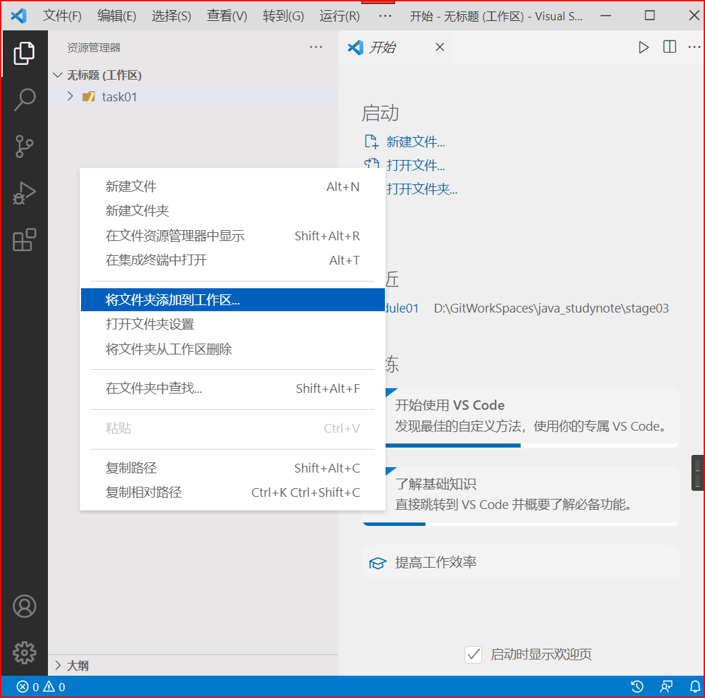

# 第06章 Vue-cli和Element-UI

[toc]

## 一. Vue-cli

### 1.1 什么是Vue-cli

- Vue-cli是基于Vue的应用卡法提供的一个标注的脚手架工具, 为应用搭建基础的框架结构, 提供插件、开发服务、Preset、构建打包功能
- Vue-cli背后集成了现代化开发的诸多功能， **通过简单的命令就可以完成“零配置”的项目环境搭建**

### 1.2 安装Vue-cli步骤

在安装`Vue-cli`前, 要确认自己的电脑是否安装了`node.js`和`npm`

#### 1.2.1 安装Node.js和npm

- 安装了`node.js`才能使用`npm`, 才能安装`Vue-cli`
- 找到`../stage03-前端技术/第05章 ECMAScript6和Node.js.md`, 根据里面的教程安装`node.js`和`npm`

#### 1.2.2 安装vue-cli

- `vue-cli`的官网是<https://cli.vuejs.org/zh/>, 可以到**指南→安装**中寻找`vue-cli`的安装命令

- 目前`vue-cli`的主力版本是`2.x`和`3.x`版本, 安装`3.x`**以上**的版本是因为该版本即可以创建`2.x`项目,也可以创建`3.x`项目

##### 1.2.2.1 安装命令

```bash
npm install -g @vue/cli
```

##### 1.2.2.2 查看vue的版本

```bash
vue -V
```

或者

```bash
vue --version
```

### 1.3 快速构建Vue项目

#### 1.3.1 构建Vue项目的步骤

1. 创建一个名为`VueTest`的空文件夹
2. 进入该文件夹, 按住`shift`键同时点击鼠标右键, 点击`在Windows终端中打开`
   - 此时Windows系统的终端会打开并进入`VueTest`文件夹
     - 
3. 输入命令`vue create my-first-vue-project`, 按下`Enter`键执行该命令, 
   -  `my-first-vue-project`是Vue项目的名字
4. 需等待一会儿等程序加载结束
5. 进行预设置, 可以通过键盘上的上下方向键(⬆, ⬇)切换选项, 切换到`Manually select features`, 进行自定义设置, 按下`Enter`键执行程序
   - 
6. 可以通过键盘上的上下方向键(⬆, ⬇)切换选项, `*`表示勾选了这个选项(空格键可以进行勾选或取消勾选, `a`键进行全选, `i`键进行反选), 勾选`Babel`和`Router`, 按下`Enter`键进行下一步
   - 
7. 选择`2.x`版本的`vue.js`, 按下`Enter`键进行下一步
   - 
8. 设置Router的历史记录模式, 输入`n`, 使用hash模式的历史记录
   - 
9. 预设置的配置内容存放的位置, 放到专用的配置文件里, 选择`In dedicated config files`
   - 
10. 保存当前配置为一个预设置, 供以后的项目使用? 不需要, 输入`n`就行
   - 
11. 需等待一会儿等程序执行结束, 出现以下信息表示项目创建成功, `my-first-vue-project`这个文件夹就是当前项目
    
    - 
    
12. 输入`cd my-first-vue-project`, 进入项目, 输入以下命令, 就可以启动本项目
    
    - ```
      npm run serve
      ```
    
13. 启动本项目后会出现以下信息, 表示项目启动成功

    - 
    - 根据`App runnning at`中的提示在浏览器中输入网址, 来访问项目
      - `http://localhost:8080/`
      - 
    
14. 在终端中按下`Ctrl` + `C`可以停止项目, 或者关闭终端也可停止项目

#### 1.3.2 导入Vue项目到VSCode

1. 在`VSCode`的资源管理器侧边栏的空白处点击右键, 点击`将文件夹添加到工作区`
   - 
2. 选择当前项目的文件夹, 点击`添加(A)`, 项目就会导入`VSCode`
3. 打开项目, 可以看到如下项目结构
   - 

#### 1.3.3 项目结构介绍

my-first-vue-project    项目名称

- node_modules    存放依赖包的位置
- public    静态资源管理目录
- src    组件源码目录(我们写的代码)
  - assets    存放静态图片资源(css也可以放在这里)
  - components    存放各种工具组件(一个页面级别的组件是由多个工具组件组成的)
  - router    存放了路由文件, 一般用来切换显示页面级别的组件
  - view    存放页面级别的组件
  - App.vue    App.vue可以当作是网站首页, 是一个Vue项目的主组件, 页面入口文件
  - main.js    打包运行的入口文件, 引入了vue模块和app.vue组件以及路由route
- babel.config.js    babel的配置文件, 对源代码进行转码(把es6转成es5)
- jsconfig.json
- package-lock.json    依赖的配置文件
- package.json    项目及工具的依赖配置文件
- README.md    项目说明
- vue.config.js    项目的自定义配置

#### 1.3.4 vue脚手架自定义配置

##### 1.3.4.1 package.json介绍

每个项目的根目录下面, 一般都有一个`package.json`文件, 定义了这个项目所需要的各种模块, 以及项目的配置信息(比如名称、版本、许可证等元数据)。 `npm install`命令根据这个歌配置文件， 自动下载所需模块， 也就是配置项目所需的运行和开发环境

```json
{
  // 1. 项目基本信息
  "name": "my-first-vue-project",
  "version": "0.1.0",
  "private": true,
  // 2. 指定运行脚本命令
  "scripts": {
    "serve": "vue-cli-service serve",
    "build": "vue-cli-service build"
  },
  // 3. 生产环境所依赖模块的版本
  "dependencies": {
    "core-js": "^3.8.3",
    "vue": "^2.6.14",
    "vue-router": "^3.5.1"
  },
  //4. 本地环境开发使用的依赖版本
  "devDependencies": {
    "@vue/cli-plugin-babel": "~5.0.0",
    "@vue/cli-plugin-router": "~5.0.0",
    "@vue/cli-service": "~5.0.0",
    "vue-template-compiler": "^2.6.14"
  }
}

```

##### 1.3.4.2 通过package.json配置项目(建议不要用此方式)

==不建议在此文件中自定义配置项目，建议在`vue.config.js`文件中自定义配置项目==

==配置内容采用Json格式，属性要用双引号包裹==

打开pacakge.json, 添加以下属性和值, 在启动项目后，就可以改变项目的访问端口

```json
"vue": {
    "devServer": {
        "port": "8081",//改变项目的访问端口
        "open": true//运行项目后自动在浏览器访问项目
    }
}
```

##### 1.3.4.3 通过`vue.config.js`自定义配置项目

**在defindeConfig的json参数中添加属性`devSever`**

```js
devServer: {
    host: "127.0.0.1",// 自动启动浏览器时访问的网址
    port: 8081, // 项目的访问端口(默是8080)
    https: false, // 启用https
    open: true, //启动本项目后会自动启动浏览器
  }
```

#### 1.3.5 组件化开发

##### 1.3.5.1 组件化开法介绍

组件化是Vue的精髓, Vue项目就是有一个一个地组件构成的. 我们主要的工作就是开发组件

##### 1.3.5.2 组件介绍

- 我们用`vue-cli`脚手架搭建的项目, 里面有很多, 如`index.vue`或者`App.vue`这一类的文件. 每一个`*.vue`文件就是一个组件, 比如: `App.vue`就是整个项目的根组件

##### 1.3.5.3 常见的组件

- 页面级别的组件
  - 页面级别的组件, 通常是`view`目录下的`.vue`文件, 是组成整个项目的各个主要页面
  - 一般只有页面级别的组件才会被路由器管理
- 业务上可复用的基础组件
  - 这一类组件通常是在业务中被整个页面服用的组件, 这一类组件通常都写到`components`目录下, 然后通过`import`在各个页面中使用

##### 1.3.5.4 组件的组成部分

- `<template>`	组件的html部分
- `<script>`         组件的js脚本(使用ES6语法编写)
- `<style>`            组件的css样式

```vue
<!--template代表组件的html结构, template中的内容必须有且只有一个根元素-->
<template>
	<div>
        页面内容...
    </div>
</template>

<!--编写vue.js代码-->
<script>
    //可以导入其他组件中的属性
    //import Header form `../components/header.vue`
	
    /*默认写法, 输出该组件的属性, 允许其他js文件或脚本导入并调用这些属性*/
    export default{
        name: "componentName", // 组件名称, 一般跟文件名相同, 用于以后路由跳转
        data: function(){// 当前组件的template中要使用的数据
            return {}
        },
        [methods: {},]
    	[computed: {},]
        [filters: {},]
        [watch: {},]
    }
</script>

<!--template中使用的css样式, 添加scoped属性后表示这些css样式只能被本文件中的template使用-->
<style scoped>
	
</style>
```

### 1.4 vue项目运行流程

- 先加载`package.json`文件, 下载好依赖包, 编译工具等等, 然后运行vue项目的入口文件`main.js`
- `main.js`文件是vue项目运行时的入口文件

#### 1.4.1 main.js

- 1.`main.js`是==打包运行的入口文件==，引入了vue模块和app.vue组件以及路由router

- ```js
  //1.项目运行时会加载 入口文件 main.js
  
  //在vue中使用 import 变量名 from 文件路径 导入这个文件导出的变量
  import Vue from 'vue'
  import App from './App.vue' //主组件
  import router from './router' //路由
  
  //关闭启动提示
  Vue.config.productionTip = false
  
  //创建vue实例
  new Vue({
    router, //为整个项目添加路由
    render: h => h(App)//生成模板,  
  }).$mount('#app')//挂载了App.vue中 id 为 app的区域
  ```

#### 1.4.2 App.vue

- **2. App.vue可以当做是网站首页，是一个vue项目的主组件，==页面入口文件==**

- ```vue
  //2. App.vue是项目的主组件(整个项目的其它页面都是在主组件中切换)
  <template>
    <div id="app">//挂载区域
      <nav>
  	  //路由的导航链接
  	  //to="/"项目的根路径, 默认跳转到此页, 跳转到 路径为"/" 的路由 导航到的组件
        <router-link to="/">Home</router-link> 
  	  //to="/about", 跳转到 路径为"/about" 的路由 导航到的组件
        <router-link to="/about">About</router-link>
      </nav>
      <router-view/>
    </div>
  </template>
  
  <style>
  	...
  </style>
  ```

#### 1.4.3 router路由

- 3.查看路由文件的具体配置

- ```js
  //3.查看路由文件的具体配置
  //引入所需文件
  import Vue from 'vue'
  import VueRouter from 'vue-router'
  //引入了HomeView.vue组件
  import HomeView from '../views/HomeView.vue'
  
  //调用了 本文件的 其他文件创建的Vue实例都会使用路由功能
  Vue.use(VueRouter)
  
  //路由组
  const routes = [
    {
      path: '/', //路由路径
      name: 'home',//路由名称
      component: HomeView//路由导航到的组件
    },
    {
      path: '/about',
      name: 'about',
      // route level code-splitting
      // this generates a separate chunk (about.[hash].js) for this route
      // which is lazy-loaded when the route is visited.
      component: () => import(/* webpackChunkName: "about" */ '../views/AboutView.vue')
    }
  
  ]
  
  //创建路由器对象, 管理路由组
const router = new VueRouter({
    routes
  })
  
  //es6的默认导出方式, 导出本文件为一个名为router的模块(对象)
  export default router
  ```
  

#### 1.4.4 HomeView.vue

- 4.查看默认访问的View目录下的HomeView.vue

- ```js
  //4.查看默认访问的View目录下的HomeView.vue
  //视图部分
  <template>
    <div class="home">
      
      <HelloWorld msg="Welcome to Your Vue.js App"/>
    </div>
  </template>
  
  <script>
  // @ is an alias to /src @表示本项目下的src文件夹的路径
  import HelloWorld from '@/components/HelloWorld.vue'
  
  //es6的默认导出, 以便路由器进行导航
  export default {
    name: 'HomeView',
    components: {
      HelloWorld
    }
  }
  </script>
  
  ```

### 1.5 组件的使用案例

- 将`HomeView.vue`文件中的`HelloWord`组件替换掉

#### 1.5.1 创建Demo.vue组件

##### 1.5.1.1 在`components`目录下创建`Demo.vue`文件


##### 1.5.1.2 编写`Demo.vue`

```vue
<template>
  <div class="color">
    {{ msg }}
    <p></p>
  </div>
</template>

<script>
export default {
  name: "Title",
  data: function(){
      return {
         msg: "最终幻想7 --- 蒂法" 
      };
  }
};
</script>

<style scoped>
.color {
  color: rgba(189, 110, 126, 0.432);
}

img {
  height: 300px;
}
</style>
```

#### 1.5.2 HomeView.vue中引入Demo组件

```vue
<template>
  <div class="home">
    
    <!--使用Demo组件-->
    <Demo />
  </div>
</template>

<script>
// @ is an alias to /src
// 1. 引入Demo组件
import Demo from "@/components/Demo.vue";

export default {
  name: "HomeView",
  components: {
    Demo,
  },
};
</script>

```

#### 1.5.3 组件的传参

- 组件的调用者可以通过属性向组件中传入参数

##### 1.5.3.1 修改Demo.vue中的代码

```vue
<template>
  <div class="color">
    {{ msg }}
    <p></p>
  </div>
</template>

<script>
export default {
  name: "Title",
  /*data: function(){
      return {
         msg: "最终幻想7 --- 蒂法" 
      };
  }*/
  props: {
    //msg--属性的名字, String---属性的类型
    msg: String,
  }
};
</script>

<style scoped>
.color {
  color: rgba(189, 110, 126, 0.432);
}

img {
  height: 300px;
}
</style>
```

##### 1.5.3.2 修改HomeView.vue中的代码

```vue
<template>
  <div class="home">
    
    <!--使用Demo组件-->
    <Demo msg="这是意大利新任议员--蒂法"/>
  </div>
</template>

<script>
// @ is an alias to /src
// 1. 引入Demo组件
import Demo from "@/components/Demo.vue";

export default {
  name: "HomeView",
  components: {
    Demo,
  },
};
</script>

```

## 二. ElementUI

### 2.1 Element-UI介绍

- Element-UI是饿了么前端出品的基于`Vue.js`的后台组件库, 方便程序员进行页面快速布局和构建.
- Element-UI官方站点
  - 基于`Vue2.x`, <https://element.eleme.cn/#/zh-CN/component/installation>
  - 基于`Vue3.x`, <https://element-plus.org/zh-CN/guide/design.html>

### 2.2 在Vue项目中使用Element-UI(基于Vue2.x)

#### 2.2.1 简单使用

- 创建一个Vue项目

- 在当前项目下打开终端, 执行以下命令, 安装`Element-UI`的依赖包

  - ```bash
    npm i element-ui -S
    ```

- 打开`mian.js`, 导入`Element-UI`相关资源

  - ```js
    //导入Element-UI组件库
    import ElementUI from 'element-ui'
    
    //导入组件相关样式
    import 'element-ui/theme-chalk/index.css'
    
    //将ElementUI安装到Vue上, 此后创建的Vue实例都会安装Element-UI
    Vue.use(ElementUI)
    ```

- 测试Element-UI是否起作用: 复制`按钮组件`的实例代码到`App.vue`中的`<template>`标签下

  - ```vue
    <template>
    	<div id="app">
            <el-row>
      			<el-button>默认按钮</el-button>
      			<el-button type="primary">主要按钮</el-button>
      			<el-button type="success">成功按钮</el-button>
      			<el-button type="info">信息按钮</el-button>
      			<el-button type="warning">警告按钮</el-button>
      			<el-button type="danger">危险按钮</el-button>
    		</el-row>
        </div>
    </template>
    ```

  - 执行命令`npm run serve`, 启动项目, 查看页面显示效果

#### 2.2.2 Vue-CLI工程改造

- 删除`views`目录和`components`目录下的所有文件

- 删除`App.vue`中的部分内容, 只保留如下部分

  - ```vue
    <template>
    	<div id="app">
        </div>
    </template>
    
    <style>
    </style>
    ```

- 删除`router`目录下的路由文件`index.js`的部分内容, 只保留如下部分

  - ```js
    import Vue from `vue`
    import VueRouter from `vue-router`
    
    Vue.use(VueRouter);
    const routes = [
        //在此添加新的路由
    ];
    const router = new VueRouter({routes});
    export default router;
    ```

#### 2.2.3 给本项目安装axios

- 使用npm下载`axios`包

  - ```bash
    npm i axios
    ```

- 在`main.js`文件中导入`axios`相关资源并启用

  - ```js
    //引入axios资源
    import axios from 'axios'
    
    //Vue使用axios
    Vue.prototype.axios = axios;
    ```

### 2.3 用户登录界面制作

#### 2.3.1 查看Element-UI官网上的Dialog对话框组件的示例代码


只留下嵌套表单的Dialog的代码

```html
<!-- Form -->
<el-button type="text" @click="dialogFormVisible = true">打开嵌套表单的 Dialog</el-button>

<el-dialog title="收货地址" :visible.sync="dialogFormVisible">
  <el-form :model="form">
    <el-form-item label="活动名称" :label-width="formLabelWidth">
      <el-input v-model="form.name" autocomplete="off"></el-input>
    </el-form-item>
    <el-form-item label="活动区域" :label-width="formLabelWidth">
      <el-select v-model="form.region" placeholder="请选择活动区域">
        <el-option label="区域一" value="shanghai"></el-option>
        <el-option label="区域二" value="beijing"></el-option>
      </el-select>
    </el-form-item>
  </el-form>
  <div slot="footer" class="dialog-footer">
    <el-button @click="dialogFormVisible = false">取 消</el-button>
    <el-button type="primary" @click="dialogFormVisible = false">确 定</el-button>
  </div>
</el-dialog>

<script>
  export default {
    data() {
      return {
        dialogFormVisible: false,
        form: {
          name: '',
          region: '',
          date1: '',
          date2: '',
          delivery: false,
          type: [],
          resource: '',
          desc: ''
        },
        formLabelWidth: '120px'
      };
    }
  };
</script>
```

#### 2.3.2 创建login.vue组件

- 在`components`目录下创建组件`login.vue`

- 将[2.3.1 查看Element-UI官网上的Dialog对话框组件的示例代码](#2.3.1 查看Element-UI官网上的Dialog对话框组件的示例代码)中的代码拷贝到`login.vue`中进行修改

- ```vue
  <template>
    <div>
      <el-button type="text" @click="dialogFormVisible = true">登录</el-button>
      <el-dialog
        title="用户登录"
        :visible.sync="dialogFormVisible"
      >
        <el-form :model="form">
          <el-form-item label="用户名" :label-width="formLabelWidth">
            <el-input
              placeholder="请输入用户名"
              autocomplete="off"
            ></el-input>
          </el-form-item>
          <el-form-item label="用户密码" :label-width="formLabelWidth">
            <el-input
              type="password"
              placeholder="请输入用户密码"
              autocomplete="off"
            ></el-input>
          </el-form-item>
        </el-form>
        <div slot="footer" class="dialog-footer">
          <el-button type="primary" @click="login">登 录</el-button>
        </div>
      </el-dialog>
    </div>
  </template>
  
  <script>
  export default {
    data() {
      return {
        formLabelWidth: "120px",
        dialogFormVisible: false,
      };
    },
    
  };
  </script>
  
  <style></style>
  
  ```

#### 2.3.3 将`login.vue`组件配置到路由中

修改`@/router/index.js`中的代码

```js
import Vue from "vue";
import VueRouter from "vue-router";
import login from "@/components/login.vue";

Vue.use(VueRouter);

const routes=[
    
    //登录弹出框的路由
    {
        path:"/login",
        name:"login",
        component: login
    },
    //路由的重定向, 会将路由路径"/", 重定向到"/login"绑定的组件
    {
        path:"/"
        redirect:"/login"
    }
    
];

const router = new VueRouter({
	routes
});

export default router;
```

##### 2.3.3.1 路由的重定向

```js
    //弹出登录对话框的路由
    {
        path:"/login",
        name:"login",
        component: login
    },
    //路由的重定向, 会将路由路径"/", 重定向到"/login"绑定的组件
    {
        path:"/"
        redirect:"/login"
    }
```


#### 2.3.4 修改App.vue

```vue
<template>
	<div id="app">
        <!--router-view的作用是跟模具访问的路径, 渲染路径匹配到的组件-->
        <router-view></router-view>
    </div>
</template>
```

#### 2.3.5 编写登录功能

##### 2.3.5.1 去掉关闭按钮

`<el-dialog>`添加一个属性`:show-close="false"`[^注释1]

```html
<el-dialog
      :show-close="false"
      title="用户登录"
      :visible.sync="dialogFormVisible"
    >
```

##### 2.3.5.2 双向数据绑定

###### 2.3.5.2.1 `<el-input>`标签中使用`v-model`指令

```html
<el-input
    type="password"
    placeholder="请输入用户名"
    v-model="form.username"
    autocomplete="off"
></el-input>
```

```html
<el-input
    type="password"
    placeholder="请输入用户密码"
    v-model="form.password"
    autocomplete="off"
></el-input>
```

###### 2.3.5.2.2 data中定义数据

```js
data(){
    return {
        formLabelWidth: "120px",
        dialogFormVisible: false,
        form: {
            username:"",
            password:""
        }
    };
}
```

##### 2.3.5.3 编写login方法

```js
data(){
    return {
        formLabelWidth: "120px",
        dialogFormVisible: false,
        form: {
            username:"",
            password:""
        }
    };
},

methods:{
    login(){
      	const url = "https://www.zqtest.com/login";
      	this.axios
        	.post(url, this.form)
        	.then((response) => {
                	this.dialogFormVisible = false;
        	})
        	.catch((error) => {
          		this.$notify.error({
            		title: "错误",
            		message: error.message,
            		duration: 0,
          		});
          		console.log(error);
        	});
    },
},
```

###### 2.3.5.3.1 Element-UI中的插件`Notification 通知`

```js
this.$notify.error({
	title: "错误",
    message: error.message,
    duration: 0,
});
```

#### 2.3.6 Postman搭建`Mock server`

- `Mock server`就是模拟一个服务器, 我们使用`Mock serve`r可以模拟后台接口, 对请求进行响应
- 在前后端分离的卡法中, 前端利用`Mock Server`模拟出对应接口, 拿到返回数据来调试, 无需等后续开发人员完成工作

- Postman模拟一个`login` server的步骤

  - 
  - 
  - 
    - 注意: Response Body中的字符串必须是json格式的字符串, 属性名必须用`""`(双引号)包裹, 不能更不能用单引号`''`, 属性值是字符串时也必须遵循这个要求, 不满足这个格式就不是json格式的字符串, 浏览器只会将之识别为普通的字符串
  - 
  - 

- 测试`login server`能否使用

  - 
  - 

- 修改`login.vue`中url的值

  - ```js
    const url="https://307db15e-1462-4bda-86fa-39a664bb3dad.mock.pstmn.io/login";
    ```

#### 2.3.7 登录成功后跳转

- 在js中设置跳转时, 常用的一种方法是`this.$router.push(routePath)`

- ```js
  methods: {
      login() {
        const url =
          "https://307db15e-1462-4bda-86fa-39a664bb3dad.mock.pstmn.io/login";
        this.axios
          .post(url, this.form)
          .then((response) => {
            if (response.data.status === 0) {
              this.$notify({
                title: "登录成功",
                message: "账号和密码正确, 即将跳转页面...",
                type: "success",
              });
              this.dialogFormVisible = false;
                
              //跳转页面, 前端跳转页面必须使用路由,使用this.$router.push(routePath)方法进行跳转
              this.$router.push("/index");
            } else {
              this.$notify({
                title: "登录失败",
                message: "账号或密码错误",
                type: "warning",
              });
            }
          })
          .catch((error) => {
            this.$notify.error({
              title: "错误",
              message: error.message,
              duration: 0,
            });
            console.log(error);
          });
      },
    },
  ```

##### 2.3.7.1 在组件的js中使用路由跳转页面

使用`this.$router.push(routePath)`方法进行跳转

### 2.4 首页布局页面制作

#### 2.4.1 在`@/components`目录下创建`index.vue`

```vue
<template>
	<div>
        布局页面
    </div>
</template>

<script>
export default{
    
}
</script>

<style scoped>
</style>
```

#### 2.4.2 `@/router/index.js`中添加布局路由

- ```js
  import index from "@/components/index.vue"
  ```

- ```js
  const routes=[
      //布局路由
      {
      	path: '/index',
      	name: 'index',
      	component: index
  	},
      //弹出登录对话框的路由
      {
          path:"/login",
          name:"login",
          component: login
      },
      //路由的重定向, 会将路由路径"/", 重定向到"/login"绑定的组件
      {
          path:"/"
          redirect:"/login"
      }
      
  ]
  ```

#### 2.4.3 Element-UI中的布局容器组件

- Container 布局容器, 适用于布局的容器组件, 方便快速搭建页面的基本结构

- 在`Container 布局容器`→**常见页面布局**中找到下图所示布局结构的代码

  - 

  - ```vue
    <el-container>
      <el-header>Header</el-header>
      <el-container>
        <el-aside width="200px">Aside</el-aside>
        <el-main>Main</el-main>
      </el-container>
    </el-container>
    
    <style>
      .el-header{
        background-color: #B3C0D1;
        color: #333;
        text-align: center;
        line-height: 60px;
      }
      
      .el-aside {
        background-color: #D3DCE6;
        color: #333;
        text-align: center;
        line-height: 200px;
      }
      
      .el-main {
        background-color: #E9EEF3;
        color: #333;
        text-align: center;
        line-height: 160px;
      }
      
      body > .el-container {
        margin-bottom: 40px;
      }
      
      .el-container:nth-child(5) .el-aside,
      .el-container:nth-child(6) .el-aside {
        line-height: 260px;
      }
      
      .el-container:nth-child(7) .el-aside {
        line-height: 320px;
      }
    </style>
    ```

- 代码复制到`@/components/index.vue`中

  - ```vue
    <template>
    	<div>
            <el-container>
              <el-header>Header</el-header>
              <el-container>
                <el-aside width="200px">Aside</el-aside>
                <el-main>Main</el-main>
              </el-container>
            </el-container>
        </div>
    </template>
    
    <script>
    export default{
        
    }
    </script>
    
    <style scoped>
      .el-header{
        background-color: #B3C0D1;
        color: #333;
        text-align: center;
        line-height: 60px;
      }
      
      .el-aside {
        background-color: #D3DCE6;
        color: #333;
        text-align: center;
        line-height: 200px;
      }
      
      .el-main {
        background-color: #E9EEF3;
        color: #333;
        text-align: center;
        line-height: 160px;
      }
      
      body > .el-container {
        margin-bottom: 40px;
      }
      
      .el-container:nth-child(5) .el-aside,
      .el-container:nth-child(6) .el-aside {
        line-height: 260px;
      }
      
      .el-container:nth-child(7) .el-aside {
        line-height: 320px;
      }
    </style>
    ```

- 复制`Container 布局容器`→**示例**中导航菜单中的代码, 进行如下修改后替换掉`<el-aside>`元素节点中的内容

  - ```html
    		 <el-menu
                background-color="#d3dce6"
              >
                <el-submenu index="1">
                  <template slot="title">
                    <i class="el-icon-location"> </i>
                    <span>导航菜单</span>
                  </template>
                  <el-menu-item-group>
                    <el-menu-item index="1-1">
                      <i class="el-icon-menu"></i>
                      <span>课程管理</span>
                    </el-menu-item>
                  </el-menu-item-group>
                </el-submenu>
              </el-menu>
    ```

### 2.5 课程列表组件制作

当我们点击导航菜单中的`课程管理`时, 要显示课程信息


#### 2.5.1 编写`course.vue`

在`@/components`目录下创建`course.vue`文件

```vue
<template>
	<div>
        课程管理
    </div>
</template>

<script>
export default{
    
}
</script>
<style scoped></style>
```

#### 2.5.2 配置路由

##### 2.5.2.1 给布局路由添加子路由

- 在`@/router/index.js`路由文件中, 为`布局路由`添加`children`属性表示子路由

  - 子路由的作用其实就是为了方便阅读
  - 并且父路由与子路由的路径也不会相互影响, 并**不会出现**`/index/course`的结果

- ```js
  //引入课程组件
  import course from "@/components/course.vue";
  ```

- ```js
  const routes=[
      //布局路由
      {
      	path: '/index',
      	name: 'index',
      	component: index,
      	//添加子路由
      	children: [
      		{
      			path: "/course",
      			name: "course",
      			components: course
  			}
  		}
  	],
      //弹出登录对话框的路由
      {
          path:"/login",
          name:"login",
          component: login
      },
      //路由的重定向, 会将路由路径"/", 重定向到"/login"绑定的组件
      {
          path:"/"
          redirect:"/login"
      }
      
  ]
  ```

##### 2.5.2.2 修改`@/componnents/index.vue`组件中的`导航菜单的属性`

给`<el-menu>`元素添加一个`:router="true"`[^注释1]属性, 

- 表示启用该元素的`vue-router`功能, 这样点击导航菜单中的条目时,就可以根据该条目的路由进行跳转了.

```html
<el-menu
          background-color="#d3dce6"
          :router="true"
        >
```

##### 2.5.2.3 为`<el-menu>`的`index`属性指定路由

指定路由后, 点击该条目后就会跳转到该路由绑定的组件

```html
 <el-menu
          background-color="#d3dce6"
          :router="true"
        >
          <el-submenu index="1">
            <template slot="title">
              <i class="el-icon-location"> </i>
              <span>导航菜单</span>
            </template>
            <el-menu-item-group>
              /**/为<el-menu>的index属性指定路由
              <el-menu-item index="/course">
                <i class="el-icon-menu"></i>
                <span>课程管理</span>
              </el-menu-item>
            </el-menu-item-group>
          </el-submenu>
        </el-menu>
```

##### 2.5.2.4 设置路由的出口`<router-view>`

将课程信息展示在`<el-main>`中, 使用`<touter-view></router-view>`替换掉`<el-main>`元素节点中的内容

```html
<el-container>
  <el-header>后台管理</el-header>
  <el-container>
    <el-aside width="200px">
         <el-menu
          background-color="#d3dce6"
          :router="true"
        >
          <el-submenu index="1">
            <template slot="title">
              <i class="el-icon-location"> </i>
              <span>导航菜单</span>
            </template>
            <el-menu-item-group>
              /**/为<el-menu>的index属性指定路由
              <el-menu-item index="/course">
                <i class="el-icon-menu"></i>
                <span>课程管理</span>
              </el-menu-item>
            </el-menu-item-group>
          </el-submenu>
        </el-menu>
    </el-aside>
    <el-main>
        <router-view></router-view>
    </el-main>
  </el-container>
</el-container>
```

### 2.6 Element-UI中的组件`Table`

- 我们通过`Element-UI`中的`Table 表格`组件来实现课程页面展示的功能, 

- 

- 复制`Table 表格`→`带斑马纹表格`中的代码

  - ```vue
    <template>
      <el-table
        :data="tableData"
        stripe
        style="width: 100%">
        <el-table-column
          prop="date"
          label="日期"
          width="180">
        </el-table-column>
        <el-table-column
          prop="name"
          label="姓名"
          width="180">
        </el-table-column>
        <el-table-column
          prop="address"
          label="地址">
        </el-table-column>
      </el-table>
    </template>
    
    <script>
      export default {
        data() {
          return {
            tableData: [{
              date: '2016-05-02',
              name: '王小虎',
              address: '上海市普陀区金沙江路 1518 弄'
            }, {
              date: '2016-05-04',
              name: '王小虎',
              address: '上海市普陀区金沙江路 1517 弄'
            }, {
              date: '2016-05-01',
              name: '王小虎',
              address: '上海市普陀区金沙江路 1519 弄'
            }, {
              date: '2016-05-03',
              name: '王小虎',
              address: '上海市普陀区金沙江路 151弄'
            }]
          }
        }
      }
    </script>
    ```

### 2.7 课程内容展示

#### 2.7.1 修改Course.vue的`<template>`部分

- 将[2.6 Element-UI中的组件`Table`](#2.6 Element-UI中的组件)中的代码修改成能够展示课程信息的样子
- 给`<el-table>`元素设置`:v-loading`属性和`:element-loading-text`属性, 用来设置课程信息加载时的动画
  - `:v-loading="true"`  显示数据加载的动画
  - `:element-loading-text="loadingText"`  数据加载动画下面显示的文字

```vue
<template>
    <el-table
      :data="courseList"
      stripe
      style="width: 100%"
      :v-loading="loading"
      :element-loading-text="loadingText"
    >
      <el-table-column prop="id" label="ID" width="180"> </el-table-column>
      <el-table-column prop="course_name" label="课程名称" width="180">
      </el-table-column>
      <el-table-column prop="price" label="价格"> </el-table-column>
      <el-table-column prop="sort_num" label="排序"> </el-table-column>
      <el-table-column prop="status" label="状态"> </el-table-column>
    </el-table>
  </div>
</template>
```

#### 2.7.2 修改Course.vue的`<script>`部分

```vue
<script>
export default {
  data() {
    return {
      loading: true,
      loadingText: "加载课程信息中...",
      courseList: [],
    };
  },
  created() {
    this.loadingCourseList();
  },
  methods: {
    loadingCourseList() {
      
      const url = "http://127.0.0.1:8080/lagou_edu_home_zq/course";
      return this.axios
        .get(url, {
          params: { methodName: "findCourseList" },
        })
        .then((response) => {
          this.courseList = response.data;
          this.loading = false;
        })
        .catch((error) => {
          this.loadingText = "获取数据失败";
          console.log(error.message);
        });
    },
  },
};
</script>
```

#### 2.7.3 启动后台和前台的服务

- 启动在IDEA中的`web_work`项目下的`lagou_edu_home_zq`模块
- 启动`el-porject`项目

#### 2.7.4 跨域问题

##### 2.7.4.1 出现跨域问题

当我们在前端项目中, 向后端发送请求来获取课程数据的时候,出现了跨域问题:

- ```
  已拦截跨源请求：同源策略禁止读取位于 http://127.0.0.1:8080/lagou_edu_home_zq/course?methodName=findCourseList 的远程资源。（原因：CORS 头缺少 'Access-Control-Allow-Origin'）。状态码：200
  ```

- 也就是说前端跟后端出现了跨域问题, **浏览器不读取**后端响应的数据

- `CORS`    跨域资源共享(Cross Origin Resource Sharing)

##### 2.7.4.2 什么是跨域

跨域是指**通过js**在不同**的域之间**==进行数据传输或通信==, 比如用ajax向一个不同的域请求数据, 只要**协议**  **域名**  **端口**有任何一个不同, 都被当作是不同的域, 浏览器就不允许跨域请求.

| 跨域的几种常见情况                                           | 是否跨域                        |
| ------------------------------------------------------------ | ------------------------------- |
| `http://www.123.com/index.html `的**js代码中调用**`http://www.123.com/server.php` | 非跨域                          |
| `http://www.123.com/index.html `的**js代码中调用**`http://www.456.com/server.phtp` | 主域名不同: `123`/`456`, 跨域   |
| `http://www.123.com/index.html `的**js代码中调用**`http://def.123.com/server.phtp` | 子域名不同: `www`/`def`, 跨域   |
| `http://www.123.com:8080/index.html `的**js代码中调用**`http://www.123.com:8081/index.html` | 子域名不同: `8080`/`8081`, 跨域 |
| `http://www.123.com/index.html `的**js代码中调用**`https://www.123.com/index.html` | 协议不同: `http`/`https`, 跨域  |

##### 2.7.2.3 解决跨域问题

跨域的允许主要有服务器端控制, 服务器端通过在响应的`header`中设置`Access-Control-Allow-Origin`及相关一系列参数, 提供跨域访问的允许策略

- 设置响应头中的参数来允许跨域请求
  - Access-Control-Allow-Credentials
  - Access-Control-Allow-Origin    表示允许跨域的请求有哪些

###### 2.7.2.3.1 在`pom.xml`文件中引入依赖

```xml
<!-- 解决跨域策略的问题 -->
<!-- https://mvnrepository.com/artifact/com.thetransactioncompany/cors-filter -->
<dependency>
    <groupId>com.thetransactioncompany</groupId>
    <artifactId>cors-filter</artifactId>
    <version>2.10</version>
</dependency>
```

###### 2.7.2.3.2 在`web.xml`中配置跨域过滤器`filter`

```xml
<!-- 跨域过滤器, 用来指定那些资源允许被跨域访问-->
<filter>
    <filter-name>corsFilter</filter-name>
    <filter-class>com.thetransactioncompany.cors.CORSFilter</filter-class>
</filter>
<filter-mapping>
    <filter-name>corsFilter</filter-name>
    <url-pattern>/*</url-pattern>
</filter-mapping>
```

### 2.8 条件查询

#### 2.8.1 Element-UI中的`Input 输入框`

- 我们通过`Element-UI`中的`Input 输入框`组件来获取用户通过鼠标或键盘输入的的字符

- 

  - 注意: 是**不支持**`v-model`**修饰符**, `v-model`属性是可以用的

- 结合`Input 输入框`→`可清空`和`Input 输入框`→`带icon的输入框`的代码, 构建一个可清空且带搜索icon的输入框

  - ```html
      <el-input
        clearable
        placeholder="请输入课程名称"
        @keyup.enter="search"
        v-model="input">
        	<i slot="prefix" class="el-input__icon el-icon-search"></i>
    </el-input>
    ```

##### 2.8.1.1 `Input 输入框`的键盘事件

- `<el-input>`**组件监听不到键盘事件**,原因是element-ui是封装组件，所以el标签属于自定义标签，因此`@keyup.enter`指令触发不了键盘事件。
- 解决办法：`@keyup.enter`加上.native原生事件修饰符即可(`@keyup.enter.native`)
  - .native：`Vue.js`中监听组件根元素的原生事件，主要作用是给自定义的组件添加原生事件。

#### 2.8.2 Element-UI的`Layout 布局`组件

- 通过基础的 24 分栏(一行被均分成了24份)，迅速简便地创建布局

- 

- 通过`<el-row>`和`<el-col>`组件, 以及`<el-col>`组件的`:span`属性我们就可以自由的组合布局

- `<el-row>`组件的`:gutter`可以用来指定`<el-col>`之间的间隔

- ```html
  <el-row :gutter="20">
    <el-col :span="6"><div class="grid-content bg-purple"></div></el-col>
    <el-col :span="6"><div class="grid-content bg-purple"></div></el-col>
    <el-col :span="6"><div class="grid-content bg-purple"></div></el-col>
    <el-col :span="6"><div class="grid-content bg-purple"></div></el-col>
  </el-row>
  ```

  - 

##### 2.8.2.1 使用`Layout 布局`设置输入框的大小

```html
<el-row :gutter="20">
  <el-col :span="6">
       <el-input
    	clearable
    	placeholder="请输入课程名称"
    	v-model="input">
    		<i slot="prefix" class="el-input__icon el-icon-search"></i>
  		</el-input> 
  </el-col>
</el-row>
```

#### 2.8.3 完成条件查询的功能

##### 2.8.2.1 `<template>`部分

```html
<template>
  <div>
    <div style="margin: 5px 0px">
      <el-row :gutter="20">
        <el-col :span="6">
          <el-input
            placeholder="请输入课程名称"
            v-model="keywordsSearched.courseName"
            clearable
            @keyup.enter.native="findByCourseNameAndStatus"
          >
            <i
              slot="prefix"
              class="el-input__icon el-icon-search"
              @click="findByCourseNameAndStatus"
            ></i>
          </el-input>
        </el-col>
      </el-row>
    </div>

    <el-table
      :data="courseList"
      stripe
      style="width: 100%"
      v-loading="loading"
      :element-loading-text="loadingText"
    >
      <el-table-column prop="id" label="ID" width="180"> </el-table-column>
      <el-table-column prop="course_name" label="课程名称" width="180">
      </el-table-column>
      <el-table-column prop="price" label="价格"> </el-table-column>
      <el-table-column prop="sort_num" label="排序"> </el-table-column>
      <el-table-column prop="status" label="状态"> </el-table-column>
    </el-table>
  </div>
</template>
```

##### 2.8.2.2 `<script>`部分

```vue
<script>
export default {
  data() {
    return {
      loading: true,
      loadingText: "加载课程信息中...",
      courseList: [],
      //条件查询的关键字, 分为课程名称和状态
      keywordsSearched: { courseName: "", status: "" },
    };
  },
  created() {
    this.loadingCourseList();
  },
  methods: {
    //根据课程名称和状态进行查询
    findByCourseNameAndStatus() {
      this.loading = true;
      const url = "http://127.0.0.1:8080/lagou_edu_home_zq/course";
      return this.axios
        .get(url, {
          params: {
            methodName: "findByCourseNameAndStatus",
            course_name: this.keywordsSearched.courseName,
            status: this.keywordsSearched.status,
          },
        })
        .then((response) => {
          this.courseList = response.data;
          this.loading = false;
        })
        .catch((error) => {
          this.loadingText = "获取数据失败";
          console.log(error.message);
        });
    },
    loadingCourseList() {
      this.loading = true;
      const url = "http://127.0.0.1:8080/lagou_edu_home_zq/course";
      return this.axios
        .get(url, {
          params: { methodName: "findCourseList" },
        })
        .then((response) => {
          this.courseList = response.data;
          this.loading = false;
        })
        .catch((error) => {
          this.loadingText = "获取数据失败";
          console.log(error.message);
        });
    },
  },
};
</script>
```


[^注释1]: 必须写有`:` , 否则会报错


