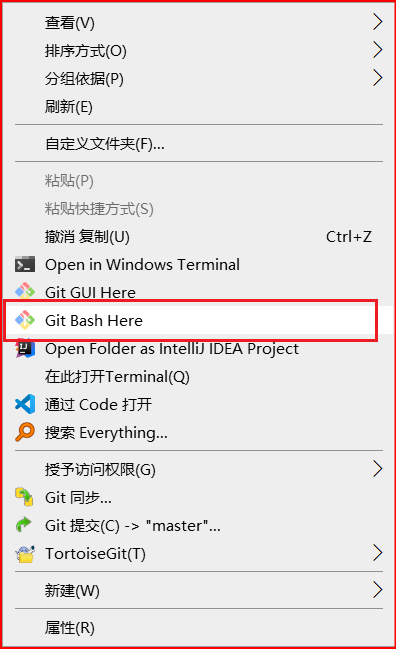

# 彻底删除gitee或者gitee中的较大文件（包括历史提交记录）

[toc]

- 确保本地仓库是最新版本

- 在仓库根目录下点击右键, 点击`Git Bash Here`

  - 

- 列出所有仓库中的文件大小处于前10的文件(包含文件的SHA值、大小、路径)， 按照文件的大小排序(由大到小)

  - ```bash
    git rev-list --all | xargs -rL1 git ls-tree -r --long | sort -uk3 | sort -rnk4 | head -10
    ```

  - 代码最后的`-10`可以改成其他数字，比如`-20`，这样就会显示20个文件

- 删除大文件以及该文件的历史提交记录

  - ```bash
    git filter-branch --tree-filter "rm -f 文件的相对路径" -- --all
    ```

- 删除包含大文件的文件夹以及该文件夹的历史提交记录

  - ```bash
    git filter-branch --tree-filter "rm -rf 文件夹的相对路径" -- --all
    ```

- 将这些删除记录从本地仓库迁至提交到远程分支

  - ```sh
    git push -f --all
    ```

- 清理本地仓库的缓存, 将本地仓库的无关历史记录也删除掉

  - ```sh
    rm -rf .git/refs/original
    rm -rf .git/logs
    git gc
    git prune
    ```

