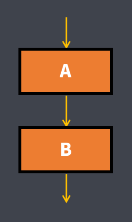

# 第04章 流程控制语句

[toc]

## 第一节 分支结构

### 分支结构的概念

| 顺序结构                                      | 分支结构                                                     |
| --------------------------------------------- | ------------------------------------------------------------ |
|  |  |

### 1. if分支结构

#### ①. if	else分支结构

```java
if (条件表达式) {
	语句块1;
}else{
	语句块2;
}
//条件表达式成立则执行语句块1; 否则执行语句块2
//else{ 语句块2; }可以省略
```

#### ②. if		else if		else分支结构

```java
if (条件表达式1) {
	语句块1;
}else if (条件表达式2){
	语句块2;
}else if (条件表达式3){
	语句块3;
}
...
else{
	语句块end;
}
//else if(条件表达式){语句块}可以是一个,也可以是多个
//if		else if		else分支结构中, 在执行完成立的第一个条件表达式对应的语句块后, if分支结构就执行完毕了, 剩下的条件表达式就不再判断了
//如果没有条件表达式成立,则执行else{语句块;}中的语句块end
//else{ 语句块end; }可以省略
```

### 2. switch case分支结构

```java
switch (变量/表达式/直接量){
    case 直接量1:
        语句块1;
        break;
    case 直接量2:
        语句块2;
        break;
    ...
    default:
        语句块n;
}
//执行流程是: 判断 变量/表达式 的值是否与case后面的直接量相等, 如果相等就执行对应的语句块,当执行到语句块中的 break; 语句时,就会在此处结束switch分支结构
//如果 变量/表达式 的值与所有case后面的直接量都不相等,那么就会执行default里面的语句块,执行结束后switch结构就执行结束了
```

- switch()中的 常量/表达式/直接量 支持的数据类型有byte、short、int、和char，JDK1.5开始支持枚举类型，JDK1.7开始支持String类型

- case后面只能跟byte、short、int、char和String类型的直接量

- 变量/表达式的数据类型必须与字面值的类型相同，否则会编译错误

- case后面的值不能相同，否则会编译时报错: case标签重复 , 需要特别注意的是字符类型对应的整数也不能跟整数变量的值相同

  - ```java
    switch ('a') {
    case 10:
    	System.out.println(10);
    	break;
    case 97:
    	System.out.println(97);
    	break;
    //编译报错, case标签重复
    /*case 97:
    	System.out.println('a');
    	break;*/
    //编译报错, case标签重复
    /*case 'a':
    	System.out.println('a');
    	break;*/
    default :
    	System.out.println("default");
    }
    ```

- 

- 只要case后面byte、short和char的直接量的值没有超过 变量/表达式/直接量 值的类型的范围 , 编译器在编译时就会将直接量的类型自动强转为 变量/表达式 值的类型 , 否则会编译报错

  - ```java
    byte a = 97;
    switch (a) {
    case 10:
    	System.out.println(10);
    	break;
case 'a':
    	System.out.println('a');
    	break;
        case 88://case 888://编译报错，因为888超过了byte的范围
    	System.out.println(88);
    	break;
    default :
    	System.out.println("default");
    }
    ```
    

#### switch结构中的break语句

- switch结构执行到了`break;`语句就会结束switch结构, 下面的case就不会再判断了

- swtich结构中如果case匹配但该case语句块里没有写`break;`语句 , 那么这个case语句块下面的所有case后面的值都不会判断是否匹配，但会运行这些case的语句块，包括default的语句块也会按顺序被执行，这种情况被称作**break穿透**[下面的语句块里如果有`break;`语句，就会在`break;`语句所在的位置跳出]

  - ```java
    byte a = 97;
    switch (a) {
    case 10:
    	System.out.println(10);
    case 'a':
    	System.out.println('a');
    case 88:
    	System.out.println(88);
    default :
    	System.out.println("default");
    }
    /*执行结果:
    a
    88
    default
    */
    ```

#### switch结构中的default语句块

```java
//当switch结构中没有case匹配时，那就会找default语句块去执行，不论default语句块是否在最后
//如果default语句块不在最后，且default语句块中没有 break; 语句，那就会发生break穿透
byte a = 97;
switch (a) {
case 10:
	System.out.println(10);
case 'b':
	System.out.println('b');
default :
	System.out.println("default");
case 88:
	System.out.println(88);
case 99:
	System.out.println(99);
}
/*执行结果:
default
88
99
*/
```

==swtich一定要按格式写，case语句块中要有break; default语句块一定要放到最后，否则会在执行过程中产生各种意想不到的结果==

## 第二节 循环结构

| 顺序结构                                                     | 分支结构                                                     | 循环结构                                                     |
| ------------------------------------------------------------ | ------------------------------------------------------------ | ------------------------------------------------------------ |
|  |  |  |

==任何复杂的程序逻辑都可以通过顺序、分支、循环三种程序结构实现==

### 1. for循环结构

- ```java
  for(初始化表达式; 条件表达式; 修改初始值表达式) {
      循环体
  }
  ```

  - 执行流程
  - 


- 双重for循环结构

  - ```java
    //主要用来处理多行多列的问题
    for(初始化表达式1; 条件表达式1; 修改初始值表达式1) {
        for(初始化表达式2; 条件表达式2; 修改初始值表达式2) {
        	循环体
    	}
    }
    ```
    
  - 双重for循环的特点
  
    - 外层循环用于控制打印的行数, 内存巡航用于控制打印的列数, 外层循环改一下, 内层循环从头到尾跑一圈
    - 在以后的卡法中若需要打印多行多列时, 需要使用双重循环
    - 多重循环不以前淘汰多层, 否则效率很低. 最高三层即可, 最常见的就是双重循环

### 2. while循环结构

```java
while(条件表达式){
	循环体;
}
```

#### while循环的执行流程


### 3. do	while循环结构

```java
do{
	循环体;
}while(条件表达式)
```

#### do  while循环的执行流程


- 从流程可以看出不管条件表达式是否成立循环都会被执行一次

## 第三节 while循环和for循环的比较

- while循环和for循环完全可以互换, 当然推荐使用for循环

- while循环更适合于明确循环条件但不明确循环次数的场合中

- for循环更适合于明确循环次数或范围的场合中

- while(true)和 for(;;)都表示无限循环, 也称死循环

  - ```java
    while(true);
    
    for(;;);
    
    while(true){
        循环体;
    }
    
    for(;;){
        循环体;
    }
    ```

### 循环结构中的`continue;`、`break;`语句以及双重循环中的标记

- `continue;`、`break;`语句都遵循就近原则，
  - `continue;`只会对距离最近的循环结构起作用
  - `break;`会对距离最近的switch结构或循环结构起作用

- ==`continue;`其作用是在此处提前结束本次循环, 并开始下一次循环==

- ==`break;`语句，其作用是在此处结束本循环结构==

- 双重循环中的标记  ---   一般用来在内循环中结束外循环

  - ```java
    //这里的outer就是标记, 当然可以起其他的名字
    outer: for(...){
        for(...){
            ...
            break outer;
            ...
        }
    }
    ```

    

  - ```java
    //这里的outer就是标记, 当然可以起其他的名字
    outer: for(...){
        for(...){
            ...
            continue outer;
            ...
        }
    }
    ```

  - 