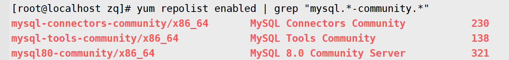

# 第07章 开发环境搭建和shell编程

[toc]

## 一. 开发环境搭建

### 1.1 Xshell和Xftp工具

#### 1.1.1 下载地址

- Xshell: <https://www.netsarang.com/en/xshell-download/>
- Xftp: <https://www.netsarang.com/en/xftp-download/>
  - 用来在主机与虚拟机之间传输文件
  - 安装好Xftp之后, 在Xshell页面上点击红圈里的标签即可打开Xftp
    - 
- 选择`Free License for Home and School Users`版本, 之后输入姓名和邮箱, 下载地址就会发送到这个邮箱中

#### 1.1.2 使用方法

- 新建**会话**, 点击侧边栏中的**连接**, 输入==远程主机==的**名称**(可以随意设置), 协议选择`SSH`, **主机(H)**里输入==远程主机==的**IP地址**, 端口号默认为`22`
- 设置**连接**
  - 如果是虚拟机, 可以根据[1.2 为虚拟机设置静态IP](#1.2 为虚拟机设置静态IP)的步骤配置虚拟机的**ip地址**
  - 
- 设置**用户和密码**
  - 
- 设置**外观**
  - 

### 1.2 为虚拟机设置静态IP

#### 1.2.1 配置VMware

- 在Vmware上右键点击虚拟机的选项卡, 点击设置, 将**网络适配器**的**网络连接**设置为**NAT模式**
  - 
- 点击Vmware的菜单**编辑**, 点击**虚拟网络编辑器(N)...**, 打开**虚拟机网络编辑器**
- 点击类型为**NAT模式**的那一列
  - 
- 点击**NAT设置(S)...**可以获取`NETMASK`和`GATEWAY`
  - 
- 点击**DHCP设置(P)...**可以获取虚拟机IP地址的取值范围
  - 

#### 1.2.2 设置虚拟机的IP配置, 将虚拟机的IP固定下来

**必须使用==root==用户进行如下操作**

- 运行以下指令, 获取当前系统的IP配置文件的路径

  - ```shell
    find /etc/sysconfig/network-scripts -name "ifcfg-en*"
    ```

  - 假设获取到的路径为`/etc/sysconfig/network-scripts/ifcfg-ens33`

- 使用`vim`打开`/etc/sysconfig/network-scripts/ifcfg-ens33`文件

- 将`BOOTPROTO`的值改为`"static"`

- 将`ONBOOT`的值改为`"yes"`

- 在文末添加以下代码

  - ```properties
    GATEWAY="192.168.220.2"
    NETMASK="255.255.255.0"
    IPADDR="192.168.220.222"
    DNS1=1"14.114.114.114"
    DNS2="8.8.8.8"
    ```

- 退出`vim`

- 由`root`用户输入以下命令重启网络, 使刚才编辑的网络配置生效

  - ```shell
    service network restart
    ```

  - 或者

    - ```shell
      systemctl restart network
      ```
  
- ==重启虚拟机, 才能使设置生效==

#### 1.2.3 通过访问宿主机来访问到虚拟机的配置

- 点击Vmware的菜单**编辑**, 点击**虚拟网络编辑器(N)...**, 打开**虚拟机网络编辑器**
- 点击**更改设置(C)**, 在**虚拟机网络编辑器**重启后, 点击**NAT设置(S)...**, 打开**NAT设置**
  - 
- 点击**添加**, 打开映射传入端口
  - 
- 如图所示, 就是**映射传入端口**
  - 
  - **虚拟机IP地址**就是虚拟机的IP地址了, **虚拟机端口**就是虚拟机对外开放的端口, 而**主机端口**就是访问主机的这个端口时实际访问的是**映射的**虚拟机的(**IP地址:端口**)

### 1.3 修改远程主机的SSH端口号

**必须使用==root==用户进行如下操作**

- 在终端输入命令, 编辑ssh的配置

  - ```shell
    vim /etc/ssh/sshd_config
    ```

- 查找`Port 22`字段, 将前面的注释`#`去掉, 再在该行下面加上一行`Port 2202`(2202是新增的SSH端口号)

  - 如果**想要关闭某个已开放的SSH端口号**, 那就在`Port 端口号`前面加个`#`

- 退出Vim

-  输入以下命令把`Port 22`和`Port 2202`添加到SElinux端口中

  - ```shell
    semanage port -a -t ssh_port_t -p tcp 22
    semanage prot -a -t ssh_port_t -p tcp 2202
    ```

  - 输入以下命令可以检测端口是否添加成功

    - ```shell
      semanage port -l | grep ssh
      ```

  

- 在终端输入以下命令来重启sshd服务, 以便sshd配置生效

  - ```shell
    systemctl restart sshd
    ```

- 根据[1.4.2 开放本机指定端口的命令](#1.4.2 开放本机指定端口的命令)配置远程主机的防火墙开放2202这个端口

### 1.4 CentOS7的防火墙`firewall`

#### 1.4.1 管理防火墙的相关命令

- 启动防火墙服务

  - ```shell
    systemctl start firewalld
    ```

- 停止防火墙服务

  - ```shell
    systemctl stop firewalld
    ```

- 重启防火墙服务

  - ```shell
    systemctl restart firewalld
    ```

- 查看防火墙服务状态

  - ```shell
    systemctl status firewalld
    ```

#### 1.4.2 开放本机指定端口的命令

**必须使用==root==用户进行如下操作**

##### 1.4.2.1 添加端口

- 永久添加指定的端口/协议（协议是TCP或者UDP）, 这里的永久是指重启时该配置也生效, 不想永久的话可以去掉关键字`--permanent`, 以`--permanent`模式添加的端口, 只能以`--permanent`模式移除

  - ```shell
    firewall-cmd --permanent --add-port=2202/tcp 
    ```
##### 1.4.2.2 使配置生效

- 重载防火墙配置, 以便刚添加的端口生效

  - ```shell
    firewall-cmd --reload
    ```

##### 1.4.2.3 查看端口

- 只有经过**使配置生效**的步骤才能查看到开放的端口

  - ```shell
    firewall-cmd --list-ports
    ```


##### 1.4.2.4 移除端口

- 移除指定的端口/协议（协议是TCP或者UDP）, 以`--permanent`模式添加的端口, 只能以`--permanent`模式移除

  - ```shell
    firewall-cmd --permanent --remove-port=65535/tcp
    ```

### 1.5 JDK的下载和安装

#### 1.5.1 下载

- 下载地址: <https://www.oracle.com/java/technologies/javase-downloads.html>
  - 向下滚动网页, 找到所需的版本, 比如[Java SE 11 (LTS)](https://www.oracle.com/java/technologies/javase-jdk11-downloads.html)
- 下载`Product/File Description`为`Linux x64 Compressed Archive`的那个文件`jdk-11.0.11_linux-x64_bin.tar.gz`

#### 1.5.2 安装

##### 1.5.2.1 传输和解压缩

- 在Xshell上使用Xftp将`jdk-11.0.11_linux-x64_bin.tar.gz`推送到远程主机的`/home/zq/Downloads`文件夹下
- **由==普通用户==解压这个压缩文件**, 这样做的目的是让这个普通用户拥有这些解压出来的文件的`rwx`权限
- 解压出来的文件夹重命名为`java/jdk/jdk-11.0.11`, 
- 由==root用户==把`java`文件夹移动到`/usr`目录下

##### 1.5.2.2 将java配置到环境变量中

- 由`root`用户输入以下命令, 打开配置文件`/etc/profile`

  - ```xshell
    vim /etc/profile
    ```

- 在文件末尾追加以下内容

  - ```properties
    # 配置JAVA_HOME
    export JAVA_HOME=/usr/java/jdk/jdk-11.0.11
    # 把JAVA_HOME添加到PATH中
    export PATH=$JAVA_HOME/bin:$PATH
    ```

  - 退出vim后输入以下命令**使配置生效**

    - ```shell
      source /etc/profile
      ```

- 输入以下命令验证是否配置成功

  - ```shell
    javac -version
    ```

  - 显示jdk版本则说明配置成功, 

###### 如果出现以下错误

- ```shell
  bash: /usr/Java/jdk-11.0.11/bin/javac: cannot execute binary file
  ```
  
- 则说明下载的jdk跟当前系统不兼容, 比如系统是32位的, 但jdk是64位的; 或者jdk是专门为debian系统准备的, 但当前系统是centos7, 解决办法就是下载一个匹配系统的jdk

##### 1.5.2.3 安装jre模块

  > JDK自JDK11之后就默认不安装JRE模块了,但我们可以通过代码使JDK安装这个模块

- 退出`root`用户

- 由普通用户依次输入以下命令, (这样做谁为了让普通用户成为`jre`目录的属主)

  - ```shell
    source /etc/profile
    ```

  - ```shell
    cd /usr/java/jdk/jdk-11.0.11
    ```

  - ```shell
    jlink --module-path jmods --add-modules java.desktop --output jre
    ```

- 输入`ls /usr/java/jdk/jdk-11.0.11`查看该文件夹下是否有`jre`这个文件夹来确认`jre`模块是否安装成功

### 1.6 Tomcat的下载和安装

#### 1.6.1 下载

- 下载地址: <https://tomcat.apache.org/download-80.cgi>
- 下载`tar.gz`类型的

#### 1.6.2 安装

##### 1.6.2.1 传输和解压缩

- 在Xshell上使用Xftp将`apache-tomcat-8.5.68.tar.gz`推送到远程主机的`/home/zq/Downloads`文件夹下

- **由==普通用户==解压这个压缩文件**, 这样做的目的是让普通成为这些解压出来的文件的属主

  - ```shell
    tar -zxvf apache-tomcat-8.5.68.tar.gz
    ```

- 解压出来的文件夹重命名为`apache/tomcat/tomcat-8.5.68`

  - ```shell
    mkdir apache
    mv apache-tomcat-8.5.68 apache/tomcat/tomcat-8.5.68
    ```

    

- 由==root用户==把`apache`文件夹移动到`/usr`目录下

  - ```shell
    mv apache /usr
    ```

- 退出root用户, 为`/usr/apache/tomcat-8.5.68/webapps`在普通用户的根目录下创建一个快捷方式

  - ```shell
    ln -s /usr/apache/tomcat/tomcat-8.5.68/webapps ~/webapps
    ```

##### 1.6.2.2 将tomcat配置到环境变量中

- 由`root`用户输入以下命令, 打开配置文件`/etc/profile`

  - ```xshell
    vim /etc/profile
    ```

- 在文件末尾追加以下内容

  - ```properties
    # 配置CATALINA_HOME
    export CATALINA_HOME=/usr/apache/tomcat/tomcat-8.5.68
    # 把CATALINA_HOME添加到PATH中
    export PATH=$CATALINA_HOME/bin:$PATH
    ```

  - 退出vim后输入以下命令使tomcat环境配置生效

    - ```shell
      source /etc/profile
      ```

- 退出`root`用户, 切换成普通用户的身份, 再次输入以下命令使tomcat环境配置在普通用户下生效

  - ```
  source /etc/profile
    ```
  
- 使用普通用户,开启tomcat验证是否配置成功

  - ```shell
    startup.sh
    ```
    

##### 1.6.2.3 在防火墙上开放tomat常用的端口

> 根据[1.4.2 开放本机指定端口的命令](#1.4.2 开放本机指定端口的命令)的步骤在防火墙上开放tomcat所需的端口(8080)

##### 1.6.2.4 tomcat常用命令

- 启动tomcat

  - ```shell
    startup.sh
    ```

- 关闭tomcat

  - ```shell
    shutdwon.sh
    ```

- 查看tomcat是否开启

  - ```shell
    ps -ef | grep tomcat
    ```

  - 显示结果的第一条中的第4个字段表示的是tomcat程序所占用cpu资源的百分比, **如果值为`0`, 则说明tomcat处于关闭状态**, ==如果值不为`0`, 说明tomcat处于开启状态==

### 1.7 将Web项目发布到远程主机的tomcat中

#### 1.7.1 使用IDEA生成`.war`文件

- `File`→`Project Structure...`→`Project Setting`→`Artifacts`→`+`→`Web Application: Archive`→`For '项目名:war exploded'`
- 打开文件夹`项目路径/out/artifacts/项目名_war`, 该文件夹下的war文件即是生成的war文件

#### 1.7.2 把war文件部署到远程主机的tomcat中

- 使用Xftp把这个war文件推送到远程主机的tomcat下的webapps文件夹中, 当tomcat重启后, 会自动解压这个war文件, 还原成web项目, **注意war文件的文件名就是web项目的名字, 也是这个项目的环境部署路径**

### 1.8 MySQL的下载和安装

#### 1.8.1获取MySQL的rpm源的repo地址

**repo是repository(仓库)的简写.**

- [打开MySQL Community Downloads的网址](https://dev.mysql.com/downloads/), 点击`MySQL Yum Repository`, 找到所需的MySQL`rpm`源的版本
  
- 
  
- 点击`Download`, 浏览器新建的下载任务里的网址就是rpm源的repo地址

  - ```
    https://repo.mysql.com//mysql80-community-release-el7-3.noarch.rpm
    ```

##### 1.8.1.1 下载mysql的rpm源到虚拟机上

**使用任意用户运行以下命令**, `wget`---从网络上下载文件到当前目录下

```shell
wget https://repo.mysql.com//mysql80-community-release-el7-3.noarch.rpm
```

#### 1.8.2 添加源

**需要在root用户下执行**

```shell
rpm -ivh mysql80-community-release-el7-3.noarch.rpm
```

#### 1.8.3 检查mysql源是否添加成功

```shell
yum repolist enabled | grep "mysql.*-community.*"
```



#### 1.8.3 安装MySQL服务器

**需要在root用户下执行**

```shell
yum install mysql-server
```

#### 1.8.4 启动服务

```shell
systemctl start mysqld
```

或者

```shell
service mysqld start
```

#### 1.8.5 查看mysql的服务状态

```shell
systemctl status mysqld
```

#### 1.8.6 登录mysql服务器的`root`用户

##### 1.8.6.1 获取刚安装好mysql的临时密码

- 输入以下命令, 获取刚安装好mysql的临时密码

  - ```shell
    grep "password" /var/log/mysqld.log
    ```

  - 结果

    - 

- 输入以下命令, 登录mysql, 密码使用上面查到的临时密码

  - ```shell
    mysql -uroot -p密码
    ```

##### 1.8.6.2 初始化root用户的登录密码

- 使用临时密码登录mysql后, 是无法进行数据库操作的, 必需为数据库设置登录密码才可以对数据库进行操作, 输入以下命令设置mysql的登录密码, **密码至少要有8位, 至少有一个小写字母, 至少有一个大写字母, 至少有一个数字, 至少有一个特殊字符**

  - ```shell
    alter user 'root'@'localhost' identified by "Zq12345!";
    ```

  - 运行以下命令, 通知MySQL, 更新了密码

    - ```sql
      flush privileges;
      ```
    
  - 退出mysql, 用新密码登录MySQL

##### 1.8.6.3 配置可以远程登录mysql服务器的`root`用户

- 登录mysql服务器的`root`用户后, 修改`mysql.user`表中, 可以访问`root`用户(用户的字段是`user`)的主机`host`的IP地址, 使这个mysql服务器允许远程使用`root`用户登录

  - ```sql
    update mysql.user set host = '%' where user = 'root';
    ```

- 按照[1.4.2 开放本机指定端口的命令](#1.4.2 开放本机指定端口的命令)开放本机的`3306`端口

##### 1.8.6.4 使用宿主机上的SQLYog客户端远程登录虚拟机上MySQL服务器

- **在创建新连接输入用户名和密码登录MySQL服务器时可能出现问题**, 这是因为创建连接时需要MySQL开启一个验证密码的插件,可通过以下步骤开启
  
  - 使用Xshell登录虚拟机上的MySQL服务器的`root`用户
  - 输入以下代码, 把用户 主机名 密码改成新连接所使用的**用户名** **主机名** 和**密码**
  - ```sql
   #1. 修改加密规则 
  ALTER USER '用户'@'主机名' IDENTIFIED BY '密码' PASSWORD EXPIRE NEVER; 
#2. 更新一下用户的密码
  ALTER USER '用户'@'主机名' IDENTIFIED WITH mysql_native_password BY '密码';
  #3. 刷新权限
  FLUSH PRIVILEGES; 
  #4. 重置密码
  alter user '用户'@'主机名' identified by '密码';
   ```
  
  

#### 1.8.7 配置MySQL服务器的默认时区和默认编码

**使用虚拟机的root用户进行以下操作**

```shell
vim /etc/my.cnf
```

##### 1.8.7.1 修改默认时区

1. 查找`[mysqld]`, 在`[mysqld]`下输入以下文本

   1. ```shell
      default-time_zone='+8:00'
      ```

   2. 若没有`[mysqld]`这一行，则手动添加。

2. +8:00表示东八区, 是中国法定时区, 设置时区在IDEA中要用

##### 1.8.7.2 配置mysql服务端默认编码

在`[mysqld]`下面添加(==若没有`[mysqld]`这一行，则在文末手动添加。==)

```shell
character-set-server=utf8mb4
```

##### 1.8.7.3 配置mysql客户端默认编码

   1. 在`[client]`下面添加(==若没有`[client]`这一行，则在**文末**手动添加==)

   1. ```shell
      default-character-set=utf8mb4
      ```

##### 1.8.7.4 重启MySQL服务

```shell
systemctl restart mysqld
```


##### 查看mysql服务器的默认时区和默认编码

```shell
SHOW VARIABLES LIKE '%time_zone%';
SHOW VARIABLES LIKE 'char%';
```


#### 1.8.8 MySQL其它的常用命令

| 命令                                                  | 说明                                                         |
| ----------------------------------------------------- | ------------------------------------------------------------ |
| mysql -u用户名 -p密码                                 | 使用指定用户名和密码登录当前计算机的MySQL数据库              |
| exit或者quit                                          | 退出数据库                                                   |
| mysqladmin -u用户名 -p旧密码 password 新密码          | 修改MySQL指定用户的登录密码, **必须知道旧密码****            |
| alter user '用户名'@'host地址' identified by "新密码" | 修改MySQL指定用户的登录密码,**无需旧密码 但必须**登录mysql服务器的`root`用户<br />如果没有设置允许简单密码, 那么新密码: **至少要有8位, 至少有一个小写字母, 至少有一个大写字母, 至少有一个数字, 至少有一个特殊字符** |


#### 1.8.9 配置mysql服务器(至少是80版本)允许设置简单密码(可选)

**登录mysql后, 输入以下命令**

```sql
set global validate_password.policy=0;
set global validate_password.length=1;
```

**想要还原的换, 就输入以下命令**

```sql
set global validate_password.policy=MEDIUM;
set global validate_password.length=8;
```


#### 1.8.10 常用的控制MySQL服务的命令

| 命令                       | 功能                 |
| -------------------------- | -------------------- |
| `systemctl start mysqld`   | 启动MySQL服务        |
| `systemctl stop mysqld`    | 关闭MySQL服务        |
| `systemctl restart mysqld` | 重启MySQL服务        |
| `systemctl status mysqld`  | 显示M有SQL服务的状态 |

#### 1.8.11 卸载MySQL

- 关闭MySQL服务

  - ```shell
    systemctl stop mysqld
    ```

- 获取MySQL的yum安装列表

  - ```shell
    yum list installed mysql*
    ```

  - 

- 从yum中卸载这些文件, 参数就是红框圈起来的部分, **不包括**`.`及`.`之后的内容

  - ```shell
    yum remove mysql-community-client mysql-community-client-plugins mysql-community-common mysql-community-libs mysql-community-server mysql80-community-release
    ```

- 找到mysql相关目录

  - ```shell
    find / -name "mysql"
    ```

  - 

- 删除这两个目录

  - ```shell
    rm -rf /var/lib/mysql /user/lib64/mysql
    ```

- 删除其他的相关文件

  - ```shell
    rm -rf /etc/my.cnf
    rm -rf /var/log/mysqld.log
    ```

#### 1.8.12 升级yum安装的所有软件

==只有root用户才能使用该命令升级所有软件==

```shell
yum update
```


## 二. Shell编程

### 2.1 基本概念

- Shell是一个命令行解释器, 可以接收应用程序或用户命令, 然后访问操作系统内核
- Shell时一个功能相当强大的编程语言, 易编写、易调试、灵活性强。

### 2.2 编写第一个Shell程序

- 一个Shell程序其实就是一个后缀名为`.sh`的文件

- 使用vim工具创建demo.sh文件(shell编程的文件的后缀名是`.sh`)

- `sh`文件的开头必须是`#!/bin/bash`

- `demo.sh`文件内容示例

  - ```shell
    #!/bin/bash
    echo "Hero's never die"
    ```

### 2.3 执行Shell程序的方式

#### 2.3.1 方式一

- **直接在终端输入sh文件的绝对路径, 即可执行该文件(前提是当前用户==必须有==该文件的执行权限,即`x`权限)**

- ```
  ./demo.sh
  ```

- ```
  /home/zq/demo.sh
  ```


#### 2.3.2 方式2

- **使用命令来执行`sh`文件(当前用户==不需要有==该文件的执行权限)**

- ```
  /bin/bash demo.sh
  ```

- ```
  bash demo.sh
  ```

- ```
  sh demo.sh
  ```

- `sh`和`bash`命令其实都是`/bin/bash`命令的不同写法

### 2.4 定义变量和使用变量

#### 2.4.1 语法格式

- ```sh
  # 定义变量, 注意: =两边不能有空格
  变量=值
  
  # 调用变量
  echo $变量
  
  # 赋新值
  变量=新值
  
  # 调用变量
  echo $变量
  
  # 撤销变量
  unset 变量
  
  # 调用变量
  echo $变量
  ```

- ```sh
  # 定义变量
  name=黑百合
  
  # 调用变量
  echo $name
  
  # 赋新值
  name="穗乃果 海莲娜"
  
  # 调用变量
  echo $name
  
  # 撤销变量
  unset name
  
  # 调用变量
  echo $name
  ```

#### 2.4.2 变量定义的规则

- 变量名称只能由字母、数字和下划线组成， 但不能以数字开头， 环境变量名建议大写， 变量名称里不能有空格

- 变量名不能使用shell里的关键字(通过help命令可以查看保留关键字)

- **在bash中， 变量默认类型都是字符串类型， 无法直接进行数值运算**

- 字符串里如果有空格， 就必须使用双引号或单引号括起来

  - 单引号括起来的字符串里不能调用变量， **但双引号括起来的字符串里可以调用变量**

- 变量的值可以是个终端命令

  -  这个终端命令必须用quote符号(反引号)``` `括起来, **需要注意的是命令只有作为变量的值是才需要用饭引号括起来**

  - 变量的值就是这个终端命令执行结束后的反馈信息,

  - 执行到这个终端命令时, **这个sh文件的执行就会进入等待状态,** 只有这个终端命令执行结束并将反馈信息赋值给变量后, **这个sh文件才会继续执行**

  - ```sh
    #!/bin/bash
    dirs=`ls -a ~`
    echo "当前用户的根目录下有以下目录和文件:
    $dirs"
    ```

#### 2.4.3 定义变量

```shell
name1=黑百合
name2='穗乃果'  #所见即所得
name3="海莲娜"
name3="${name1}代号:widowmaker"  #可以调用变量, 使用转义符号
name4=`ls ~`    #执行命令, 等命令执行结束后将命令输出赋值给变量
```

#### 2.4.4 使用变量

**推荐使用变量时给变量加上花括号, 这是个良好的编程习惯**

```sh
name="黑百合"
#使用变量的方法一
echo $name
#使用变量的方法二
echo ${name} 推荐使用变量时给变量加上花括号, 这是个良好的编程习惯
```

#### 2.4.5 删除变量

```sh
name="黑百合"
echo ${name}
unset name
echo ${name}
```

#### 2.4.6从终端读取用户的输入

**要求用户在终端输入内容, 并将这个内容保存到一个变量中**

##### 2.4.6.1 提示内容与输入内容在同一行

```sh
#!/bin/bash
read -p "请输入您的名字: " name
echo "您的名字是: ${anme}"
```

##### 2.4.6.2 提示内容与输入内容不在同一行

```sh
#!/bin/bash
echo "请输入您的名字: "
read name
echo "您的名字是: ${name}"
```

### 2.5 常用运算符

#### 2.5.1 算术运算符

| 运算符 | 说明 |
| ------ | ---- |
| `+`    | 加   |
| `-`    | 减   |
| `*`    | 乘   |
| `/`    | 除   |
| `%`    | 取余 |

**三种使用方式**

##### 2.5.1.1 第一种使用方式

```sh
#!/bin/bash
a=99
b=88
c=`expr ${a} + ${b}`# +号两边必须有空格
echo "c=$c"
```

##### 5.1.2 第二种使用方式

```sh
#!/bin/bash
a=99
b=88
c=$[${a}+${b}]# 两边不能有空格
echo "c=${c}"
```

##### 2.5.1.3 第三种方式

```sh
#!/bin/bash
a=99
b=88
c=$((${a}+${b}))# 两边不能有空格
echo "c=${c}"
```


#### 2.5.2 赋值运算符

**赋值运算符两边不能有空格**

| 运算符 | 说明 | 举例                                                         |
| ------ | ---- | ------------------------------------------------------------ |
| `=`    | 赋值 | 为一个变量赋值, 注意在shell编程中, 变量的默认类型是字符串, ==`=`两边不能有空格== |

```sh
#!/bin/bash
a=黑百合
b="黑百合 穗乃果"
c="$b Mercy"
echo "a=$a"
echo "b=$b"
echo "c=$c"
```


#### 2.5.3 关系运算符

- **关系运算符两边必须有空格**
- **关系运算符形成的条件表达式不能赋值给变量, 只能用在流程控制语句的条件判断上**
- 使用方法:`  [ 99 -eq 88 ] `, 关系运算符两边要有空格,**中括号前后**也必须有空格
-  ` [ 99 -eq 88 ]`是一个条件表达式, 注意`[ ]`是条件表达式的一部分

##### 2.5.3.1 整数比较符

| 运算符 | 说明                               |
| ------ | ---------------------------------- |
| `-eq`  | equal, 相等                        |
| `==`   | 相等                               |
| `-ne`  | not equal, 不等于                  |
| `!=`   | 不等于                             |
| `-gt`  | greater than, 大于                 |
| `-ge`  | greater thar or equal to, 大于等于 |
| `-lt`  | less than, 小于                    |
| `-le`  | less than or equal to, 小于等于    |

```sh
#!/bin/bash
a=99
b=88
if [ a -eq b ] ;#中括号前后也必须有空格
	then
		echo "${a}等于${b}"
	else
		echo "${a}不等于${b}"
fi
```

##### 2.5.3.2 字符串比较符

| 运算符 | 描述                  | 示例                                                    |
| ------ | --------------------- | ------------------------------------------------------- |
| `==`   | 两边的字符串相同      | ` [ "黑百合" == '黑百合' ] `为`true`                    |
| `!=`   | 两边的字符串不同      | ` [ "黑百合" != '黑百合' ] `为`false`                   |
| `-n`   | 字符串长度不等于0为真 | ` [ -n "黑百合" ] `为`true`<br />` [ -n "" ] `为`false` |
| `-z`   | 字符串长度等于0为真   | ` [ -z "黑百合" ]`为`false`<br />` [ -z "" ] `为`true`  |

##### 2.5.3.3 布尔运算符

| 运算符 | 描述       | 示例                    |
| ------ | ---------- | ----------------------- |
| `!`    | 逻辑**非** | `[ ! 1 -eq 2 ]`         |
| `-a`   | 逻辑**与** | `[ 1 -eq 2 -a 2 -eq 2]` |
| `-o`   | 逻辑**或** | `[ 1 -eq 2 -o 2 -eq 2]` |


### 2.6 终端命令单独成一行

- **终端命令单独成一行时是==不可以==用反引号括起来的**
- 执行单独成一行的命令时, **bash会继续执行`sh`文件的下一行代码, 不管这个命令有没有执行结束**

### 2.7 数组

- Shell只支持一维数组

- Shell 数组用括号来表示，元素用"空格"符号分割开，语法格式如下：

  - ```sh
    arr=(value1 value2 ... valuen)
    ```

- 数组元素的下标由0开始

  - ```sh
    arr=(1 2 3 4)
    echo "数组的第1个元素是: ${arr[0]}"
    echo "数组的第2个元素是: ${arr[1]}"
    echo "数组的第3个元素是: ${arr[2]}"
    echo "数组的第4个元素是: ${arr[3]}"
    ```

- 数组元素的赋值, **数组的长度可以按需增加**

  - ```sh
    arr=()
    arr[0]="A"
    arr[1]="B"
    arr[2]="C"
    arr[3]="D"
    arr[4]="E" 
    ```

- 调用整个数组: `${arr[*]}`或者`${arr[@]}`

  - ```sh
    #!/bin/bash
    arr=()
    arr[0]=a
    arr[1]=b
    arr[2]=c
    arr[3]=d
    echo ${arr[*]} # a b c d
    echo ${arr[@]} # a b c d
    
    newArr=(${arr[*]}) 
    newArr[4]=5
    echo ${newArr[*]} # a b c d 5
    ```

- 数组长度,: `${#arr[*]}`或者`${#arr[@]}`, 跟调用整个数组相比多了个`#`

  - ```shell
    arr=(a c d e g)
    echo "数组arr为: ${arr[*]}"
    echo "数组arr的长度为: ${#arr[*]}"
    ```

### 2.8 流程控制语句

#### 2.8.1 if语句

##### 2.8.1.1 单分支

###### 2.8.1.1.1 语法格式

**注意: ==空格绝不可省略==**

```sh
if 条件表达式 ; then #注意空格绝不可省略
	命令
fi
```

###### 2.8.1.1.2 示例代码

```sh
read -p "请输入您的成绩: " score
if [ ${score} -ge 60 ] ; then
	echo "你考了60分, 及格万岁"
fi
```

##### 2.8.1.2 双分支

###### 2.8.1.2.1 语法格式

```sh
if 条件表达式 ; then
	命令
else
	命令
if
```

###### 2.8.1.2.2 示例代码

```sh
#!/bin/bash
read -p "请输入您的成绩: " score
if [ ${score} -ge 60 ] ; then
    echo "您的成绩为${score}分, 及格万岁"
else
    echo "您的成绩为${score}分, 准备补考吧"
fi

```

##### 2.8.1.3 多分枝

###### 2.8.1.3.1 语法格式

```sh
if 条件表达式1 ; then
	命令1
elif 条件表达式2 ; then
	命令2
else
	命令3
fi
```

###### 2.8.1.3.2 示例代码

```sh
#!/bin/bash
read -p "请输入您的成绩: " score
if [ ${score} -ge 85 ] ; then
    echo "您的成绩是${score}分, 非常优秀"
elif [ ${score} -ge 60 -a ${score} -lt 85 ] ; then
    echo "您的成绩是${score}分, 及格万岁"
else 
    echo "您的成绩是${score}分, 准备补考吧"

fi
```

#### 2.8.2 case语句

**shell中的case语句对标java中的switch语句**

##### 2.8.2.1 语法格式

```sh
case ${变量名} in
	"值1")
		程序1
	;;  #类似于Java语句中的break
	"值2")
		程序2
	;;
	
	...
	
	*) # 类似于Java中switch语句里的default
		程序x
	;;
esac
```

##### 2.8.2.2 示例代码

```sh
#!/bin/bash
read -p "请输入1~4的整数" num 

case ${num} in
    "1")
        echo "您输入的是1"
    ;;  
    "2")
        echo "您输入的是2"
     ;;  
     "3")
        echo "您输入的是3"
    ;;  
    "4")
        echo "您输入的是4"
    ;;  
    *)  
        echo "您输入的不是1~4的整数, 请重新输入"
    ;;  
esac
```


#### 2.8.3 循环语句

##### 2.8.3.1 for循环

###### 2.8.3.1.1 语法格式

````sh
for (( 初始值 ; 循环控制条件 ; 变量变化 ))#跟Java中的for循环相同
do
	程序
done
````

###### 2.8.3.1.2 示例代码

```sh
#!/bin/bash
for(( i=0 ; i < 10 ; i++))
do
    echo "这是第$[${i}+1]行"
done

```

##### 2.8.3.2 while循环

###### 2.8.3.2.1 语法格式

```sh
while 条件表达式
do
	程序
done
```

###### 2.8.3.2.2 示例代码

```sh
#!/bin/bash
i=0
while [ ${i} -lt 10 ]
do
    i=$[${i}+1]
    echo "这是第${i}行"
done
```

##### 2.8.3.3 循环语句中的`continue`和`break`

- Shell的循环语句中可以使用`continue`和`break`, 功能与Java语言中的`continue;`和`break;`相同

#### 2.8.4 函数

##### 2.8.4.1 语法格式

- ```sh
  [function] funname [()]
  {
  	action;
  	[return int;]
  }
  ```

- `[ ]`表示改内容可以省略

- `()`只有在该方法不接受参数时才可以省略, **最好任何情况下也不要省略`()`**

- 返回值只能是个整数, 一般只是用来表示这个方法的功能有没有成功实现, `0`表示功能成功实现, 其它整数表示功能实现失败; **如果没写return语句的话, 本函数将会将以最后一条命令运行结果，作为返回值**

##### 2.8.4.2 示例代码

###### 2.8.4.2.1 定义函数

```sh
#!/bin/bash
demo()
{
    echo "您输入了${#}个参数"
    echo "这些参数是: ${*}"
    echo "这些参数是: ${@}"
    echo "您输入的参数1是: ${1}"
    echo "您输入的参数2是: ${2}"
    return 100;
}

```

- ${#}    表示这个函数接收了多少个参数
- ${*}    将这个函数接受的所有参数依次放到一个字符串里, 并用一个空格隔开, `${*}`表示的就是这个字符串
- ${@}    功能与`${*}`相同
- ${1}    表示函数接收的第1个参数
- ${2}    表示函数接受的第2个参数, 可以以此类型`${3}`  `${4}`  `${5}`的作用, 第1~9个参数的花括号**可以省略**, 第10以及超过10的参数的花括号**不可以省略**

###### 2.8.4.2.2 调用函数

```sh
read -p "请输入一个整数: " num1
read -p "请输入另一个整数: " num2

#调用函数
demo $num1 $num2
echo "方法的返回值是: ${?}"
```

- 调用函数时, 先写函数的名字, 后面写出入函数的参数, 函数与参数, 参数与参数之间要有空格, `demo $num1 $num2`
- `${?}`    表示上一个命令的返回值, 比如此时就表示`demo`这个函数的返回值
- 调用函数的语句可以在定义函数的语句前面, 也可以在后面

## 三. 布尔类型详解

- 在Shell中, `true`和`false`不是布尔值, 而是两个内置函数

  - 函数`true`的返回值是0
  - 函数`false`的返回值是1

- 条件表达式的值不是`true`或者`false`, 而是`0`或非`0`的整数

  - `0`表示通过

  - 非`0`的正数表示不通过

  - ```sh
    #!/bin/bash
    read -p "请输入一个整数: " num 
    if [ ${num} ] ; then
        echo "数字--0"
    else
        echo "非0数字"
    fi
    ```