# 第03章 课程管理模块开发02

## 一. 开发流程

### 1.1 需求分析

接下来开发的是: 配置课时(课程内容管理)模块, 主要是对课程内容进行管理

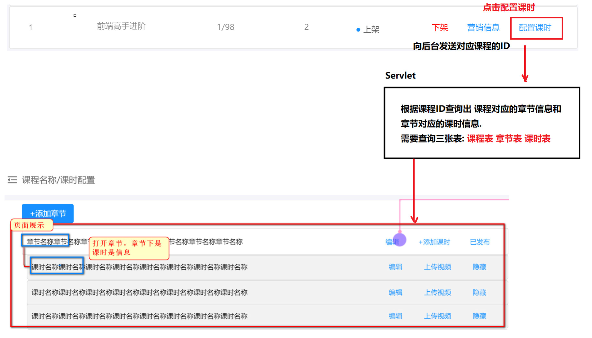

### 1.2 数据库表分析

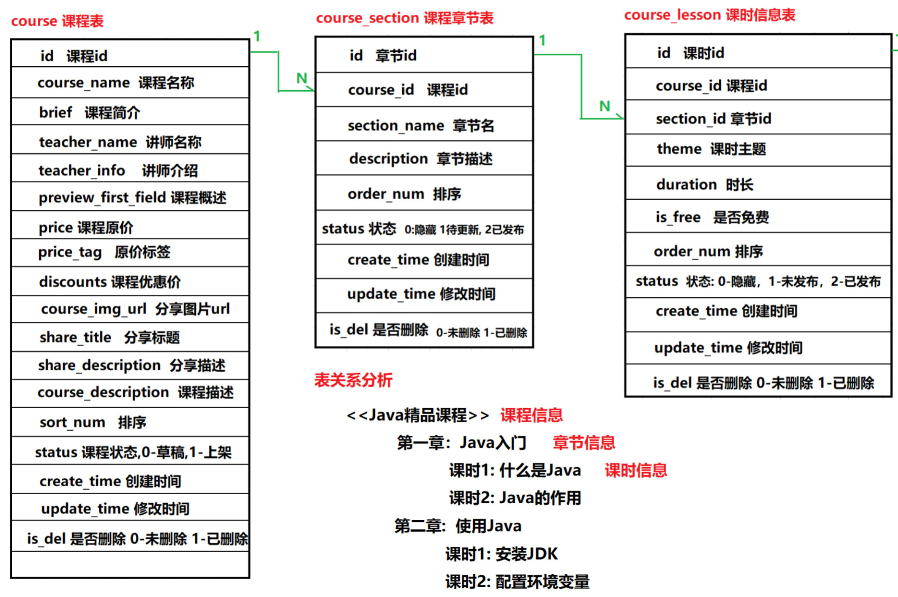

### 1.3 实体类设计

#### 1.3.0 数据库表关系分析

- course表与course_section表是1对多关系, 1是course, 多是course_section
- couse_section表与course_lesson表是1对多关系, 1是course_section, 多是course_lesson

#### 1.3.1 Course类

```java
  /**
   * 1对∞的数据表关系中, 在 1 的一方的实体类里, 会封装一个 ∞ 的对象的集合
   * 1的类型是{@link Course},
   * ∞的类型是{@link Course_Section}
   */
  private List<Course_Section> courseSectionList;
```

#### 1.3.2 Course_Section类

```java
  /**
   * ∞对1的数据库表关系中, 在 ∞ 的一方的实体类里, 会封装一个 1 的对象
   * ∞的类型是{@link Course_Section},
   * 1的类型是{@link Course}
   */
  private Course course;

  /**
   * 1对∞的数据库表关系中, 在 1 的一方的实体类里, 会封装一个 ∞ 的对象的集合
   * 1的类型是{@link Course_Section},
   * ∞的类型是{@link Course_Lesson}
   */
  private List<Course_Lesson> courseLessonList;
```

#### 1.3.3 Course_Lesson类

```java
  /**
   * ∞对1的数据库表关系中, 在 ∞ 的一方的实体类里, 会封装一个 1 的对象
   * ∞的类型是{@link Course_Lesson},
   * 1的类型是{@link Course_Section}
   */
  private Course_Section courseSection;
```

### 1.4 Dao接口及其实现类创建

#### 1.4.1 Dao接口创建

```java
public interface CourseContentDao {
    
}
```

#### 1.4.2 Dao实现类创建

```java
@NoArgsConstructor
public class CourseContentDaoImpl extends BaseDao implements CourseContentDao {
    
    public CourseContentDaoImpl(DataSource dataSource){
        super(dataSource);
    }
}
```

### 1.5 Service接口及其实现类创建

#### 1.5.1 Servlce接口创建

```java
/**
 * 课程内容相关业务的Service接口
 *
 * @author zq007
 * @version V1.0
 * @date 2022/2/6 21:47
 */
public interface CourseContentService {
}
```


#### 1.5.2 Servlce实现类创建

```java
@NoArgsConstructor
public class CourseContentServiceImpl implements CourseContentService{
    @Getter
    @Setter
    private CourseContentDao courseContentDao;

    public CourseContentServiceImpl(CourseContentDao courseContentDao){
        setCourseContentDao(courseContentDao);
    }
}
```

### 1.6 CourseContentServlet类创建

```java
/**
 * 课程内容管理模块, 具有课程内容管理的各种功能
 *
 * @author zq007
 * @version V1.0
 * @date 2022/2/6 22:06
 */
@WebServlet(name = "CourseContentServlet", urlPatterns ={"/courseContent"})
public class CourseContentServlet extends BaseServlet{

    private static final long serialVersionUID = -2030989247169628487L;

}
```

## 二. 功能1: 展示课程内容

### 2.1 需求分析

要展示的内容是某个课程下的所有章节和这些章节中每个章节下的所有课时

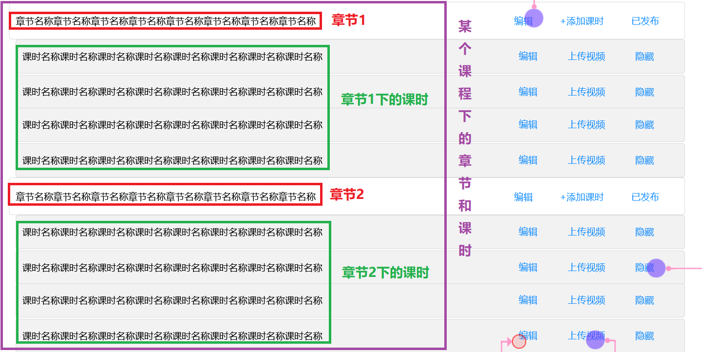

#### 2.1.1 查询`id`为10的课程的章节信息

```mysql
SELECT id,
	course_id,
	section_name,
	description,
	order_num,
	status
	FROM course_section
	WHERE course_id = 10;
```

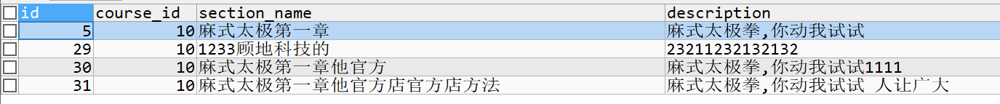

#### 2.1.2 查询``id`为5的章节的课时信息

```sql
SELECT id,
	course_id,
	section_id,
	theme,
	duration,
	is_free,
	order_num,
	status
	FROM course_lesson
	WHERE section_id = 5;
```

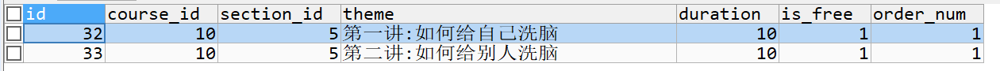

### 2.2 dao层编写

#### 2.2.1 CourseContentDao

新建两个方法

```java
    /**
     * 根据章节id查询该章节下的所有课时
     * @param sectionId 章节id
     * @return
     */
    List<Course_Lesson> findCourseLessonsBySectionId(int sectionId);

    /**
     * 根据课程id获取该课程下的所有章节, 同时每个章节都携带有课时信息
     * @param courseId 课程id
     * @return
     */
    List<Course_Section> findCourseSectionsWithLessonsByCourseId(int courseId);
```

#### 2.2.2 CourseContentDaoImpl

```java
    /**
     * 根据章节id查询该章节下的所有课时
     *
     * @param sectionId 章节id
     * @return
     */
    @Override
    public List<Course_Lesson> findCourseLessonsBySectionId(int sectionId) {
        // 1. 编写SQL语句
        // language=MySQL
        String sql = "SELECT id, course_id, section_id, theme, duration, is_free, order_num, status FROM course_lesson WHERE section_id = ?;";
        // 2. 创建QueryRunner对象
        QueryRunner queryRunner = getQueryRunner();
        // 3. 创建一个可以下划线与驼峰命名转换的BeanHandler对象
        GenerousBeanProcessor gbp = new GenerousBeanProcessor();
        BasicRowProcessor brp = new BasicRowProcessor(gbp);
        BeanListHandler<Course_Lesson> beanListHandler = new BeanListHandler<>(Course_Lesson.class, brp);
        //4. 执行查找并以JavaBean集合的形式获得结果
        List<Course_Lesson> query = null;
        try {
            query = queryRunner.query(sql, beanListHandler,
                    sectionId);
        } catch (SQLException e) {
            e.printStackTrace();
            return null;
        }
        return query;
    }

    /**
     * 根据课程id获取该课程下的所有章节, 同时每个章节都携带有课时信息
     *
     * @param courseId 课程id
     * @return
     */
    @Override
    public List<Course_Section> findCourseSectionsWithLessonsByCourseId(int courseId) {
        // 1. 编写SQL语句
        // language=MySQL
        String sql = "SELECT id, course_id, section_name, description, order_num, status FROM course_section WHERE course_id = ?;";
        // 2. 创建QueryRunner对象
        QueryRunner queryRunner = getQueryRunner();
        // 3. 创建一个可以下划线与驼峰命名转换的BeanHandler对象
        GenerousBeanProcessor gbp = new GenerousBeanProcessor();
        BasicRowProcessor brp = new BasicRowProcessor(gbp);
        BeanListHandler<Course_Section> beanListHandler = new BeanListHandler<>(Course_Section.class, brp);
        //4. 执行查找并以JavaBean集合的形式获得结果
        List<Course_Section> query = null;
        try {
            query = queryRunner.query(sql, beanListHandler, 
                    courseId);

            // 遍历章节集合, 给每个章节配上课时信息
            for (Course_Section courseSection :
                    query) {
                List<Course_Lesson> lessons = findCourseLessonsBySectionId(courseSection.getId());
                courseSection.setCourseLessonList(lessons);
            }
        } catch (SQLException e) {
            e.printStackTrace();
            return null;
        }
        return query;
    }
```

#### 2.2.3 dao层Junit测试

```java
   /**
     * 测试{@link CourseContentDao#findCourseLessonsBySectionId(int)}方法的功能
     */
    @Test
    public void testFindCourseLessonsBySectionId(){
        List<Course_Lesson> lessons = courseContentDao.findCourseLessonsBySectionId(5);
        System.out.println(JSON.toJSONString(lessons));
    }

    /**
     * 测试{@link CourseContentDao#findCourseSectionsWithLessonsByCourseId(int)}方法的功能
     */
    @Test
    public void testFindCourseSectionsWithLessonsByCourseId(){
        List<Course_Section> courseSections =
                courseContentDao.findCourseSectionsWithLessonsByCourseId(2);
        for (Course_Section section:
             courseSections) {
            System.out.println(section.getSection_name() + ":");
            List<Course_Lesson> lessons = section.getCourseLessonList();
            for (Course_Lesson lesson :
                    lessons) {
                System.out.println("\t" + lesson.getTheme());
            }
        }
    }
```

### 2.3 Service层编写

#### 2.3.1 CourseContentService

```java
    /**
     * 根据课程id获取课程内容
     * @param courseId
     * @return
     */
    List<Course_Section> findCourseSectionsWithLessonsByCourseId(int courseId);
```

#### 2.3.2 CourseContentServiceImpl

```java
    /**
     * 根据课程id获取课程内容
     *
     * @param courseId
     * @return
     */
    @Override
    public List<Course_Section> findCourseSectionsWithLessonsByCourseId(int courseId) {
        return courseContentDao.findCourseSectionsWithLessonsByCourseId(courseId);
    }
```

### 2.4 Sevlet编写

- 参考`.\第00章 学习资料\10_接口文档\项目接口文档.pdf`中的`1. 接口1 展示课程内容`进行sevlet新功能编写

- 在`CourseContentServlet`中添加`findSectionAndLessonByCourseId`方法

```java
    /**
     * 根据课程id获取该课程下的章节和章节下的课时信息
     * @param req
     * @param resp
     */
    public void findSectionAndLessonByCourseId(HttpServletRequest req, HttpServletResponse resp) {
        // 1. 解析请求
        String courseId = req.getParameter("course_id");
        // 2. 业务处理
        CourseContentDao courseContentDao = new CourseContentDaoImpl(getDataSource());
        CourseContentService courseContentService = new CourseContentServiceImpl(courseContentDao);
        List<Course_Section> courseSectionsWithLessonsByCourseId =
                courseContentService.findCourseSectionsWithLessonsByCourseId(Integer.parseInt(courseId));

        // 3. 进行响应
        String respString = JSON.toJSONString(courseSectionsWithLessonsByCourseId);
        try {
            resp.getWriter().println(respString);
        } catch (IOException e) {
            e.printStackTrace();
        }

    }
```

### 2.5 接口测试

根据`.\第00章 学习资料\10_接口文档\项目接口文档.pdf`中`1. 接口1 展示课程内容 `的要求在postman中进行接口测试

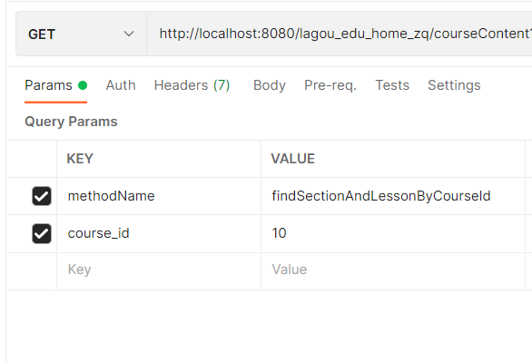

## 三. 功能2: 新建章节信息

### 3.1 需求分析

- 课程的配置课时页面有个`添加章节`按钮, 点击这个按钮后, 会将当前课程的id发送给服务器, 服务器根据课程id获取到这个课程的`id,course_name`,然后发送给浏览器
- 浏览器接收到课程的`id, course_name`后会跳转到, 给该课程添加新章节的页面

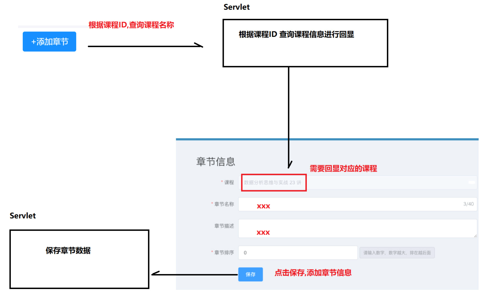

### 3.2 dao层编写

#### 3.2.1 CourseContentDao

```java
    /**
     * 根据课程id获取该课程的<code>id, course_name</code>
     *
     * @param courseId
     * @return
     */
    Course findCourseById(int courseId);

    /**
     * 向course_section中保存一条章节记录, 保存的字段有
     * <p><code>section_name,description,order_num,STATUS,create_time,update_time</code></p>
     * <p>status --- 0:隐藏；1：待更新；2：已发布</p>
     *
     * @param courseSection
     * @return
     */
    int saveCourseSection(Course_Section courseSection);
```

#### 3.2.2 CourseContentDaoImpl

```java
    /**
     * 根据课程id获取该课程的<code>id, course_name</code>
     *
     * @param courseId
     * @return
     */
    @Override
    public Course findCourseById(int courseId) {
        // 1. 编写SQL语句
        // language=MySQL
        String sql = "select id,course_name from course where id = ?";
        // 2. 创建QueryRunner对象
        QueryRunner queryRunner = getQueryRunner();
        // 3. 创建一个可以对下划线和驼峰命名进行转换的BeanHandler对象
        GenerousBeanProcessor gbp = new GenerousBeanProcessor();
        BasicRowProcessor brp = new BasicRowProcessor(gbp);
        BeanHandler<Course> beanHandler = new BeanHandler<>(Course.class, brp);
        //4. 执行查找并以JavaBean的形式获得结果
        Course query = null;
        try {
            query = queryRunner.query(sql, beanHandler,
                    courseId);
        } catch (SQLException e) {
            e.printStackTrace();
            return null;
        }
        return query;


    }

    /**
     * 向course_section中保存一条章节记录, 保存的字段有
     * <p><code>section_name,description,order_num,STATUS,create_time,update_time</code></p>
     * <p>status --- 0:隐藏；1：待更新；2：已发布</p>
     *
     * @param courseSection
     * @return
     */
    @Override
    public int saveCourseSection(Course_Section courseSection) {
        //1. 编写SQL语句
        // language=MySQL
        String sql = "insert into course_section(course_id, section_name,description,order_num,status,create_time,update_time) values(?,?,?,?,?,?,?)";
        // 2. 创建QueryRunner
        QueryRunner queryRunner = getQueryRunner();
        // 3. 执行增删改操作
        int result = 0;
        try {
            result = queryRunner.update(sql,
                    courseSection.getSection_name(), courseSection.getDescription(), courseSection.getOrder_num(),
                    courseSection.getStatus(), courseSection.getCreate_time(), courseSection.getUpdate_time());
        } catch (SQLException e) {
            e.printStackTrace();
            return 0;
        }
        return result;

    }
```

#### 3.2.3 dao层junit测试


### 3.3 service层编写

#### 3.3.1 CourseContentService

```java
   /**
     * 根据课程id获取课程信息, 课程信息只包含<code>id, course_name</code>
     * @param courseId
     * @return
     */
    Course findCourseById(int courseId);

    /**
     * 向course_section中保存一条章节记录, 保存的字段有
     * <p><code>section_name,description,order_num,STATUS,create_time,update_time</code></p>
     * <p>status --- 0:隐藏；1：待更新；2：已发布</p>
     * @param courseSection
     * @return
     */
    String saveCourseSection(Course_Section courseSection);
```

#### 3.3.2 CourseContentServiceImpl

```java
    /**
     * 根据课程id获取课程信息, 课程信息只包含<code>id, course_name</code>
     *
     * @param courseId
     * @return
     */
    @Override
    public Course findCourseById(int courseId) {
        return courseContentDao.findCourseById(courseId)
    }

    /**
     * 向course_section中保存一条章节记录, 保存的字段有
     * <p><code>section_name,description,order_num,STATUS,create_time,update_time</code></p>
     * <p>status --- 0:隐藏；1：待更新；2：已发布</p>
     * @param courseSection
     * @return
     */
    @Override
    public String saveCourseSection(Course_Section courseSection) {
        int row = courseContentDao.saveCourseSection(courseSection);
        return row > 0 ? StatusCode.SUCCESS.toString() : StatusCode.FAIL.toString();
    }
```


### 3.4 servlet编写

#### 3.4.1 课程信息回显

##### 3.4.1.1 新功能编写

- 参考`.\第00章 学习资料\10_接口文档\项目接口文档.pdf`中的`2. 接口2 回显章节对应的课程信息`进行sevlet新功能编写

- `CourseContentServlet`中添加`findCourseById`方法

```java
    /**
     * 课程信息回显
     * @param req
     * @param resp
     */
    public void findCourseById(HttpServletRequest req, HttpServletResponse resp){
        // 1. 解析请求
        String courseId = req.getParameter("id");
        // 2. 处理业务
        CourseContentDao courseContentDao = new CourseContentDaoImpl(getDataSource());
        CourseContentService courseContentService = new CourseContentServiceImpl(courseContentDao);
        Course course = courseContentService.findCourseById(Integer.parseInt(courseId));

        /*jsonFilter -- 实体类对象转换成json对象时, 可以指定实体类中的哪些字段能够转换成json字符串*/
        SimplePropertyPreFilter jsonFilter = new SimplePropertyPreFilter(Course.class,
                "id","course_name");
        String respString = JSON.toJSONString(course, jsonFilter);
        // 3. 进行相应
        try {
            resp.getWriter().println(respString);
        } catch (IOException e) {
            e.printStackTrace();
        }
    }
```

##### 3.4.1.2 接口测试

参考`.\第00章 学习资料\10_接口文档\项目接口文档.pdf`中的`2. 接口2 回显章节对应的课程信息`进行接口测试

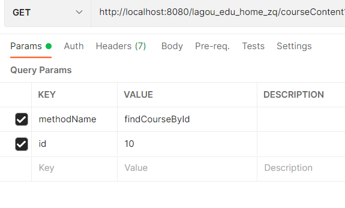

#### 3.4.2 保存章节信息

- 参考`.\第00章 学习资料\10_接口文档\项目接口文档.pdf`中的`3. 接口3 保存&修改章节信息`进行servlet新功能的编写
- 需要以`post`的方式提交**只含有文本数据**的表单

##### 3.4.2.1 POST请求方式介绍

==POST请求方式常用的三种数据提交格式==

| 格式                                                     | 说明                                                |
| -------------------------------------------------------- | --------------------------------------------------- |
| `Content-Type:application/x-www-form-urlencoded`[^注释2] | 表单中的数据会以==普通表单形式(键值对)==发送到后端  |
| `Content-Type:application/json;charset=utf-8`[^注释1]    | 表单中的数据会以==json字符串的形式==发送到后端      |
| `Content-Type:multipart/form-data`[^注释1]               | 多部件上传, ==表单既可以上传键值对 也可以上传文件== |

[^注释1]: 使用这个格式的Post请求, 后台通过`getParameter(String)`方法是**获取不到**参数的
[^注释2]:使用这个格式的Post请求, 后台通过`getParameter(String)`方法获是**可以获取**到参数的

##### 3.4.2.2 需求分析

- 参考`.\第00章 学习资料\10_接口文档\项目接口文档.pdf`中的`3. 接口3 保存&修改章节信息`要求: 前台使用post请求将表单中的数据以json格式传送给后台, 后台通过`getParameter(String)`方法是**获取不到**参数的

- ```json
  {
      "methodName":"saveOrUpdateSection",
      "course_id":19,
      "section_name:"微服务架构",
      "description":"跟着药水一起学习如何使用微服务",
      "order_num ":0
  }
  ```

##### 3.4.2.3 修改BaseServlet

如果请求中的数据是json格式的字符串, 我们可以通过`request.getReander`这个方法获取一个从`request`中读取数据的输入流对象,然后从`request`中读取到这个json格式的字符串

###### 3.4.2.3.1 在BaseServlet 中创建一个方法,用来获取JSON格式的数据

```java
    /**
     * 当post请求将表单中的数据以json格式传送到后台时, 可以通过此方法读取post请求中
     * 的json格式的字符串
     *
     * @param req
     * @return
     */
    private String getPostJson(HttpServletRequest req) {
        try {
            BufferedReader reader = req.getReader();
            StringBuilder sb = new StringBuilder();
            String line = null;
            while ((line = reader.readLine()) != null) {
                sb.append(line);
            }
            return sb.toString();
        } catch (IOException e) {
            e.printStackTrace();
            return null;
        }
    }
```

###### 3.4.2.3 修改BaseServlet中的doGet方法

1. 获取POST请求的 Content-Type类型
2. 判断传递的数据是不是JSON格式
3. 如果是 就调用上面编写的 getPostJSON方法,获取数据
4. 将获取到的JSON格式的字符串转换为 Map
5. 从Map中获取要调用的方法名
6. 将Map保存到request域对象中 (因为`request.getReader()`方法只能使用一次)

```java
    @Override
    protected void doGet(HttpServletRequest req, HttpServletResponse resp) throws ServletException, IOException {
        //已经在EncodingFilter中对req的编码进行了设置, 这里就不必再设置了
        //req.setCharacterEncoding("utf-8");
        //String contentType = req.getHeader("Content-Type");
        String contentType = req.getContentType();
        String methodName = null;
        if ("application/json;charset=utf-8".equalsIgnoreCase(contentType)) {
            String postJson = getPostJson(req);
            Map<String,Object> postJsonMap = JSON.parseObject(postJson, Map.class);
            req.setAttribute("postJsonMap",postJsonMap);

            assert postJsonMap != null;
            methodName = (String) postJsonMap.get("methodName");
        } else {
            methodName = req.getParameter("methodName");
        }

        if (!EmptyUtils.isEmpty(methodName)) {
            Class<? extends BaseServlet> clazz = this.getClass();
            try {
                Method method = clazz.getMethod(methodName, HttpServletRequest.class, HttpServletResponse.class);
                method.invoke(this, req, resp);
            } catch (NoSuchMethodException | InvocationTargetException | IllegalAccessException e) {
                System.out.println("[" + methodName + "]这个功能不存在, 或者这个功能里出现错误");
                e.printStackTrace();
            }
        } else {
            System.out.println("request请求没有携带methodName参数");
        }

```

##### 3.4.2.4 CourseContentServlet添加新功能

```java
   /**
     * 保存或更新章节信息,
     *
     * @param req
     * @param resp
     */
    public void saveOrUpdateSection(HttpServletRequest req, HttpServletResponse resp) {
        // 1. 解析请求
        Map<String, Object> map = (Map) req.getAttribute("postJsonMap");
        // 2. 处理业务
        Course_Section section = new Course_Section();
        try {
            BeanUtils.populate(section, map);
            CourseContentDao courseContentDao = new CourseContentDaoImpl(getDataSource());
            CourseContentService courseContentService = new CourseContentServiceImpl(courseContentDao);
            String result = courseContentService.saveCourseSection(section);
            // 3. 进行响应
            resp.getWriter().println(result);
        } catch (IllegalAccessException | InvocationTargetException | IOException e) {
            e.printStackTrace();
        }
    }
```

##### 3.4.2.5 测试接口

参考`.\第00章 学习资料\10_接口文档\项目接口文档.pdf`中的`3. 接口3 保存&修改章节信息`进行接口测试

1. 选择POST请求方式,设置`Content-Type=application/json;charset=utf-8`
   1. 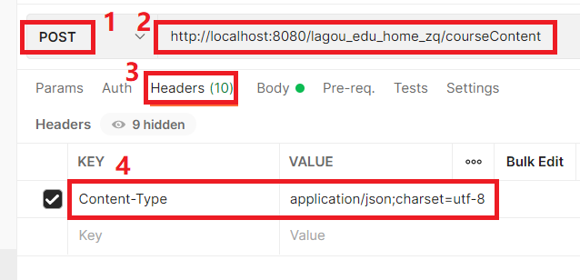
2. `Body`选择raw, 发送JSON格式数据
   1. 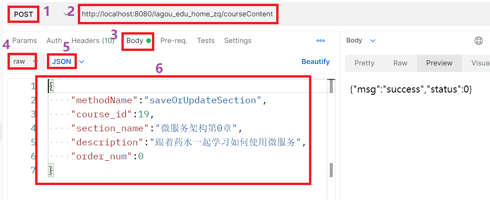

## 四. 功能3: 修改章节信息

### 4.1 需求分析

1. 前台将要修改的章节的`id`发送到后台
2. 后台根据这个章节的`id`查询到章节的相关信息, 然后将这个章节信息发送给前台==[后台任务]==
3. 前台对这个章节信息作出修改后, 将修改后的章节信息发送给后台
4. 后台将修改后的章节信息保存下来==[后台任务]==

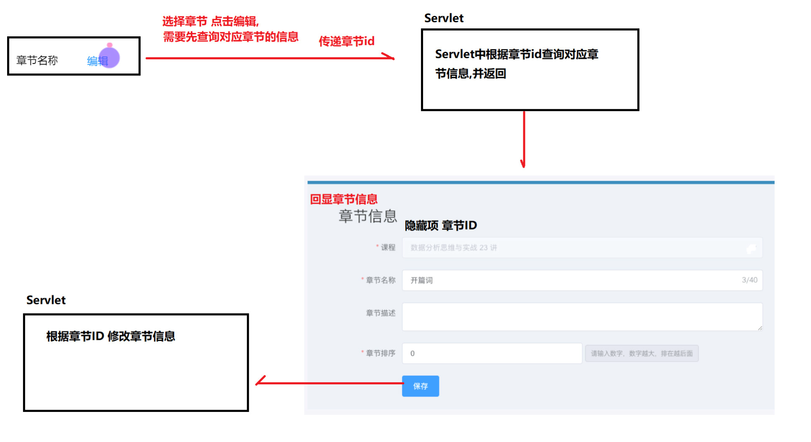

### 4.2 dao层编写

1. 后台根据这个章节的`id`查询到章节的相关信息, 然后将这个章节信息发送给前台==[后台任务]==. 这个任务其实在`findCourseSectionsWithLessonsByCourseId(int)`方法中已经完成了, 所以跳过
2. 后台将修改后的章节信息保存下来==[后台任务]==

#### 4.2.1 CourseContentDao

```java
    /**
     * 更新course_section表中的一条记录, 更新的字段有
     * <p><code>section_name,description,order_num,update_time</code></p>
     * <p>这条记录要满足<code>id = ?</code></p>
     * @param courseSection
     * @return
     */
    int updateCourseSection(Course_Section courseSection);
```


#### 4.2.2 CourseContentDaoImpl

```java
    /**
     * 更新course_section表中的一条记录, 更新的字段有
     * <p><code>section_name,description,order_num,update_time</code></p>
     * <p>这条记录要满足<code>id = ?</code></p>
     * @param courseSection
     * @return
     */
    @Override
    public int updateCourseSection(Course_Section courseSection) {
        //1. 编写SQL语句
        // language=MySQL
        String sql = "UPDATE course_section SET section_name=?, description=?, order_num=?, STATUS=?, update_time=? WHERE id=?;";
        // 2. 创建QueryRunner
        QueryRunner queryRunner = getQueryRunner();
        // 3. 执行增删改操作
        int result = 0;
        try {
            result = queryRunner.update(sql,
                    courseSection.getSection_name(),courseSection.getDescription(),courseSection.getOrder_num(),courseSection.courseSection.getUpdate_time(),courseSection.getId());
        } catch (SQLException e) {
            e.printStackTrace();
            return 0;
        }
        return result;

    }
```

#### 4.2.3 dao层junit测试


### 4.3 service层编写

#### 4.3.1 `CourseContentServie`

```java
    /**
     * 更新课程信息, 更新的字段有
     * <p><code>section_name,description,order_num,update_time</code></p>
     * @param courseSection
     * @return {@link StatusCode#toString()}
     */
    String updateCourseSection(@NonNull Course_Section courseSection);
```

#### 4.3.2 `CourseContentServiceImpl`

```java
    /**
     * 更新课程信息, 更新的字段有
     * <p><code>section_name,description,order_num,update_time</code></p>
     *
     * @param courseSection
     * @return {@link StatusCode#toString()}
     */
    @Override
    public String updateCourseSection(@NonNull Course_Section courseSection) {
        courseSection.setUpdate_time(DateTimeUtils.getDateTime());
        int row = row = courseContentDao.updateCourseSection(courseSection);
        return row > 0 ? StatusCode.SUCCESS.toString() : StatusCode.FAIL.toString();
    }
```


### 4.4 servlet编写

- 保存章节信息和修改章节信息,访问的是同一个接口,所以在`CourseContentServlet#saveOrUpdateSection()`方法中中,我们要进
  行一下判断
  - **携带id**的就是修改章节操作
  - **未携带id**的就是新增章节操作

```java
    /**
     * 保存或更新章节信息, 不携带id, 就是保存章节, 携带id, 就是更新章节
     *
     * @param req
     * @param resp
     */
    public void saveOrUpdateSection(HttpServletRequest req, HttpServletResponse resp) {
        // 1. 解析请求
        Map<String, Object> map = (Map) req.getAttribute("postJsonMap");
        // 2. 处理业务
        Course_Section section = new Course_Section();
        try {
            BeanUtils.populate(section, map);
            String result = null;
            CourseContentDao courseContentDao = new CourseContentDaoImpl(getDataSource());
            CourseContentService courseContentService = new CourseContentServiceImpl(courseContentDao);
            // 判断map是否携带id
            if (map.get("id") == null) {
                // 不携带id, 就是保存章节
                result = courseContentService.saveCourseSection(section);
            } else {
                // 携带id, 就是更新章节
                result = courseContentService.updateCourseSection(section);
            }
            // 3. 进行响应
            resp.getWriter().println(result);
        } catch (IllegalAccessException | IOException | InvocationTargetException e) {
            e.printStackTrace();
        }

    }
```

### 4.5 接口测试

参考`.\第00章 学习资料\10_接口文档\项目接口文档.pdf`中的`3. 接口3 保存&修改章节信息息`进行接口测试

1. 选择POST请求方式,设置`Content-Type=application/json;charset=utf-8`
   1. 
2. `Body`选择raw, 发送JSON格式数据
   1. 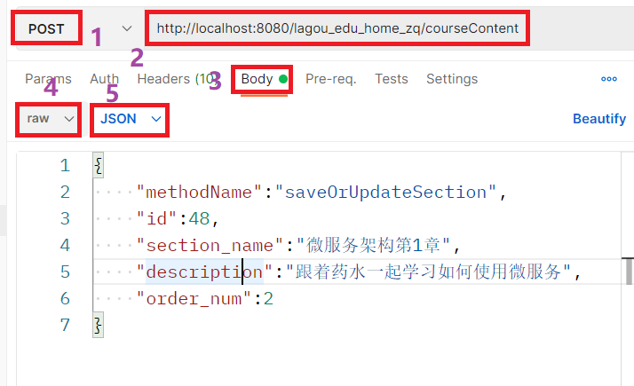

## 五. 功能4: 章节状态管理

### 5.1 需求分析

根据选择的状态信息,发送对应的状态编号 进行修改, status 状态，0:隐藏；1：待更新；2：已发布

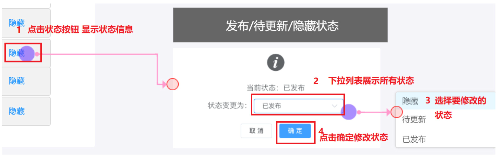

- 点击`隐藏`(当前章节的状态), 会携带着当前章节的id和status跳转到章节状态管理的页面==[这些事都是在前台做的]==
- 前台会将当前章节的`id`和修改后的`status`提交给后台, 后台在数据库中对章节的状态进行修改==[后台任务]==

### 5.2 dao层

在数据库中对章节状态进行修改

#### 5.2.1 CourseContentDao

```java
    /**
     * 修改课程状态, 修改的字段有
     * <p><code>status, update_time</code></p>
     * <p>条件是: <code>id = ? </code></p>
     * <p>status  --- 0:隐藏；1：待更新；2：已发布</p>
     * @param section
     * @return
     */
    int updateCourseSectionStatus(Course_Section section);
```

#### 5.2.2 CourseContentDaoImpl

```java
    /**
     * 修改课程状态, 修改的字段有
     * <p><code>status, update_time</code></p>
     * <p>条件是: <code>id = ? </code></p>
     * <p>status  --- 0:隐藏；1：待更新；2：已发布</p>
     *
     * @param section
     * @return
     */
    @Override
    public int updateCourseSectionStatus(Course_Section section) {
        //1. 编写SQL语句
        // language=MySQL
        String sql = "update course_section set status=?,update_time=? where id=?";
        // 2. 创建QueryRunner
        QueryRunner queryRunner = getQueryRunner();
        // 3. 执行增删改操作
        int result = 0;
        try {
            result = queryRunner.update(sql,
                    section.getStatus(),section.getUpdate_time());
        } catch (SQLException e) {
            e.printStackTrace();
            return 0;
        }
        return result;

    }
```

#### 5.2.3 dao层junit测试


### 5.2 service层

#### 5.2.1 CourseContentService

```java
    /**
     * 更新课程状态
     * <p>修改的字段有<code>status, update_time</code></p>
     * <p>条件是: <code>id = ? </code></p>
     * @param courseSection
     * @return {@link StatusCode#toString()}
     */
    String updateCourseSectionStatus(@NonNull Course_Section courseSection);
```

#### 5.2.2 CourseContentServiceImpl

```java
    @Override
    public String updateCourseSectionStatus(@NonNull Course_Section courseSection) {
        courseSection.setUpdate_time(DateTimeUtils.getDateTime());
        int row = courseContentDao.updateCourseSectionStatus(courseSection);
        return row > 0 ? StatusCode.SUCCESS.toString() : StatusCode.FAIL.toString();
    }
```


### 5.3 sevlet编写

- 参考`.\第00章 学习资料\10_接口文档\项目接口文档.pdf`中的`4.接口4 修改章节状态 `进行sevlet新功能编写

- 在`CourseContentServlet`中添加`updateSectionStatus`方法

```java
    /**
     * 修改课程状态的功能
     *
     * @param req
     * @param resp
     */
    public void updateSectionStatus(HttpServletRequest req, HttpServletResponse resp) {
        // 1. 解析请求
        String id = req.getParameter("id");
        String status = req.getParameter("status");
        // 2. 处理业务
        Course_Section section = new Course_Section();
        section.setId(Integer.parseInt(id));
        section.setStatus(Integer.parseInt(status));
        CourseContentDao courseContentDao = new CourseContentDaoImpl(getDataSource());
        CourseContentService courseContentService = new CourseContentServiceImpl(courseContentDao);
        String respString = courseContentService.updateCourseSectionStatus(section);
        // 3. 进行响应
        try {
            resp.getWriter().println(respString);
        } catch (IOException e) {
            e.printStackTrace();
        }
    }
```

### 5.4 接口测试

参考`.\第00章 学习资料\10_接口文档\项目接口文档.pdf`中的`4.接口4 修改章节状态 `进行接口测试


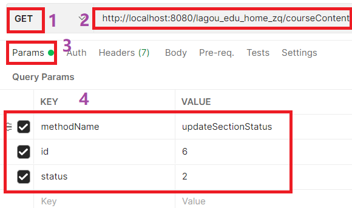

## 六. 功能5: 新建课时信息

### 6.1 需求分析


- 前台点击章节条目的`+添加课时`按钮后, 会携带着`couse_id`  `section_id`  `course_name`和`section_name`跳转到添加课时页面

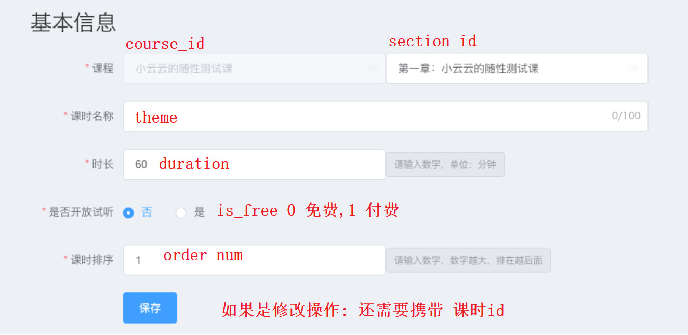

- 点击保存后, 前台页面会将本页面的数据发送给后台. 后台`course_lesson`表要保存的数据有`course_id, section_id, theme, duration, is_free, order_num,  create_time, update_time, status`

### 6.2 dao层

#### 6.2.1 CourseContentDao

```java
    /**
     * 保存新课时
     * <p>保存的字段有<code>course_id, section_id, theme, duration, is_free, order_num,  create_time, update_time, status</code></p>
     * <p>status : 课时状态,0-隐藏，1-未发布，2-已发布</p>
     * <p>is_free : 是否免费, 0-是, 1-0</p>
     * @param lesson
     * @return
     */
    int saveCourseLesson(Course_Lesson lesson);
```

#### 6.2.2 CourseContentDaoImpl

```java
    /**
     * 保存新课时
     * <p>保存的字段有<code>course_id, section_id, theme, duration, is_free, order_num,  create_time, update_time, status</code></p>
     * <p>status : 课时状态,0-隐藏，1-未发布，2-已发布</p>
     * <p>is_free : 是否免费, 0-否, 1-是</p>
     * @param lesson
     * @return
     */
    @Override
    public int saveCourseLesson(Course_Lesson lesson) {
        //1. 编写SQL语句
        // language=MySQL
        String sql = "insert into course_lesson(course_id, section_id, theme, duration, is_free, order_num,  create_time, update_time, status) values(?,?,?,?,?,?,?,?,?)";
        // 2. 创建QueryRunner
        QueryRunner queryRunner = getQueryRunner();
        // 3. 执行增删改操作
        int result = 0;
        try {
            result = queryRunner.update(sql,
                    lesson.getCourse_id(), lesson.getSection_id(), lesson.getTheme(), lesson.getDuration(), lesson.getIs_free(), lesson.getOrderNum(), lesson.getCreate_time(), lesson.getUpdate_time(), lesson.getStatus());
        } catch (SQLException e) {
            e.printStackTrace();
            return 0;
        }
        return result;

    }
```

####  6.2.3 junit测试


### 6.3 service层

#### 6.3.1 CourseContentService

```java
    /**
     * 保存新课时
     * <p>保存的字段有<code>course_id, section_id, theme, duration, is_free, order_num,  create_time, update_time, status</code></p>
     * <p>status : 课时状态,0-隐藏，1-未发布，2-已发布, 默认为2</p>
     * <p>is_free : 是否免费, 0-否, 1-是</p>
     * @param lesson
     * @return {@link StatusCode#toString()}
     */
    String saveCourseLesson(Course_Lesson lesson);
```

#### 6.3.2 CourseContentServiceImpl

```java
    /**
     * 保存新课时
     * <p>保存的字段有<code>course_id, section_id, theme, duration, is_free, order_num,  create_time, update_time, status</code></p>
     * <p>status : 课时状态,0-隐藏，1-未发布，2-已发布, 默认为2</p>
     * <p>is_free : 是否免费, 0-否, 1-是</p>
     *
     * @param lesson
     * @return {@link StatusCode#toString()}
     */
    @Override
    public String saveCourseLesson(Course_Lesson lesson) {
        lesson.setStatus(2);
        String now = DateTimeUtils.getDateTime();
        lesson.setCreate_time(now);
        lesson.setUpdate_time(now);
        int row = courseContentDao.saveCourseLesson(lesson);
        return row > 0 ? StatusCode.SUCCESS.toString() : StatusCode.FAIL.toString();
    }
```


### 6.4 servlet编写

- 参考`.\第00章 学习资料\10_接口文档\项目几口文档2.md`中的`一. 保存&修改课时接口`进行sevlet新功能编写
- 在`CourseContentServlet`中添加`saveOrUpdateLesson`方法

```java
    /**
     * 保存或更新课时信息,
     * @param req 是个post请求, req在{@link BaseServlet#doGet(HttpServletRequest, HttpServletResponse)}方法
     *            里面封装了一个名为<code>postJsonMap</code>的attribute
     * @param resp
     */
    public void saveOrUpdateLesson(HttpServletRequest req, HttpServletResponse resp){
        // 1. 解析请求
        Map<String,Object> map = (Map<String, Object>) req.getAttribute("postJsonMap");
        // 2. 处理业务
        Course_Lesson lesson = new Course_Lesson();
        try {
            BeanUtils.populate(lesson,map);
            CourseContentDao courseContentDao = new CourseContentDaoImpl(DruidPool.getInstance().getDataSource());
            CourseContentService courseContentService = new CourseContentServiceImpl(courseContentDao);
            String respData = courseContentService.saveCourseLesson(lesson);
            // 3. 进行响应
            resp.getWriter().println(respData);
        } catch (Exception e) {
            e.printStackTrace();
        }
    }
```

### 6.5 接口测试

参考`.\第00章 学习资料\10_接口文档\项目几口文档2.md`中的`一. 保存&修改课时接口`进行在postman中接口测试

- 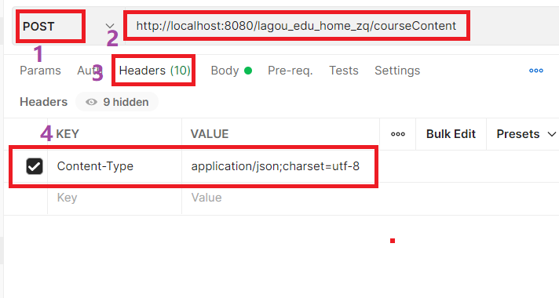
- 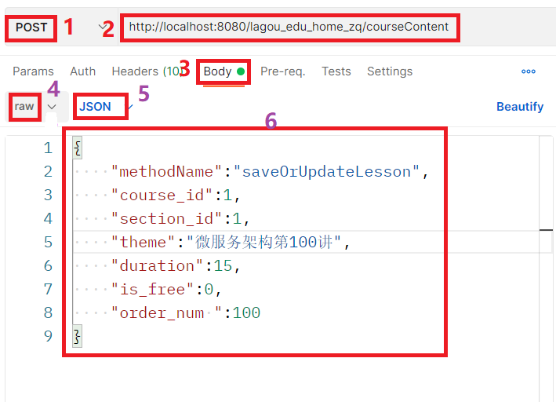

## 七. 功能6: 更新课时信息

### 7.1 需求分析


- 前台点击课时条目的`编辑`按钮后, 会携带着`id`  `couse_id`  `section_id`  `course_name`和`section_name`跳转到添加课时页面


- 点击保存后, 前台页面会将本页面的数据发送给后台. 后台`course_lesson`表`id=?`的记录需要更新的数据有`course_id, section_id, theme, duration, is_free, order_num, update_time`

### 7.2 dao层

#### 7.2.1 CourseContentDao

```java
  /**
     * 更新<code>course_lesson</code>表中课时信息
     * <p>需要更新的字段是: <code>course_id, section_id, theme, duration, is_free, order_num, update_time</code></p>
     * <p>需要满足的条件: <code>id=?</code></p>
     * @param lesson
     * @return
     */
    int updateCourseLesson(Course_Lesson lesson);
```

#### 7.2.2 CourseContentImpl

```java
   /**
     * 更新<code>course_lesson</code>表中课时信息
     * <p>需要更新的字段是: <code>course_id, section_id, theme, duration, is_free, order_num, update_time</code></p>
     * <p>需要满足的条件: <code>id=?</code></p>
     *
     * @param lesson
     * @return
     */
    @Override
    public int updateCourseLesson(Course_Lesson lesson) {
        //1. 编写SQL语句
        // language=MySQL
        String sql = "update course_lesson set course_id=?, section_id=?, theme=?, duration=?, is_free=?, order_num=?, update_time=? where id=?";
        // 2. 创建QueryRunner
        QueryRunner queryRunner = getQueryRunner();
        // 3. 执行增删改操作
        int result = 0;
        try {
            result = queryRunner.update(sql,
                    lesson.getCourse_id(),lesson.getSection_id(),lesson.getTheme(),lesson.getDuration(),lesson.getIs_free(),lesson.getOrderNum(),lesson.getUpdate_time(),lesson.getId());
        } catch (SQLException e) {
            e.printStackTrace();
            return 0;
        }
        return result;

    }
```

#### 7.2.3 junit测试


### 7.3 service层

#### 7.3.1 CourseContentService

```java
    /**
     * 更新课时信息
     * <p>需要更新的字段是: <code>course_id, section_id, theme, duration, is_free, order_num, update_time</code>,
     * update_time由本服务设置</p>
     * <p>需要满足的条件: <code>id=?</code></p>
     * @param lesson
     * @return {@link StatusCode#toString()}
     */
    String updateCourseLesson(Course_Lesson lesson);
```

#### 7.3.2 CourseContentServiceImpl

```java
    /**
     * 更新课时信息
     * <p>需要更新的字段是: <code>course_id, section_id, theme, duration, is_free, order_num, update_time</code>,
     * update_time由本服务设置</p>
     * <p>需要满足的条件: <code>id=?</code></p>
     *
     * @param lesson
     * @return {@link StatusCode#toString()}
     */
    @Override
    public String updateCourseLesson(Course_Lesson lesson) {
        lesson.setUpdate_time(DateTimeUtils.getDateTime());
        int row = courseContentDao.updateCourseLesson(lesson);
        return row > 0 ? StatusCode.SUCCESS.toString() : StatusCode.FAIL.toString();
    }
```


### 7.4 servlet编写

- 参考`.\第00章 学习资料\10_接口文档\项目几口文档2.md`中的`一. 保存&修改课时接口`进行sevlet新功能编写
- 升级`CourseContentServlet`中`saveOrUpdateLesson`方法的功能

```java
    /**
     * 保存或更新课时信息, 请求参数中携带'id'参数则保存, 请求参数中未携带'id'参数则更新
     *
     * @param req  是个post请求, req在{@link BaseServlet#doGet(HttpServletRequest, HttpServletResponse)}方法
     *             里面封装了一个名为<code>postJsonMap</code>的attribute
     * @param resp
     */
    public void saveOrUpdateLesson(HttpServletRequest req, HttpServletResponse resp) {
        // 1. 解析请求
        Map<String, Object> map = (Map<String, Object>) req.getAttribute("postJsonMap");
        // 2. 处理业务
        Course_Lesson lesson = new Course_Lesson();
        String respData = null;
        try {
            CourseContentDao courseContentDao = new CourseContentDaoImpl(DruidPool.getInstance().getDataSource());
            CourseContentService courseContentService = new CourseContentServiceImpl(courseContentDao);

            BeanUtils.populate(lesson, map);
            // 判断map里是否包含'id'键, 包含则跟新课时信息, 不包含则保存课时信息
            if (map.containsKey("id")) {
                //更新课时信息
                respData = courseContentService.updateCourseLesson(lesson);
            } else {
                respData = courseContentService.saveCourseLesson(lesson);
            }
            // 3. 进行响应
            resp.getWriter().println(respData);
        } catch (Exception e) {
            e.printStackTrace();
        }

    }
```


### 7.5 接口测试

参考`.\第00章 学习资料\10_接口文档\项目几口文档2.md`中的`一. 保存&修改课时接口`进行在postman中接口测试

- 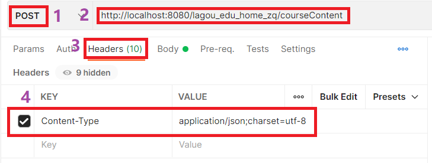
- 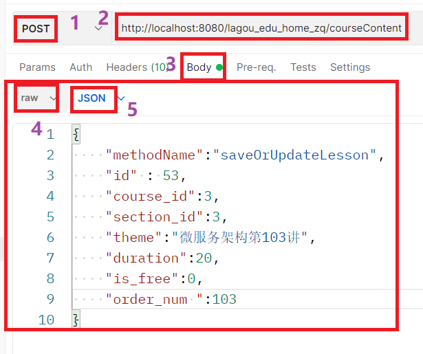


